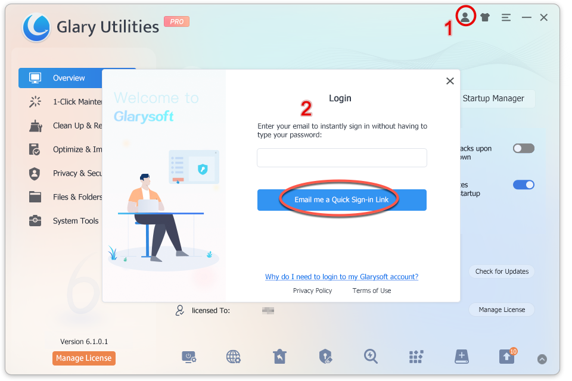
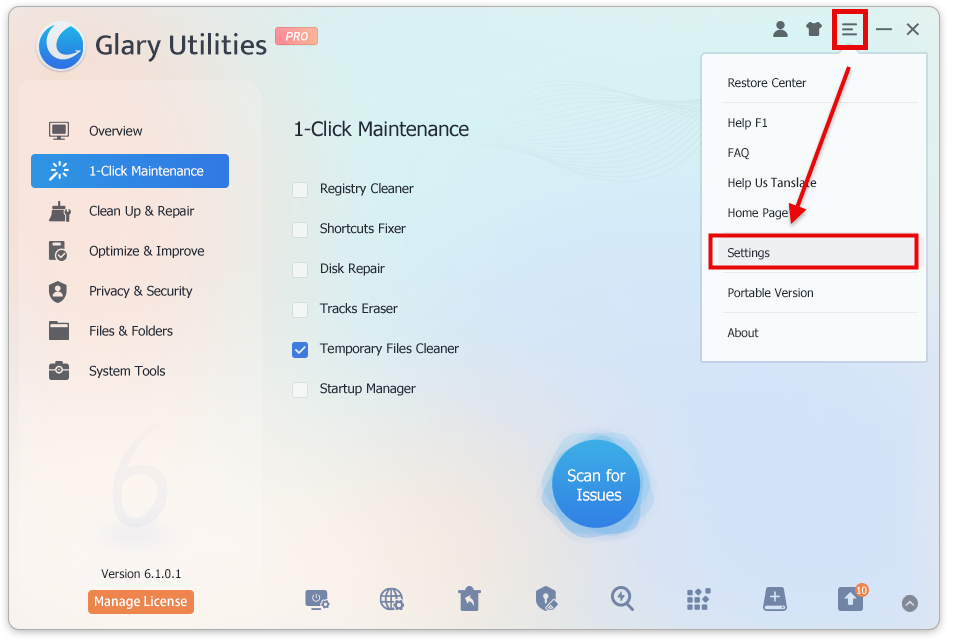
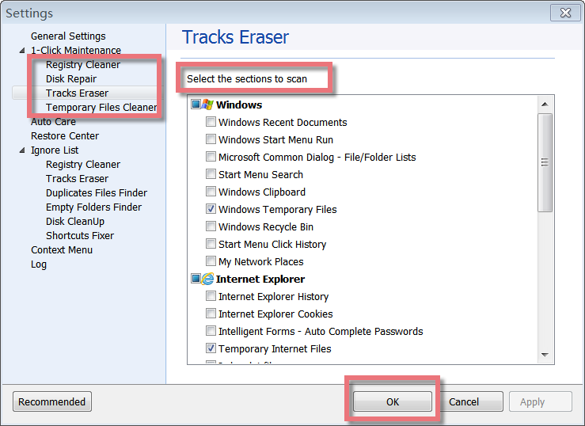
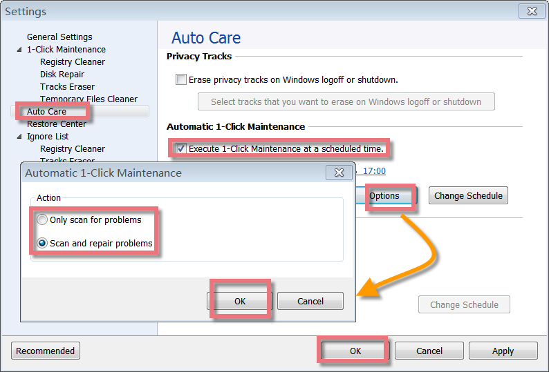
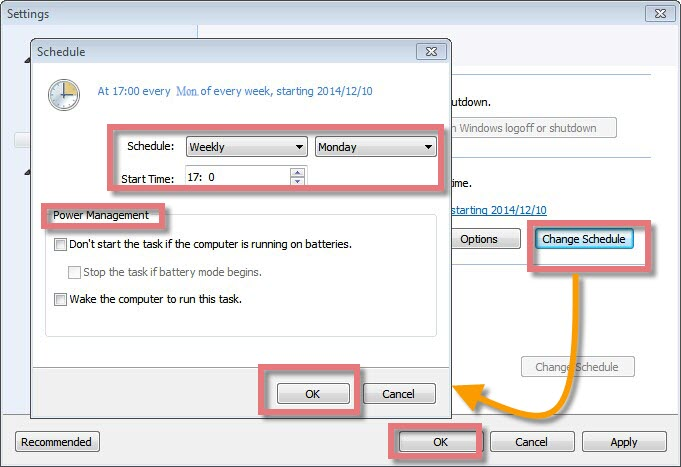

1-Click Maintenance allows you to perform comprehensive system checks and error corrections with just one click. You can schedule it to run regularly, ensuring your system stays clean without interrupting your work.

**Interface Overview**

**1\. Feature Area:** Displays the available features for 1-Click Maintenance. You can choose which feature to scan for issues.  
  
**2\. Options Button:** Allows you to select the sections of each feature to scan.

**3\. Scan for Issues Button:** Once the setup is complete, click the “Scan for Issues” button to find and resolve any issues on your PC.

**Where to Select the Sections to scan for 1-Click Maintenance**

There are two ways to find the place to set up 1-Click Maintenance. You can find the Options button on the 1-Click Maintenance page, click Options, and then set it up in a new pop-up window.

Or you can open Glary Utilities-> Click the Menu icon on the top right -> Select Settings. You will also find the page to set up.

**Choose tasks to scan for 1-Click Maintenance**

On the Settings page, you can choose the task under each feature you need to scan. Here are four features on the left: Registry Cleaner, Disk Repair, Tracks Eraser, and Temporary Files Cleaner. Click on each feature, you will see some tasks below this feature on the right box. Just check up the box before each section you want to scan, and then click the **OK** button. When you rescan issues for 1-Click Maintenance, these sections will be scanned. 

**Automatic 1-Click Maintenance**

Using the pro version, you can schedule the time to execute automatic 1-Click Maintenance from "Auto Care". You can find "Auto Care" from Settings in the **Menu** list.

After you have marked the box before "Execute 1-Click Maintenance at a scheduled time.", you can set up by "Options" button and "Change Schedule" button.

**"Options" button:** Allows you to setup 1-Click Maintenance to "only scan for problems" or "Scan and repair problems". Just remember to click the "OK" button to finish the setup.

**"Change Schedule" button:** Allows you to schedule the date daily, weekly, and monthly from Monday to Sunday. You can edit the start time to any minute you wish. There is also power management. Through Power Management, you can choose "Don’t start the task if the computer is running on batteries" or "Wake the computer to run this task", and finally click the "OK" button to finish this schedule.
