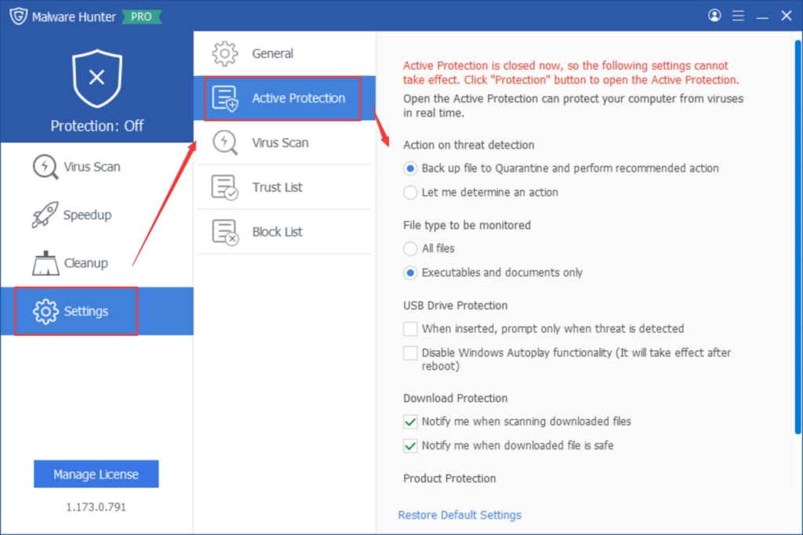
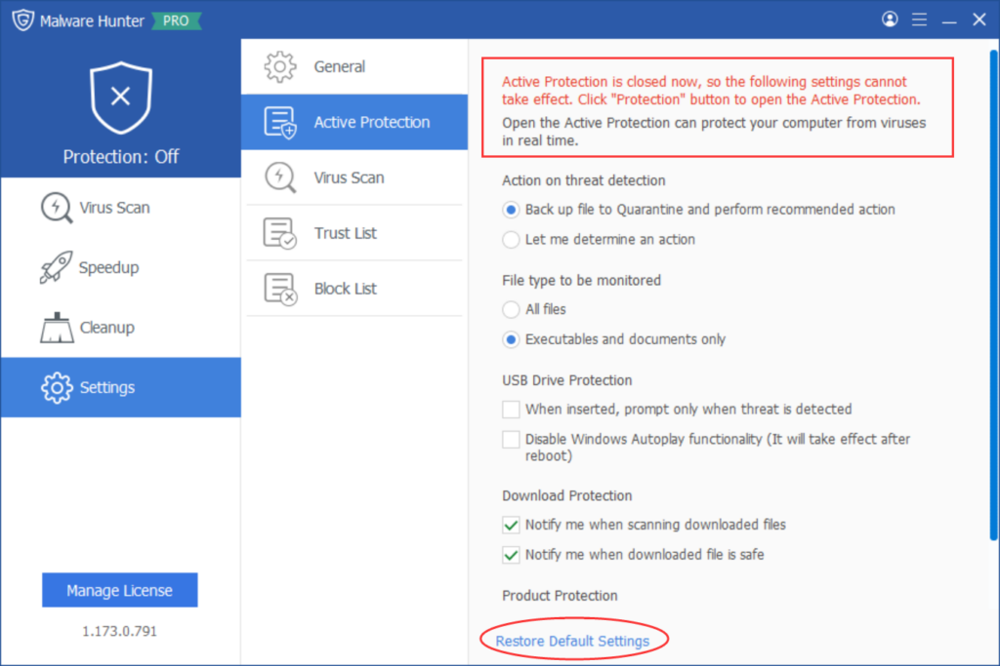
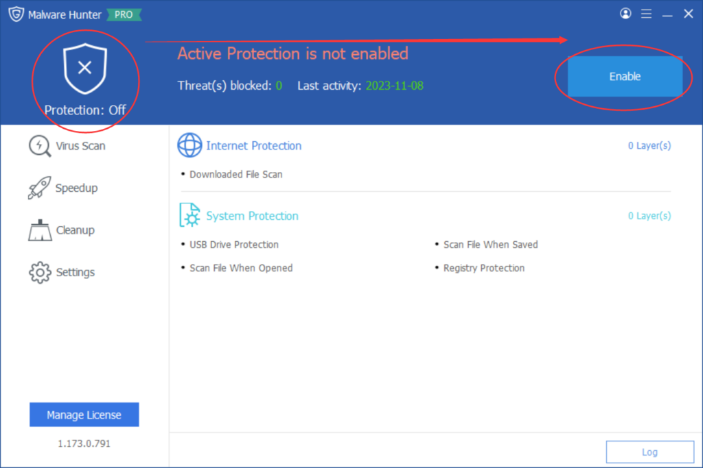
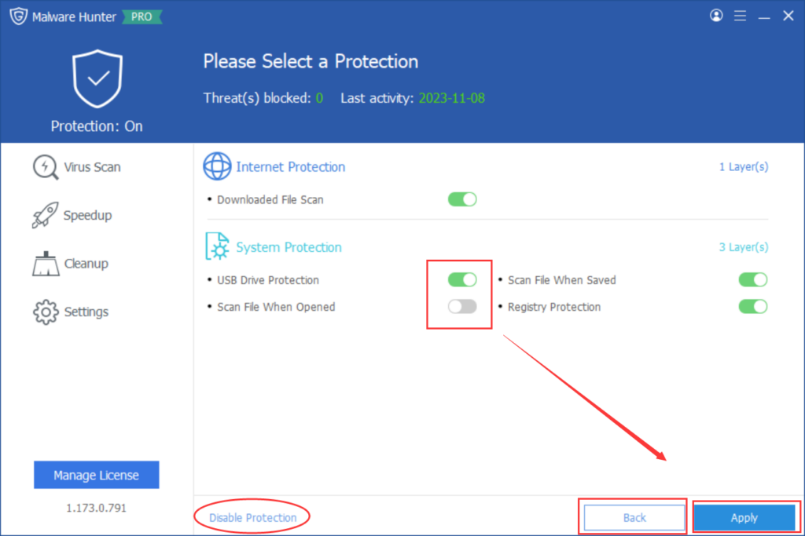
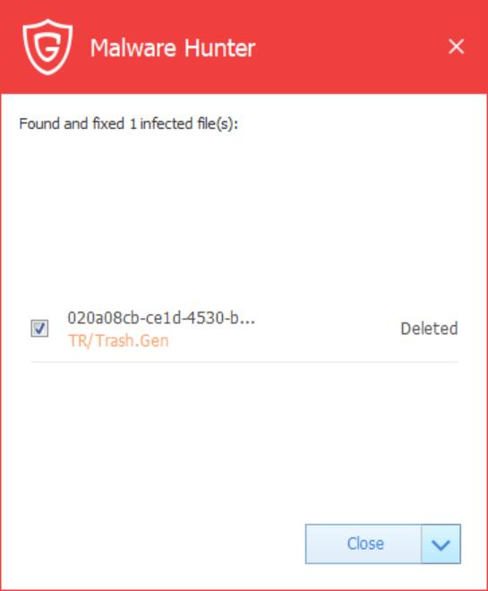
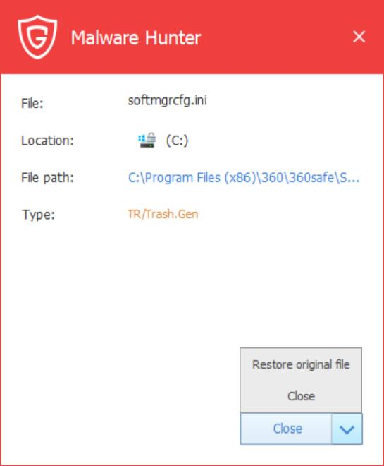

Glarysoft Malware Hunter's Active Protection feature takes a proactive approach to detect and automatically remove potential threats on your PC.

To customize this feature and tailor the protection to your specific needs and preferences, you can access Settings. In the Settings, you have the option to configure various parameters, including:

- **Action on threat detection**

- **File type to be monitored**

- **USB Drive Protection**

- **Download Protection**

- **Product Protection**

If you ever want to restore the default settings, click the corresponding button located at the bottom. However, please note that these settings will only take effect when the Active Protection function is enabled.

A "**Protection**" button on the main page indicates whether the feature is currently enabled or disabled.

You can check the status of specific **Internet/System Protection** functions by clicking this button. After making any changes, remember to click "Apply" to apply the new settings, or click "Back" to cancel the operation. Additionally, the button in the lower-left corner can be used to disable the active defense function if needed.

If you trust a file, you can choose to restore it.

In conclusion, Glarysoft Malware Hunter's Active Protection feature adds an extra layer of security by proactively detecting and removing potential threats. By customizing the settings in the program's Settings section, you can personalize the protection according to your preferences and ensure a safer computing experience.
