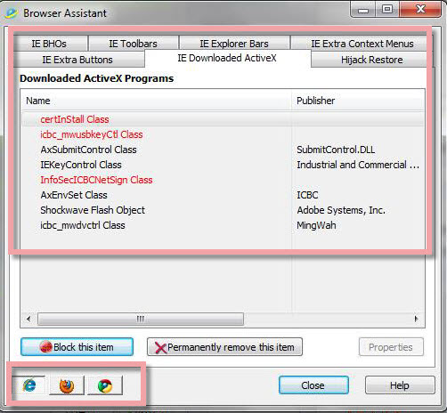
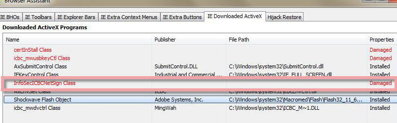
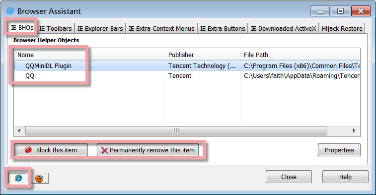
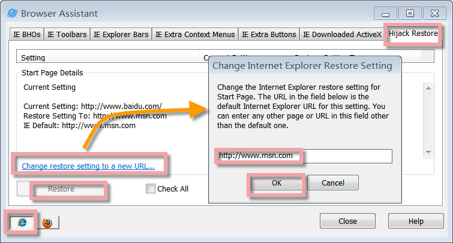
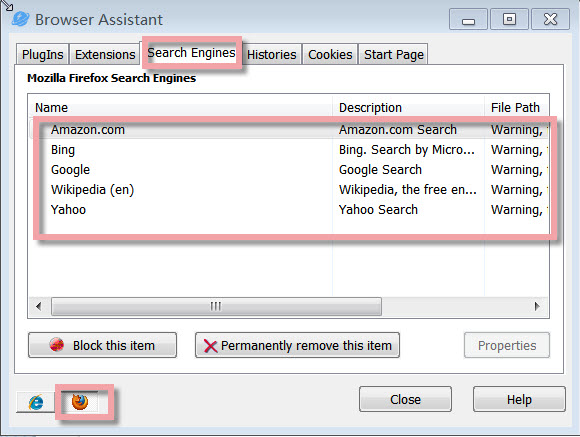
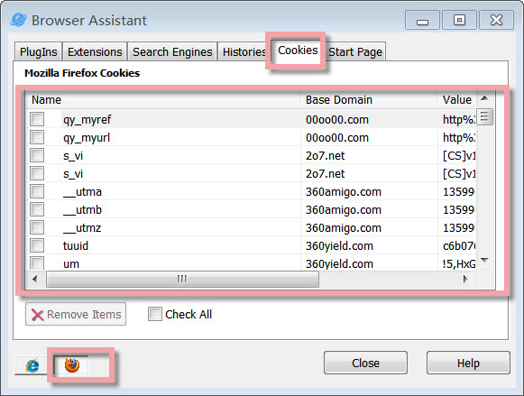

Browser Assistant is a browser extension, plugin, or addon for Mozilla Firefox and Google Chrome, and also for Internet Explorer. Using 'Browser Assistant', you can easily disable, enable and delete any of these "add-ons" to keep your browser as stable and efficient as possible.

**Interface Overview**

  
**  
1.The Upper Box:** quick access button to **IE BHOs**, **IE Toolbars**, **IE Explorer Bars** and **Hijack Restore,** and so on. The related context will be shown below.

**2\. The Lower Icon:** if you want to customize Mozilla Firefox, Google Chrome, or Internet Explorer, just click its logo.

**Red Color under IE Downloaded ActiveX**

When you click IE Downloaded ActiveX, you will see some "Downloaded ActiveX Programs" in red. Here "red color" means this program is damaged. Under **Properties,** you will see that it says "Damaged". If the program is damaged, it can not be repaired. All you need to do is to redownload and reinstall it.

**How to Control IE BHOs**

Many add-ons come from the Internet. Most add-ons from the Internet require that you give your permission before they are downloaded to your computer. Some, however, might be downloaded without your knowledge. This can happen if you previously gave permission for all downloads from a particular Web site or because the add-on was part of another program you installed. Some add-ons are installed with Microsoft Windows.

Add-ons are typically fine, but sometimes they force Internet Explorer to shut down unexpectedly. Spyware and browser redirectors often use BHOs to display advertisements or follow your activities across the Internet.

Using the 'Browser Assistant' you can easily remove any of these "add-ons" to keep your IE browser as stable and efficient as possible. Click the Internet Explorer browser’s logo, and find 'IE BHOs', and you will see all the add-ons. Choose the unneeded add-ons if you want to view more information by clicking 'Properties', and then you can decide to 'block this item' or 'permanently remove this item'.

**'Hijack Restore' allows to modify of all default IE settings**

'Browser Assistant' allows you to view Internet Explorer's set URL and sites such as your current default home page, search URLs, and many of the hidden URLs that Internet Explorer uses and that are commonly taken advantage of by URL redirectors.

You can modify the settings for each URL and site and save your settings for later use. And 'Browser Assistant' can restore all default IE settings with just one click on 'Restore'.

**Block/Remove useless Search Engines in Mozilla Firefox**

When your Web browser is redirected, attempts to view some Web sites (such as common search engines or popular Web directory sites) are automatically redirected to an alternative Web site of the attacker’s choice without your knowledge or consent. A browser redirector may also disallow access to certain Web pages, for example, the site of an antivirus software manufacturer. These programs also can disable antivirus and anti-spyware software.

Click the Mozilla Firefox browser’s logo, and find 'Search Engines', and you will see all the search engines in Mozilla Firefox here. Choose a useless or unknown search engine. If you want to view more information on this search engine, click 'Properties', and then you can decide to 'block this item' or 'permanently remove this item'.

**Remove Cookies in Mozilla Firefox**

After browsing with Mozilla Firefox, several cookies may occur. Here you can click Mozilla Firefox’s logo below, find Cookies, or you can use Check All to check all the items, and finally, click the **Remove Items** button to delete the selected cookies.
