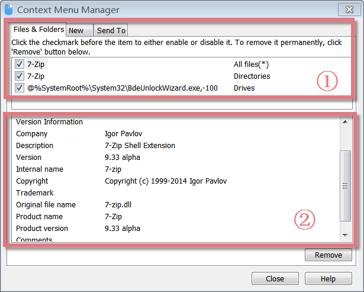
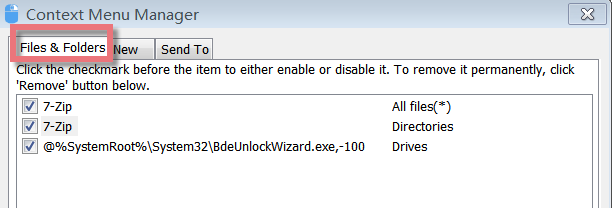
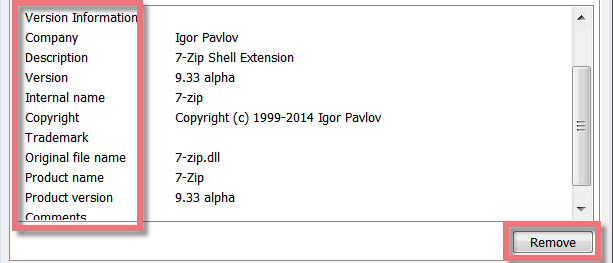
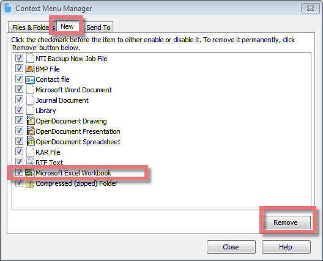
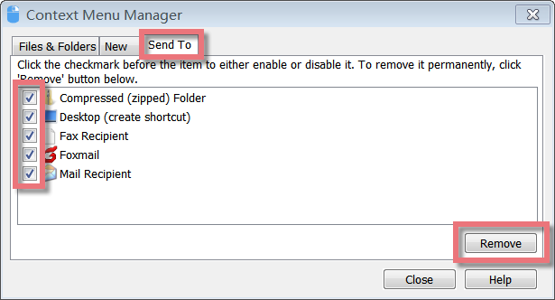

Context Menu Manager is an excellent tool for viewing and managing installed shell extensions. If available, it displays the description, version details, company information, file name, and more. You can optionally disable/enable any item, which can be very useful to disable an extension that you don't need or that has been left behind in your right-click menu from a previous software install.

**Interface Overview**

**1.****The Above box:** shows three types of extensions in your right-click menu: Files&Folders, New, and **Send To**.

**2\. The Lower box:** displays the description of the extensions, as well as version details, company information, file name, and more.  
  
**How to Handle Files&Folders in your Right Click menu**

When you right-click a file/folder, there may be a huge delay before Windows displays the context menu. When you try to empty Recycle Bin (from Common Tasks), it opens Quick Finder instead. Error message "Windows Explorer has encountered a problem and needs to close. We are sorry for the inconvenience" when you right-click a folder. These problems are caused by a bad context menu handler.

Context Menu Manager allows you to delete the bad shell extensions. Start Context Menu Manager, and you will see the "Files&Folders" menu. Here you can view what is in your right-click menu.

When you click an extension, the related information will show below: version details, company name, copyright, file name, and more. Finally, find the item you never want, and click the Remove button to delete it from the "**Files&Folders**" menu.

**How to Remove the items from the "New" menu**

Many applications, such as Office and other document-based programs, may add options to the New context menu. This can slow down the system since IE 4 as to generate this list, has to fetch the icons for each of the documents.

If you want to delete some items, you can start Context Menu Manager. Choose the "New" menu, and find the item you never need. Finally, click the Remove button to remove it from the "New" menu.

**How to Customize the items from "Send to"**

In your right-click menu, you may find some items from the "Send to" menu that you never need. How to remove these useless items? 

Here start Context Menu Manager, click the "Send to" menu, and find the one you never use, finally click the Remove button to delete it from the "Send to" menu.
