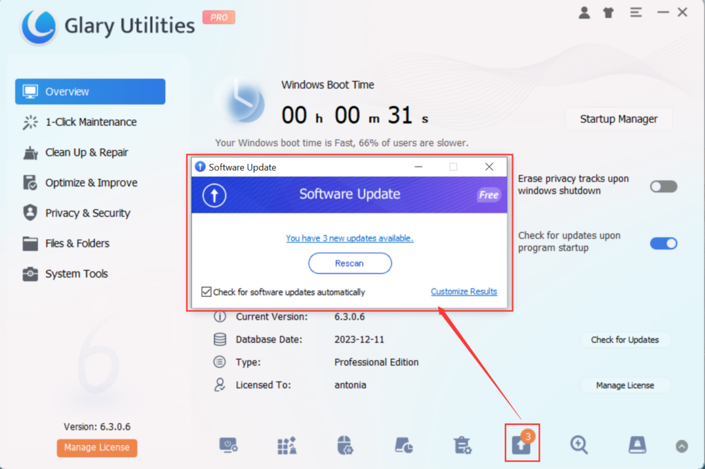
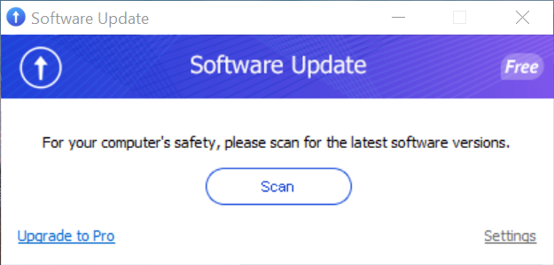
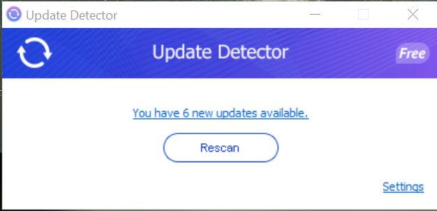
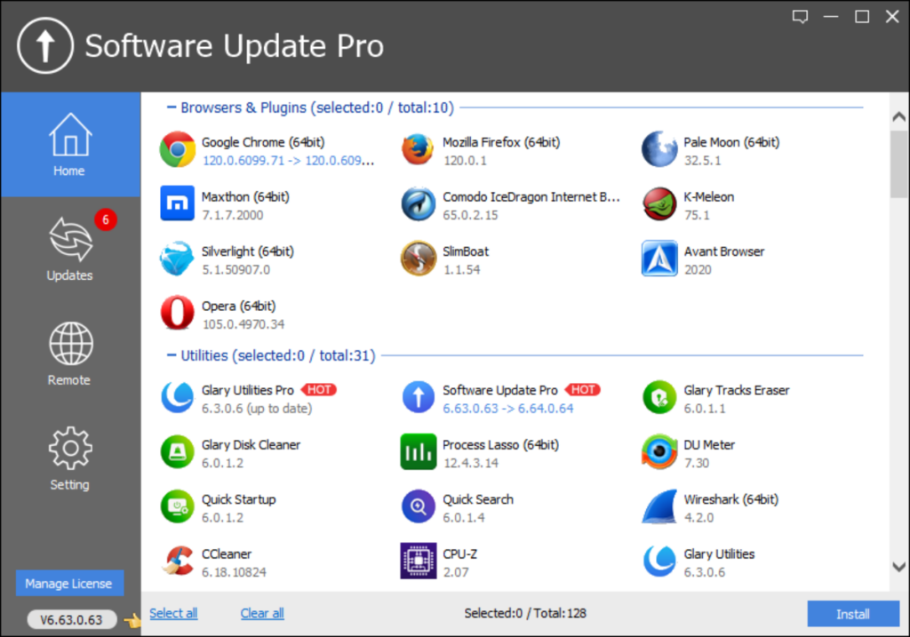
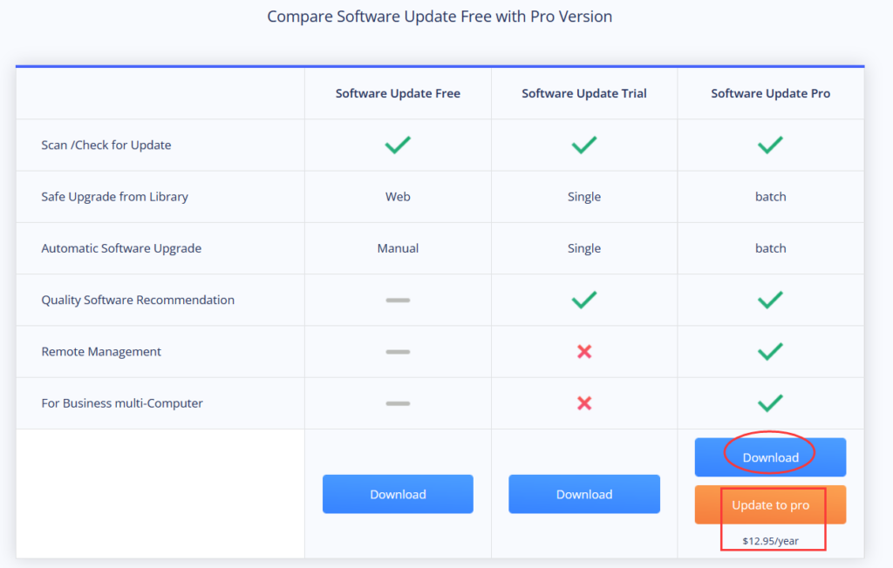

What are the Differences in Glarysoft Software Update Versions? Let's explore their distinctions.  
  

1\. **Integrated Software Update:  
**This version is integrated into Glary Utilities and can be accessed by clicking on the Software Update icon in the bottom toolbar. It is a free tool that offers seamless integration within Glary Utilities.

For more information, please click here: [Integrated Software Update](https://www.glarysoft.com/kb/integrated-software-update/).

  
  

2\. **Software Update Free:  
**This is a standalone free software that requires a separate installation package. It provides the same functionalities as the integrated version but can be used independently.

For more information, please click here: [Software Update Free](https://www.glarysoft.com/kb/glarysoft-software-update-free/).

  
  

3\. **Update Detector:  
**Update Detector is an independent free software tool available on the Library - [Filepuma](https://www.filepuma.com/) website. It shares similar interfaces, functionalities, and methods of use with the other versions. For more information, please click here: [Update Detector](https://www.filepuma.com/updatedetector/).

  
  
All three tools mentioned above share similar interfaces, functionalities, and usage methods. They operate by scanning the installed software on the computer, sending information to [Filepuma.com](https://www.filepuma.com/), and automatically redirecting to the web interface to view the results of update information. Users can perform operations such as scanning, downloading, and managing beta versions of software. The updated software includes all the programs cataloged in the Library – [Filepuma](https://www.filepuma.com/).  
  
  

4\. **Software Update Pro:  
**Similar to the other three versions regarding scanning and downloading capabilities, Software Update Pro stands out with its unique features. It has its own client and a distinct interface. The software included can be silently installed, providing exceptional convenience. Moreover, it includes a Remote Manager feature that simplifies software installation on PCs connected via LAN and facilitates software management for multiple devices within the local network.

For more information, please click here: [Software Update Pro](https://www.glarysoft.com/kb/glarysoft-software-update-pro/).

  
  
In summary, these software update tools share similarities in scanning installed software but differ in interface design, independence, and additional functionalities. Users can choose the version that best suits their needs and preferences.

