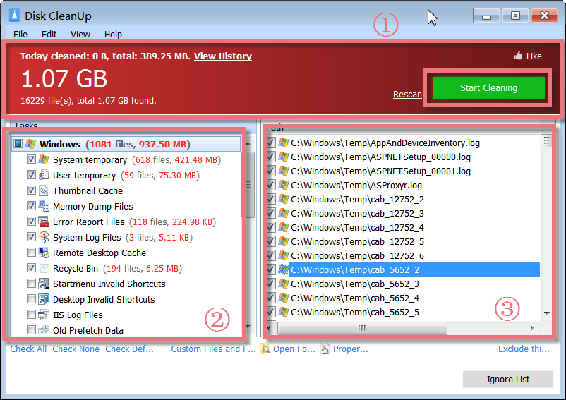
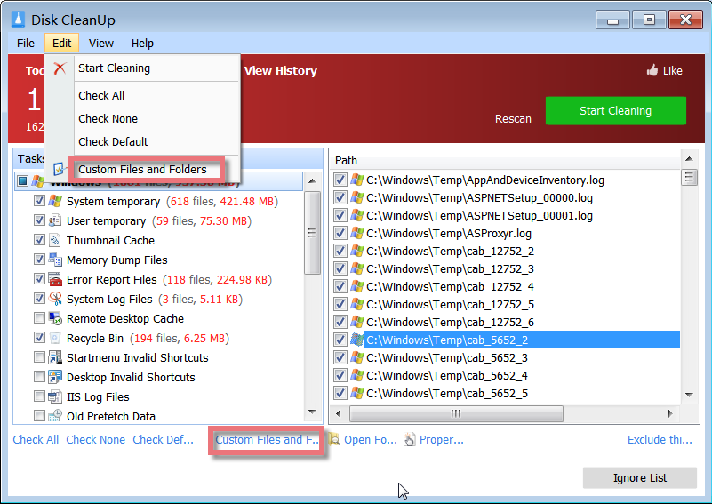
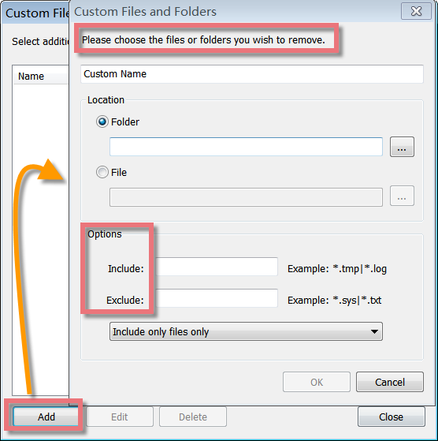
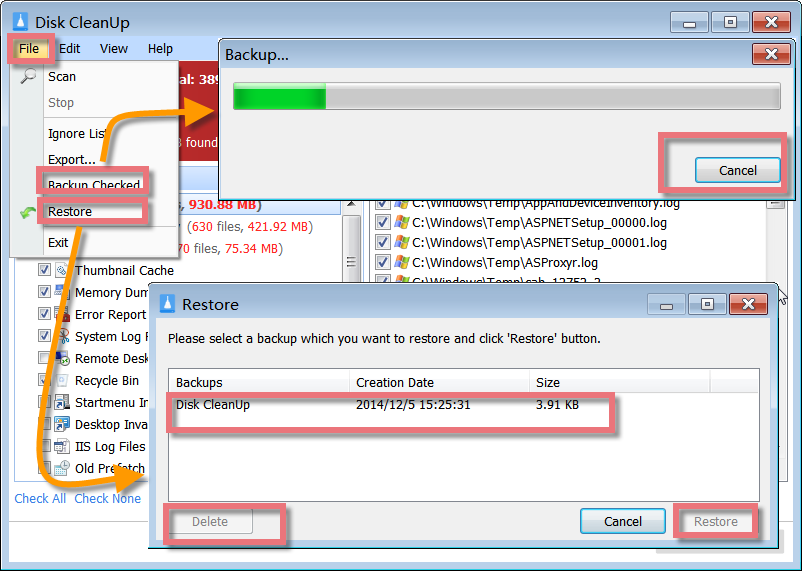
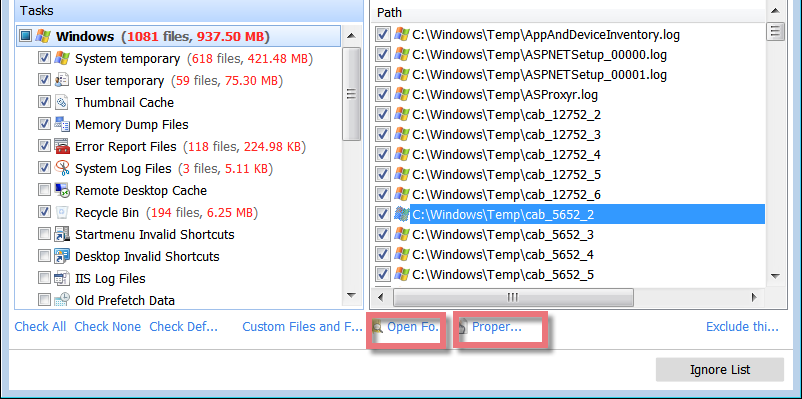
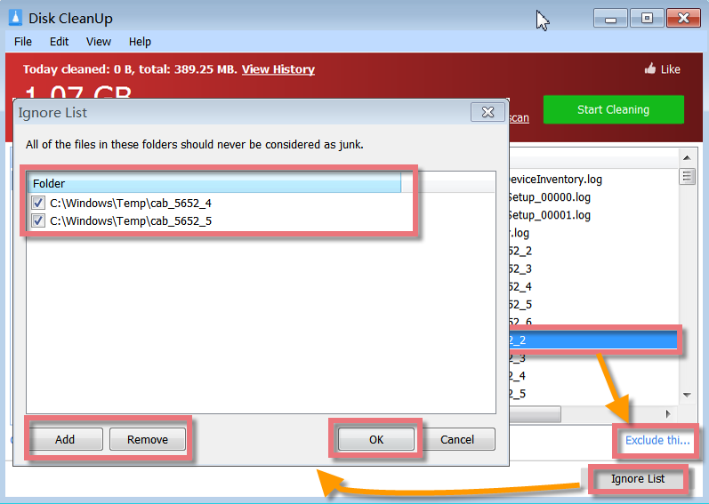

Glary Disk Cleaner is a free disk utility designed to help you keep your disk clean by deleting unnecessary files. Usually, these unnecessary or junk files appear as the result of program incomplete uninstallers, temporary Internet Files, etc. With its intuitive and easy-to-use interface, Glary Disk Cleaner helps you quickly wipe out all the junk files.

**Interface Overview**

**1\. The Above Red Area:** shows how much space junk files are found and allows you to rescan junk files, as well as clean up all the unnecessary files.  
  
**2\. Left-hand Side Button:** allows you to select the needed tasks to scan junk files.

**3\. Right-hand Sidebox**: displays the summary of junk files found with their path. For the one, you do not want to clean, do not check it. Just choose the right one you need to wipe out, and click "Start Cleaning" in the upper box of the main window.

**Cleanup files by using the "Custom Files and Folders" feature**

Windows applications create several files on your hard drive for temporarily storing the data. These files are supposed to be removed when the application terminates. Often, however, the temporary files are not removed because of a program error or careless architecture, because your system was reset or not shut down properly, or because another application has stopped responding or crashed. It is important to clean up those files to keep your PC running fast and smoothly. You can use the "Custom Files and Folders" feature to clean up the files and folders you want.

You can find the "Custom Files and Folders" feature from the "Edit" menu at the top, or directly click "Custom Files and Folders" at the bottom of this page, and a new window will pop up.

On the pop-up window, click the "add" button, and you will get another window that allows you to choose the files and folders or enter the included content you wish to remove and click the "OK" button. Then you can "scan" the file or folders you selected and choose to "start cleaning" after checking the files from the report of total junk files.  
  
**Backup Checked files and Restore the Backup**

In case of accidental deletion of important files after a cleaning up, you can back up the files before deleting them. Mark the check box in front of the files, and click "Backup Checked" from  
File Menu. At some point, if you decide to stop the backup process, click on the 'Cancel' button on the new pop-up window.

To restore a backup, you can click "Restore" from the File menu, and a box will show you these backups. According to the **Creation Date** and Size, you can choose the one you want to recover, then click the "Restore" button. If you want to remove the backups, choose the backup and click the "Delete" button.

**Exclude the file and Ignore the List**

Junk and obsolete files can accumulate to megabytes of wasted hard drive space, as well as turn into potential error-producing cross-linked drive references. Disk Cleaner targets these specific types of files missed by common disk utilities like Uninstaller, Defrag, Scandisk, etc., ensuring that all junk files are removed from your system.

After scanning, Disk Cleaner will display a summary report of the total junk files found on your system. There are various options, and all of them are self-explanatory. Click on the "Properties" below, you will see the detailed information about this file. Click on the "Open Folder" next to "Properties", you will find this file in its location.

If you do not want to remove some files, you can add the files to ignore list. To exclude a file in the search result, mark the Check box in front of the file and then click the "Exclude this file" button. The file will be added to ignore list. If you want to remove the files from ignore list, you can click "Ignore List", and a new window will pop up. Here you can view all the files that should never be considered junk. Click the "Add" button, and you can exclude more files. To delete the files, check the box before the file, and then click the "Remove" button, and finally, click the "OK" button to close this window.
