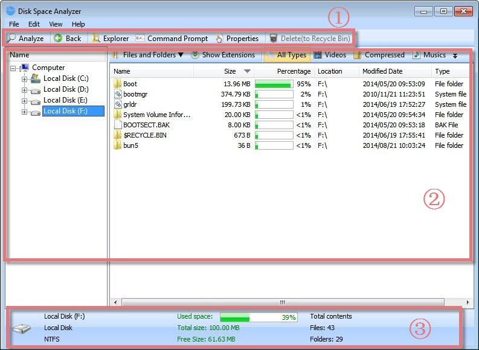
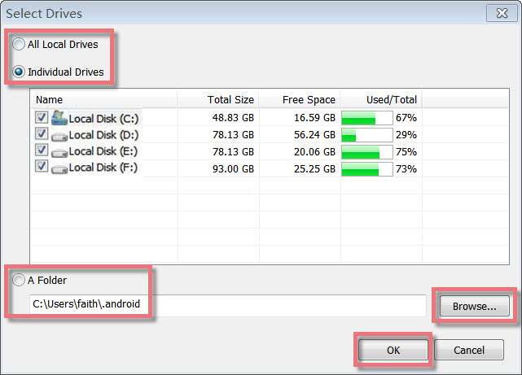
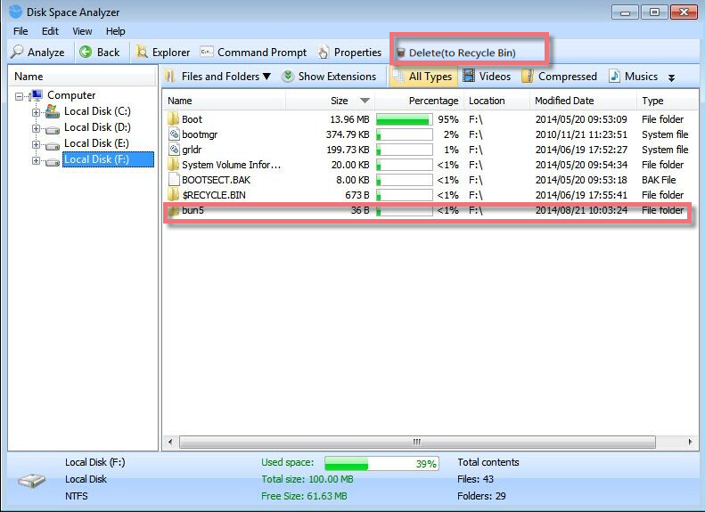
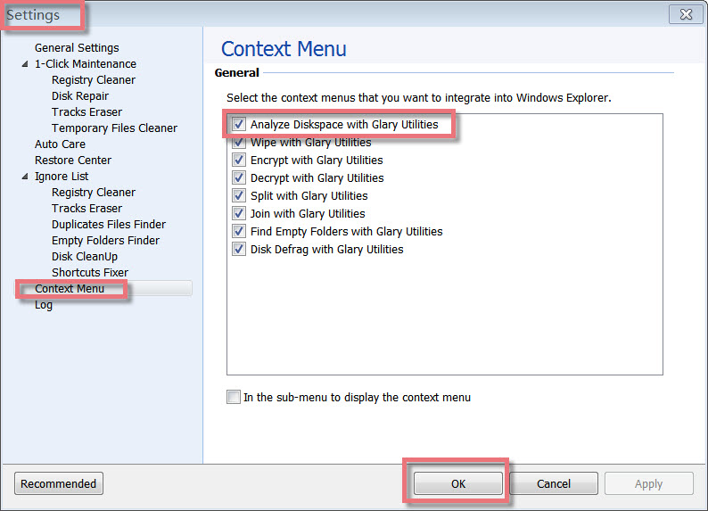
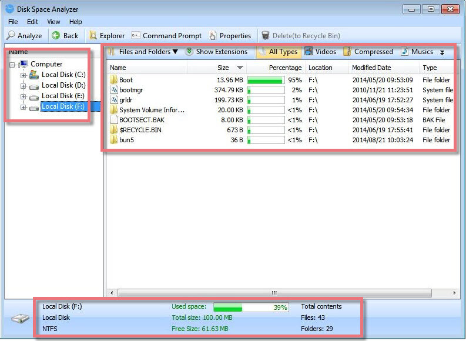

Disk Space Analyzer helps you to view at a glance all the folders, files inside them, and the space occupied by them on your system. This utility is an important tool with which you can organize your data and can easily view the data on your disk.

**Interface Overview**

**1.The Second Line Button:** quick access button to **Analyze**, **Back**, **Explorer**, **Command Prompt**, **Properties,** and Delete the selected files.

**2.The Upper Box**: allows you to analyze the disk by **Files and Folder**, **Extension,** and other types, including Videos, Compressed, and Music, and shows File Name, File Size, Percentage, Location, and other information here.

**3.The Lower Box:** displays the analyzed disks with some information, such as disk capacity, free space size and used space percentage, analyzed file, and folder amounts.

**Select all Drives or Single Drives or Folder to Analyze**

Disk Space Analyzer can scan all parts of a disk, analyzing many files. It offers a quick and effective way to analyze the files from local disks or folders and will show you a list of files on the drive. Just click "Analyze" and a box will pop up, which allows you to choose all drives or individual drives or a folder you want to analyze, and then click on the "OK" button, and all kinds of files will be shown at once.

**Delete Useless files to Recycle Bin**

After analyzing the local drives, you can see how the data occupies your hard disk. By using Disk Space Analyzer, you can easily organize your data and quickly free up additional space on your disk when needed. Just select the Drive or folder to see which files are taking up most of your hard drive space. Then choose the useless files you want to delete, and click "Delete(to Recycle Bin)" to remove the unneeded files from your disk.

**Integrate Disk Space Analyzer Into Windows Explorer Context Menu**

Disk Space Analyzer allows you to integrate itself into Windows Explorer Context Menu. You can open Glary Utilities, go to "Menu", choose "Settings", click on "Context Menu" and check the "Analyze Diskspace with Glary Utilities" option. Finally, click "OK" at the bottom of the page.

**How to use Disk Space Analyzer**

Start Disk Space Analyzer. Select the drive(s) or a folder you want 'Analyze' to analyze, then click 'OK'.

**Layout**

There are three panes.

The left upper pane shows all disks on your PC. When you click it, all files will be shown in the right pane if you have analyzed the disk. You can view at a glance all the subfolders and files inside parent folders by clicking  icon.

The upper right pane shows the types of files, their size, percentage, and the total number of files of a particular extension in the analyzed drive/folder. You can quickly filter the specified file type in the current list, such as video, music, documents, image, and compressed files. When you click an extension, the bottom list will show all the files of this extension. You can also use the right-click popup menu to find more information.

The bottom pane shows you the number of all files and their attributes in the analyzed drive/folder.
