Disk Defrag **(known as [Disk SpeedUp](https://download.glarysoft.com/dssetup.exe) when used as a standalone tool)** is a free and remarkably fast disk defragmentation tool with a user-friendly interface. It serves as a crucial feature integrated within Glary Utilities, allowing you to analyze and optimize your disks for optimal performance. The software provides a clear visualization of drive fragmentation, displaying empty, non-fragmented, and fragmented blocks. After running the defragmentation process, Disk Defrag swiftly detects all fragments and intelligently rearranges files on your disk to occupy contiguous storage locations. By effectively reducing fragmentation, it improves access speed, accelerates application launches, enhances search speed, shortens system startup times, and boosts overall system performance.

**Interface Overview:**

1. **Quick Access Button:** Located on the second line, it allows you to quickly Defrag the selected disk or Defrag a file or folder. The "Options" feature enables users to customize the General settings of Disk Defrag. This includes configuring Defrag settings (such as Scheduled defrag, Auto defrag, and Boot Time Defrag), specifying Optimize preferences, and managing Excludes.

3. **Drive Information:** The upper box displays the drive name, file system, capacity, free space, and other relevant details.

5. ****Analyze and Defrag Buttons**:** Located below Drive Information, this is a shortcut button for Analyze and Defrag, along with buttons for Pause and Stop operations. You can also check "Turn off PC after defragmentation" here.

7. **Fragmentation Details:** The lower box shows fragmentation percentages, disk capacity, free and used space sizes, analyzed file amounts, and a list of file fragments that need defragmentation, along with their path information. The top-left tab provides a quick switch button to schedule Boot Time Defrag, access defrag Reports, and configure SSD Optimize settings.

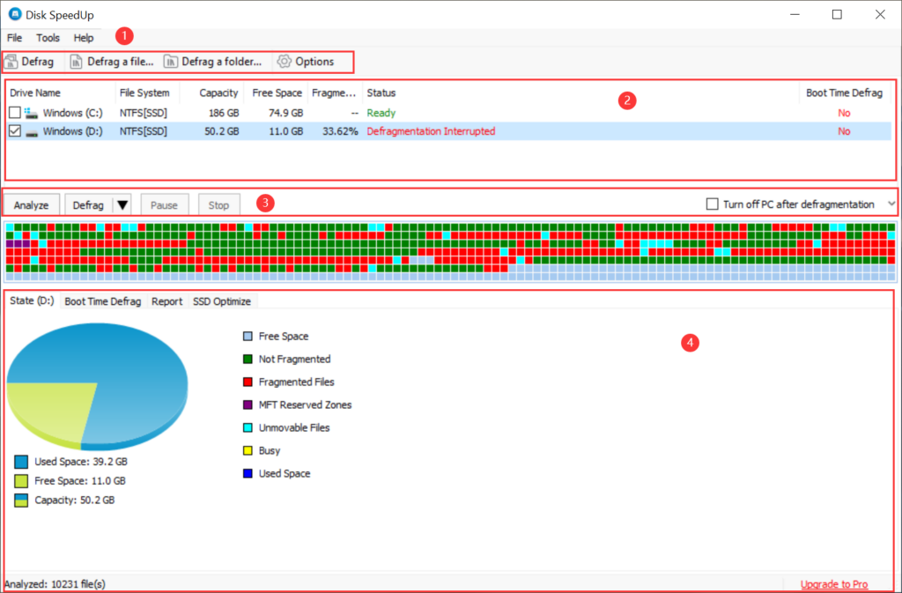

5. **Defrag Status:** The middle box shows the current defragging disk state. Upon clicking the small square in the disk array, access the "Selected" tab to view detailed information about the stored files. Within the "Selected" list, right-clicking on a chosen file allows for specific move operations.

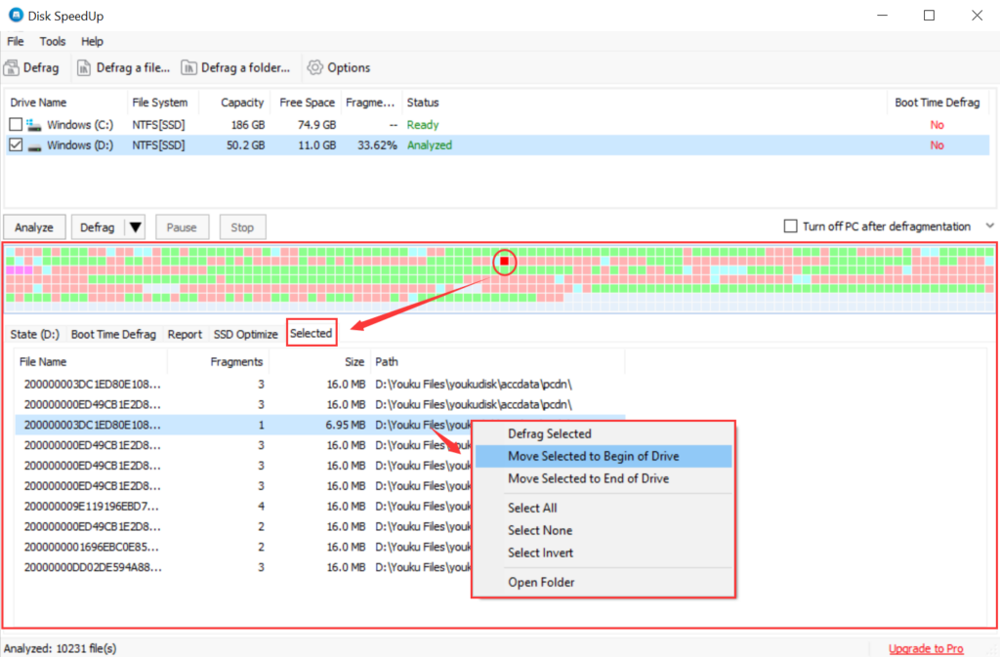

**How to Analyze and Defrag Disk Fragments?**

**Step 1: Analyze**

Select the disks you want to analyze, and then click the "Analyze" button or choose "Analyze" from the "File" option on the first-line button. Disk Defrag will conduct a comprehensive analysis of the disk, displaying detailed information. With a powerful engine, this analysis is remarkably fast, completing within a minute.

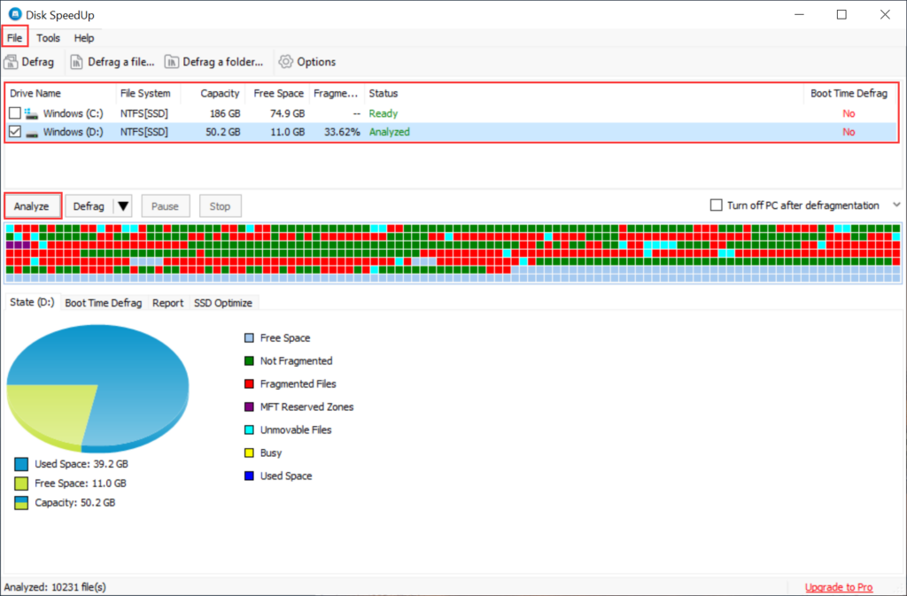

**Step 2. Defrag**

Choose the disks you want to defrag, and then click "Defrag" or select it from the "File" option on the first-line button. The small triangle to the right of "Defrag" opens a menu, allowing you to choose different defrag modes based on your specific requirements.

**Differentiation of Defrag Modes:**

- **Defrag:** The basic defragmentation function that organizes only fragmented files.

- **Defrag and Optimize (slower, use once a week)**: This mode relocates less frequently accessed files to the end of the disk, creating space at the front to enhance read and write speeds.

- **Defrag and Prioritize Files (slower, use once a week):** In this mode, folders and frequently used files are prioritized and moved to the front for optimized access.

- **Defrag Freespace:** This mode arranges all files towards the front, maximizing available space at the rear for optimal storage capacity.

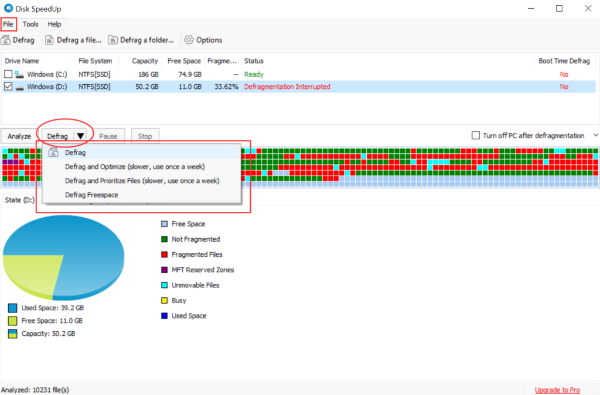

After defragmentation, Disk Defrag efficiently detects and rearranges fragments on your disk, significantly improving access speed, accelerating application launches, enhancing search speed, shortening system startup times, and boosting overall system performance.

**Other Features:**

1\. **Defragmentation of Single Files or Folders:**

If you need to defrag a specific file or folder without waiting for the entire drive defragmentation process, Disk Defrag offers the flexibility to do so. This feature is particularly useful when optimizing the performance of installed applications, games, or downloaded videos. Unlike many other defragmentation tools that only allow defragmenting entire drives, Disk Defrag enables you to defrag specific files or folders.

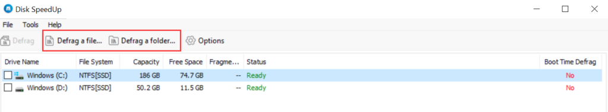

**2.** **Scheduled Defragmentation**

Disk Defrag provides automatic PC care with customizable scheduling options. You can set up scheduled defragmentation according to your preferences, along with other customization features. To configure the schedule, click the "Options" button, choose "Schedule" under "Defrag" on the left, select "Run on a schedule," and define the desired action, frequency, time, and drives. Once you are satisfied with the settings, click "OK."

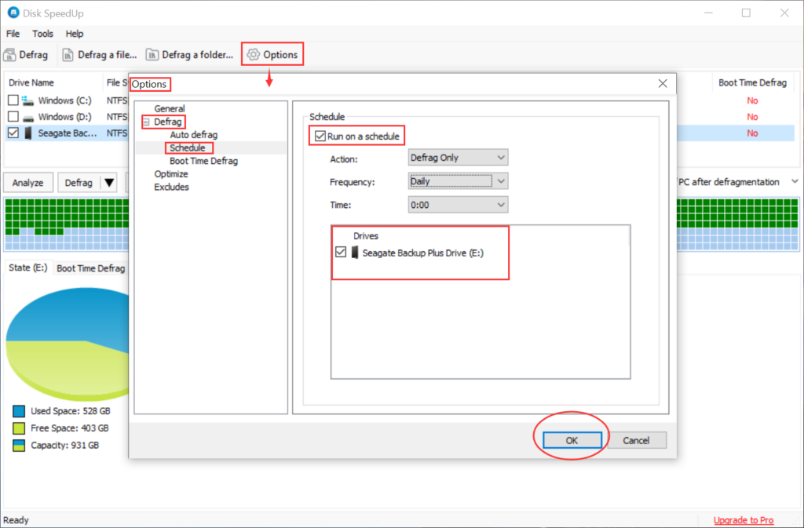

**3\. System Boot File Defragmentation**

Disk Defrag supports defragmentation of both FAT 16/32 and NTFS file systems, including system files such as page files, registry hives, hiberfil.sys, and other system-locked files. When Windows fully runs, defragmenting system booting files improves PC boot time.

On the main interface, you can select the "Boot Time Defrag" tab to enable or disable the operation, check specific items, and view the history of Boot Time Defrag. Click "Configure" or "Options" for further settings on the frequency of boot defrag.

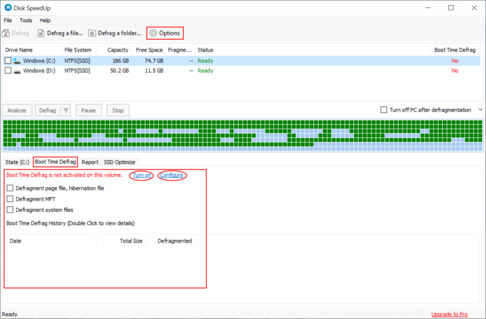

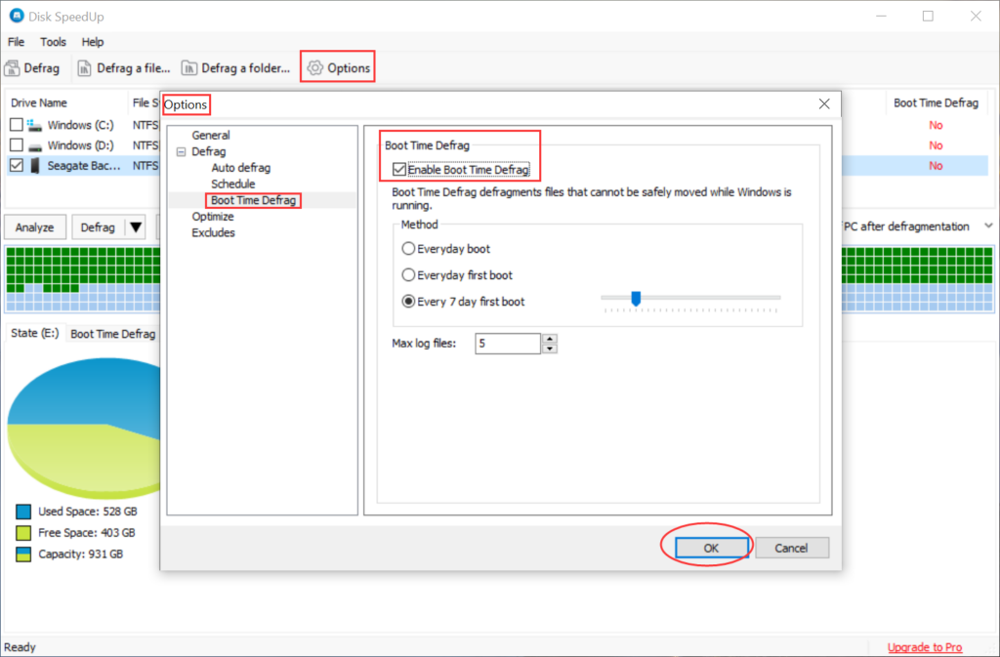

**4\. SSD Optimize**

Select a drive in the partition list, right-click, and choose to either check or uncheck \[SSD\] to designate the drive as an SSD or non-SSD. When an SSD is selected, the SSD Optimize optimization page will appear below. Enable or disable certain system options to optimize your SSD. Hover over these items to view their descriptions.

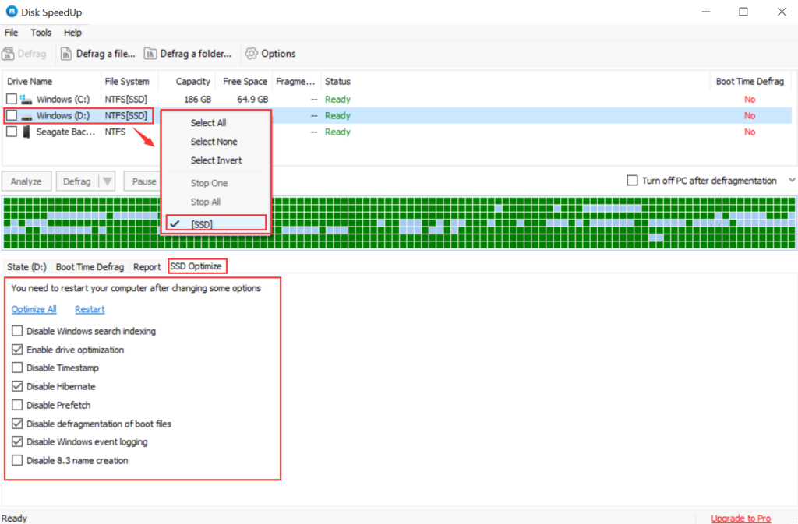

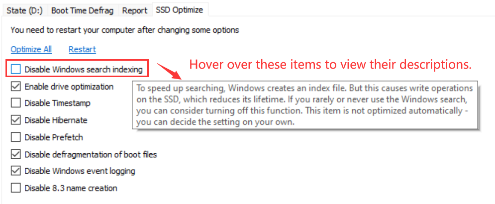

**5\. Excluding Specific Files and Folders:**

Disk Defrag includes an excluding module that allows you to create an ignore list of files and folders that you do not want to defragment. You can easily add and remove files and folders from this module. To access the Excludes function, click the "Options" button, and then save or remove files as needed. Don't forget to click "OK" to apply the changes.

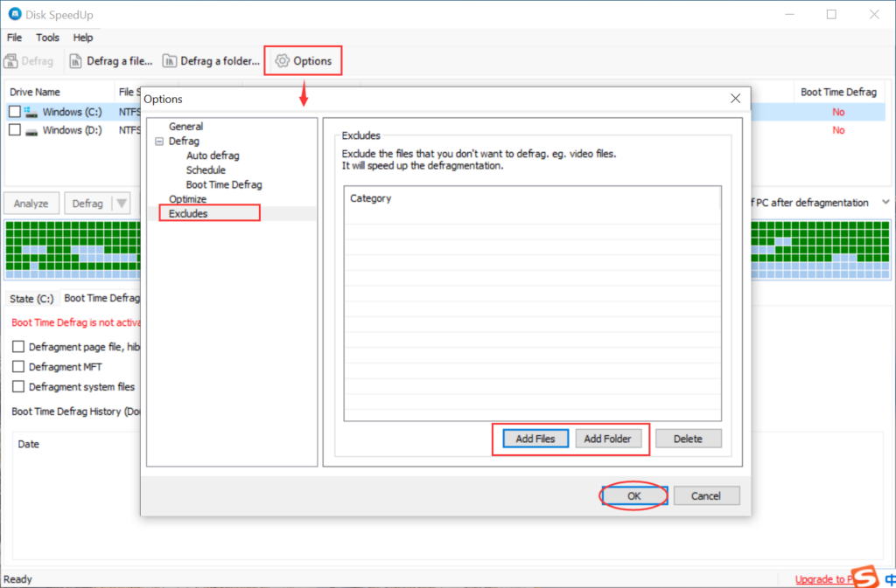

**6\. Automatic Computer Shutdown:**

Once the defragmentation process is completed, Disk Defrag can automatically shut down your computer. This feature saves electricity and time, especially when defragmenting multiple drives. To enable automatic shutdown, check the box labeled "Turn off PC after defragmentation."

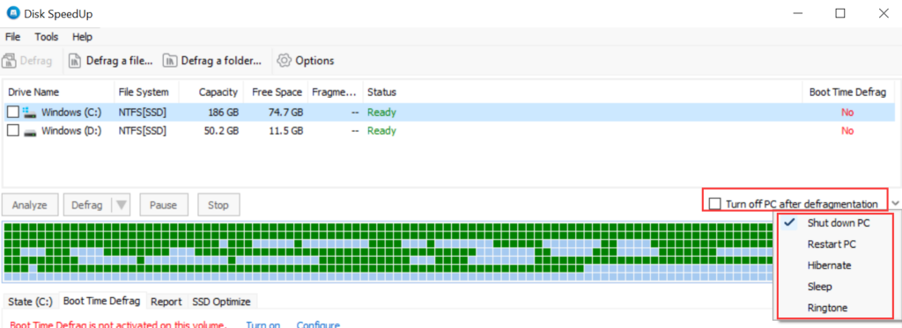

**7\. Integration with Windows Explorer Context Menu:**

Disk Defrag offers integration with the Windows Explorer Context Menu. To enable this feature, open Glary Utilities, go to "Menu," select "Settings," click on "Context Menu," and check the "Disk Defrag with Glary Utilities" option. Finally, click "OK" at the bottom of the page.

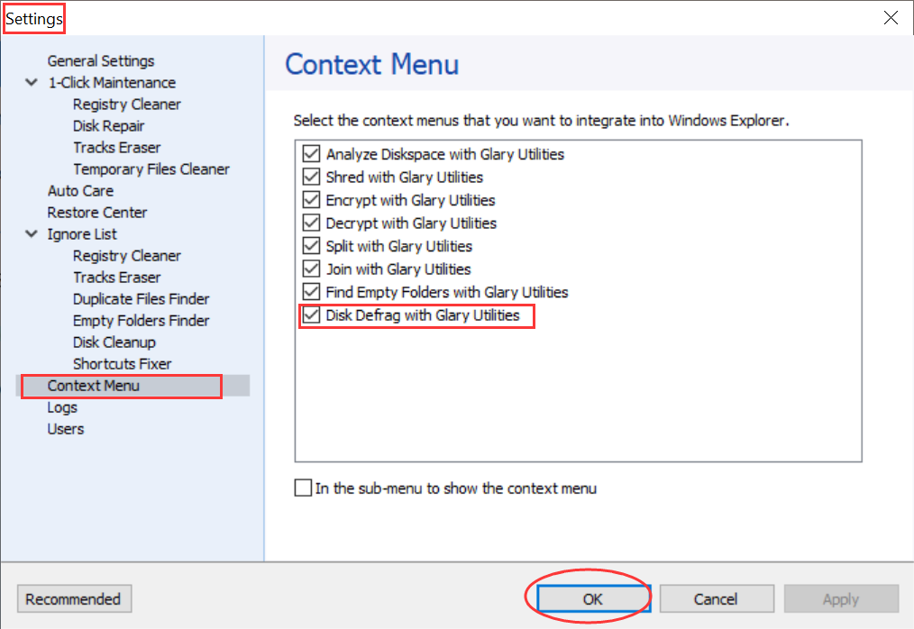

  
**Note:** You can also configure options such as Auto Defrag, Auto Start-up with the operating system, and optimize defrag file size categories from the "Options" menu.

However, please note that if all the drives are solid-state drives, the automatic defrag options will be disabled. **Defragging may reduce the lifespan of solid-state drives (SSDs), so it is not recommended to defrag SSDs.**
