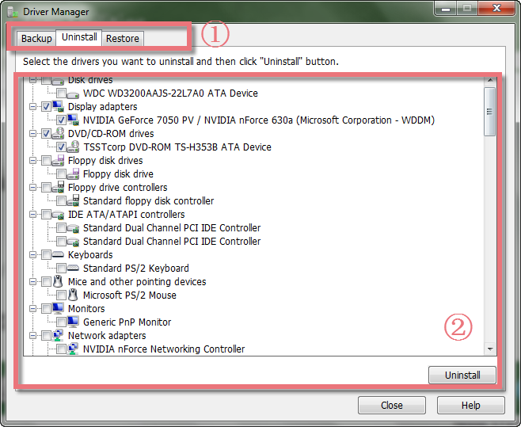
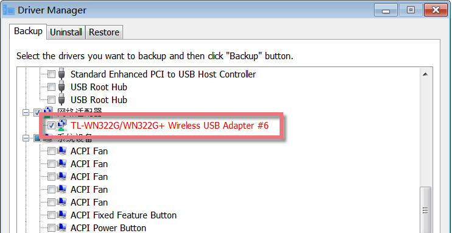
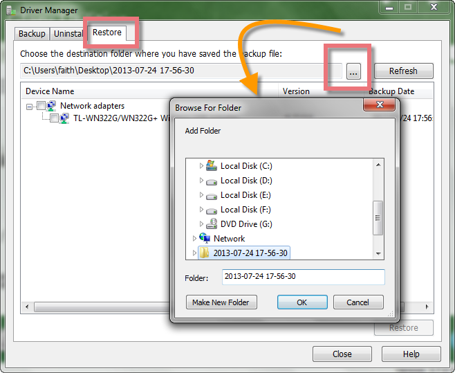
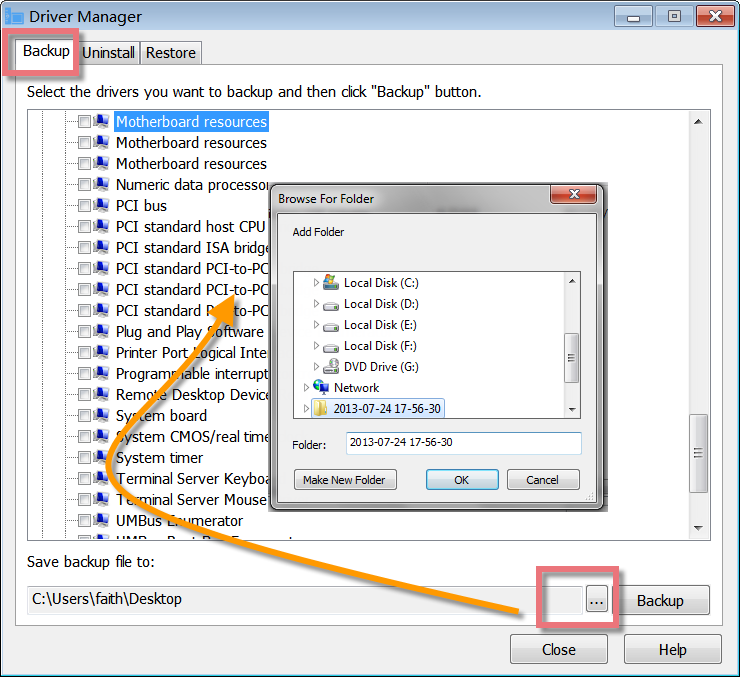

Driver Manager is the easiest tool to back up and restore your device drivers. If the latest updated drivers do not match the requirement, you can use "uninstall" to remove them. It is extremely useful, especially when you're about to reformat or re-install Windows.

**Interface Overview**

**1\. The First Line Buttons:** quick access button to "Backup", "Uninstall" or "Restore" functions.

**2\. The Big Box:** displays a laundry list of device drivers with a little information on the driver name, icon, type, and so on under the "Backup" and "Uninstall" tabs.

**Red Entries under the "Backup" tab**

Click the "Backup" tab, you may see some entries in red color under the parent entry. The red entries in Driver Manager are non-Microsoft drivers. So you’d better backup the red entries in case you lost them accidentally.

**Protect against device driver problems**

Driver Manager allows you to access thousands of device drivers for your computer. It provides a complete backup option to copy data about the drivers that have been downloaded to the media devices through a simple wizard. The backup function helps to keep a copy of your original Windows drivers in case of any hardware or software error, or the latest updated drivers do not match the requirement that you can easily roll back to previous versions. This protects your system against any unforeseen device driver problems and offers you peace of mind during each driver update.

**Uninstall device drivers with Driver Manager**

Driver Manager not only helps you back up your PC with all drivers but is also a great time-saving software for you to uninstall your useless device drivers. Its unique user-friendly interface and vast database make it the ultimate solution for getting your computer stable.

Click the "Uninstall" button in the first line, and all device drivers will display in the box below. It is easier to select the top parent, and automatically its sub-items are check marked. Or choose the sub-items, and then click the "Uninstall" button at the bottom right-hand corner. To make sure you want to uninstall the useless device drivers, click "YES".

**Restore PCs to Initial State**

Driver Manager can restore data from a backup system for the existing drivers for the latest updated drivers do not work on the requirement. Click the "Restore" button in the first line, choose the destination folder where you have saved the backup file in a pop-up window, and then click the "Restore" button at the bottom right-hand corner. To ensure you want to restore PCs to their initial state, click "YES".

**Save Backup Files to User-Defined Folders**

To minimize data loss, Driver Manager provides users with the function to save backup files according to the user-defined location. Once you have created backup files, you can save the backup files to any folder you like. Therefore, you can easily find the backup files where you saved them.
