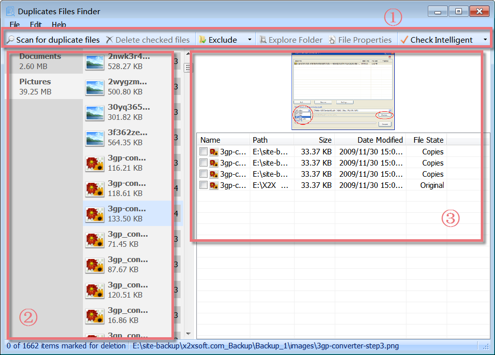
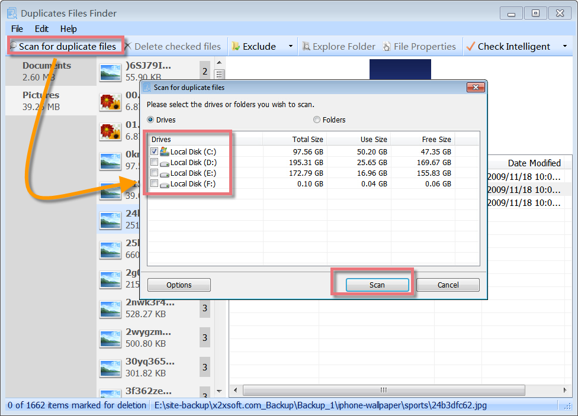
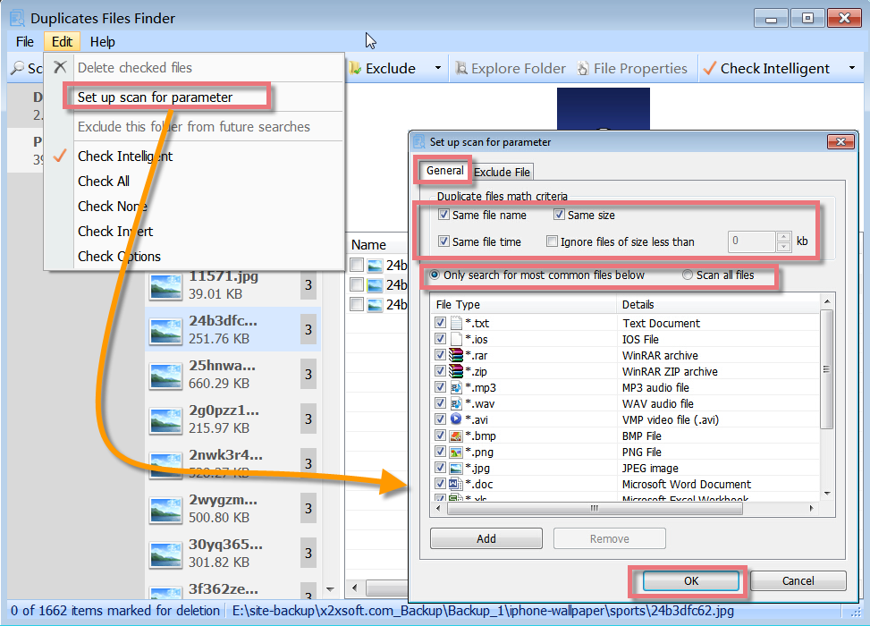
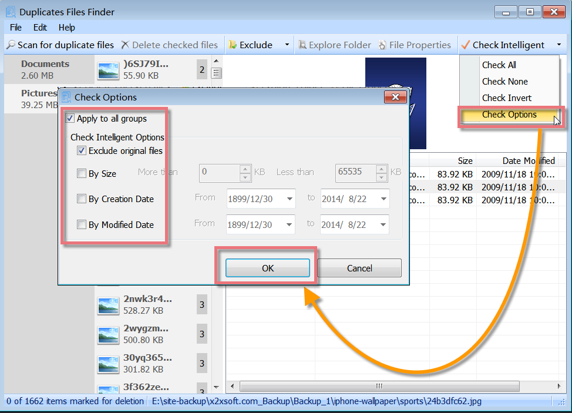
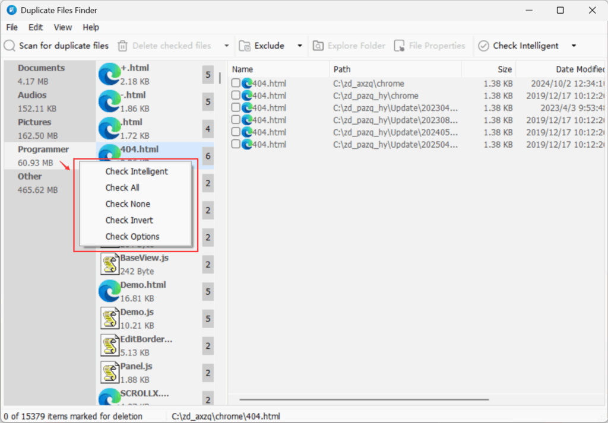
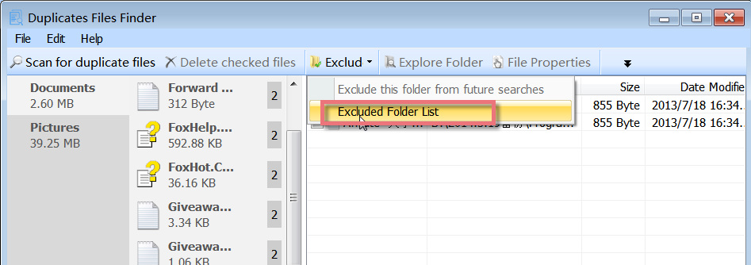
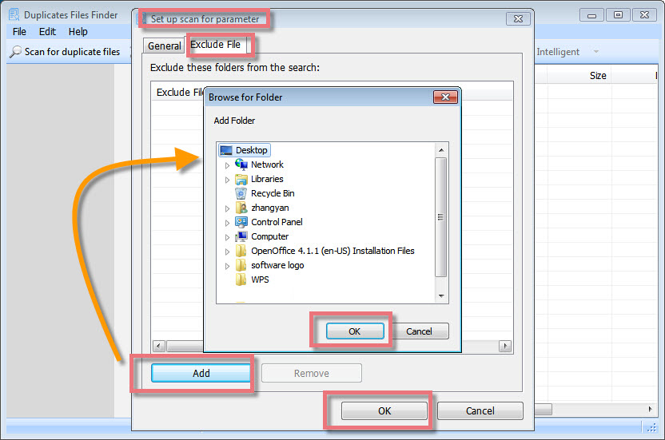

Glary Utilities 'Duplicate Files Finder' is a powerful search engine that can easily locate and remove duplicates of the same file before they cause system instability. It will deep scan all types of files - photos, music, films, video, Word documents, PowerPoint presentations, and text files. Removal of duplicate files from your system will organize your data and will increase your system speed as it has now to scan lesser files.

**Interface Overview**

**1.The Second Line Button:** quick access button to "scan for duplicate files" on the fixed drive, "delete checked files", "exclude this folder from future searches" or "check intelligent" on the duplicate file.

**2.Left-hand Box:** click the file type on the left side to narrow down the results of the search on the duplicate files. If you click on a file type, a long list of related files with some information is shown, such as their name, and size.

**3.Right-hand Box:** you can preview the picture from the upper box, and some detailed information is shown on a selected file on the below box, such as the file name, the path, size, the date modified, and its file state.

**Select the Drives or Folder to Scan**

Duplicate Files Finder can scan all parts of a drive, searching for a large number of duplicate files. It offers a quick and effective way to find the same files from local disks or folders and will show you a list of duplicate files on the drive. Just click "Scan for duplicate files" choose the drive or the folder you want to scan, and then click on the "Scan" button, all kinds of duplicate files will be shown at once.

**Set up Scan for Parameter**

Duplicate Files Finder allows you to set up a scan for parameters. You can click "Edit" -> "Set up scan for parameter", and a new box will pop up. Here you can select duplicate files to match criteria and select to scan all files or only scan for those file types that are in the type list. It supports custom matching conditions by file type, name, size, and date of creation to find your duplicate search. Photos, music, Word documents, videos - you name it. If it appears twice on your system, then Duplicate Files Finder will find it. Duplicate Files Finder can deeply scan for all types of files, takes only one or two clicks, and send them to the recycle bin with your permission.

**Check more than one Duplicate File Group with Check Intelligent**

To save you much time on checking duplicate files, Duplicate Files Finder offers a powerful feature that can check more than one duplicate file group at a time. Just click "Check Intelligent". It can help to check all the duplicate files at once. You can also set up the check intelligent options, including excluding original files, size, creation date, or modified date. If you want to check all duplicate files, check none, check invert or schedule the check options, click an inverted black triangle symbol beside "Check Intelligent".

You can also access these same options by clicking the **“Edit”** menu in the top toolbar, or by **right-clicking on the file type tree** in the **left pane** of the results section. This gives you flexible and efficient control when handling a large number of duplicate files.

**How to use Duplicate Files Finder**

- Click 'Scan for duplicate files' to start the Scanning wizard.

- Select the drives/folders on the hard disk you want to scan by checking the appropriate drives. Then click 'Next' to proceed further.

- Select duplicate files to match criteria and select to scan all files or only scan for those file types that are in the type list. Then click 'Next' to proceed further.

- If you would like to exclude a folder not currently displayed within the Excluded Folder list, you may do so in the following manner.

Click the 'Add Folder' button.

You'll be presented with a box allowing you to browse your drives for the specific folder location you would like to add. Select this folder You can also use wildcards (\* and ? ).

Click 'Ok'

- Click the 'Next' button and wait for the process to complete. This might take some time.

- All the duplicate file groups will be listed. From each group, keep the original copy and checkmark the duplicate copy by viewing the properties/viewing the file by opening it with its associated program. Click 'Delete checked files' to remove all the check-marked files. By default, all deleted files are sent to the recycle bin.
