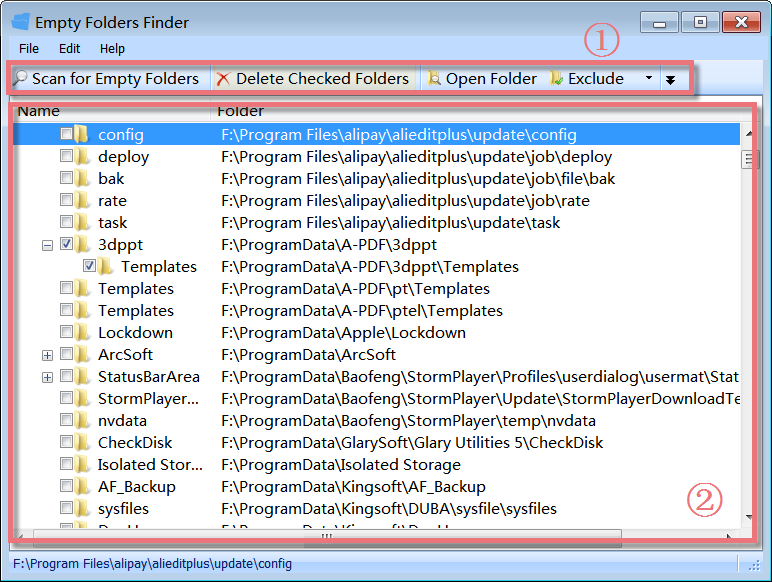
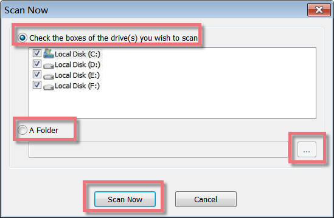
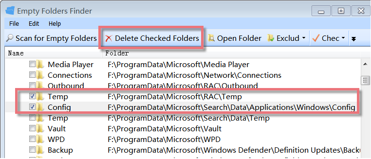
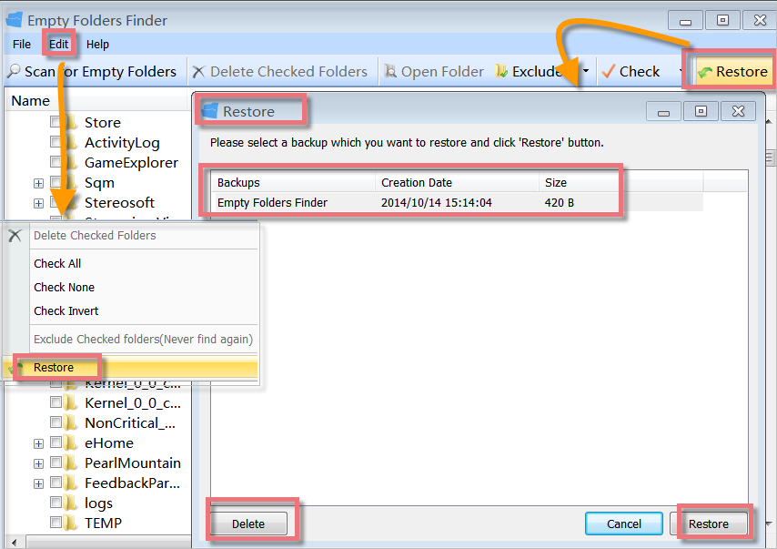
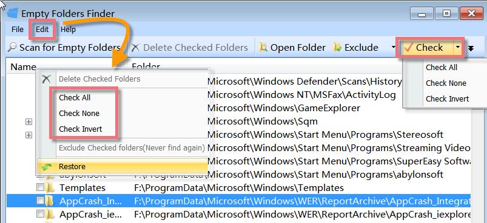
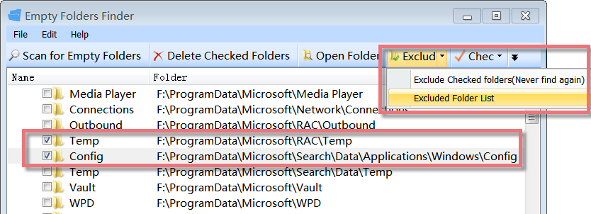

Glary Utilities 'Empty Folders Finder' is a freeware tool that finds empty folders quickly, allows you to open the folder for a preview of its contents, and allows you to delete those folders to the Recycle Bin.

**Interface Overview**

**1.The Second Line Button:** quick access button to **Scan for Empty Folders**, **Delete Checked Folders**, Open Folder,s and add the selected folders to **Exclude folder list**.

**2.The Large Box:** displays the empty folders with the name and full path of the folder.

**Select all Drives or Folders to Scan**

Empty Folders Finder can scan all parts of a disk for empty folders. It offers a quick and effective way to scan the files from local disks or folders and will show you a list of files on the drive. Just click "Scan for Empty Folders" and a box will pop up, which allows you to choose all drives or individual drives or a folder you want to scan, and then click on the "Scan Now" button and all empty folders will be shown at once.

**Delete Checked Empty Folder to Recycle Bin**

After scanning the local drives, you can see how many empty folders occupy your hard disk. If those empty folders are system folders, you needn't remove them. Our recommendation is not to remove it. If the empty folders were created by yourself for storing files and then you haven't put any files in them, then you'd better remove them. Just mark the box before the empty folders you want to delete, and click "Delete Checked Folders" to remove the empty folders from your disk.

**Restore Deleted Empty Folders**

Empty Folders Finder can auto-backup the empty folders that you have deleted. If you have deleted some empty system folders, you can use the "Restore" feature to recover them. You can quickly restore deleted empty folders with Empty Folders Finder. First, find "Restore" from the "Edit" menu on the first line button or click the "Restore" button from the second line button, and then you need to choose the backups you want to restore, finally, click "Restore" in the lower right corner.

**Menu Check more than one Empty Folders Group**

Empty Folders Finder offers a great feature that can check more than one empty folder group at a time to save you much time on checking empty folders. Just click "Check". It can help to check all the empty folders at once. If you want to check all folders, check none, or invert, click an inverted black triangle symbol beside "Check" or click the "Edit" menu on the first line button.

**How to use Empty Folders Finder**

1\. Click 'Scan for empty folders'. Select the drives you want to scan by checking the appropriate drives.

2\. Click the 'Scan Now' button and wait for the process to complete. You can cancel the scanning process by pressing the Cancel Button.

3\. From the list of empty folders, you can select those you want to delete by checking them. You can also ignore the folder while scanning by clicking 'Exclude this folder(Never find again)' from the Edit menu or on the Second Line Button. Select the folders and right-click on them to see a context menu. The various options given are self-explanatory.

4\. Click 'Delete checked folders' to send all selected empty folders to the Recycle Bin.
