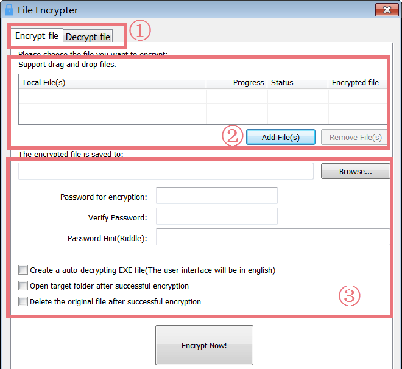
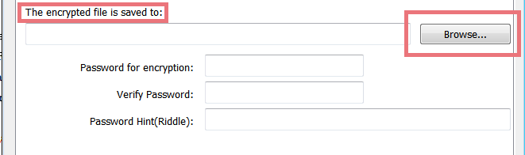
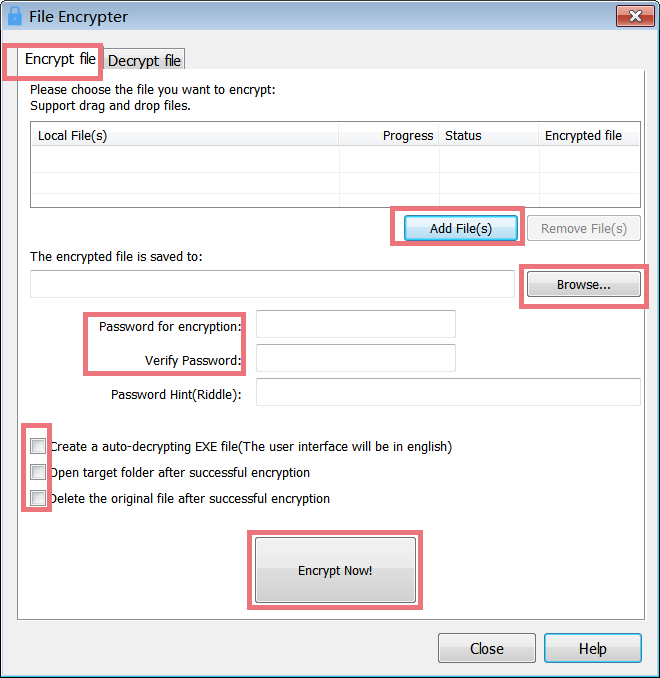
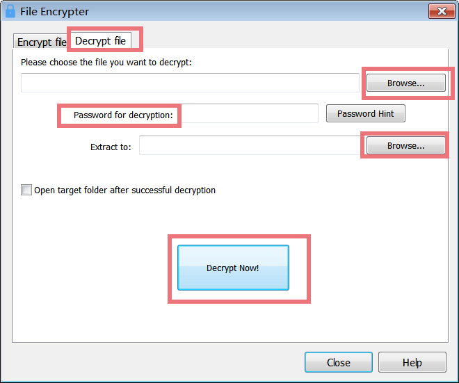

File Encrypter and Decrypter is a powerful professional encryption tool with an easy-to-use interface. It provides the safest way to store your information or sensitive data and protect them against malicious or unintended intrusions.

**Interface Overview**

**1\. The First Line Buttons:** quick access button to the "Encrypt file" or "Decrypt file" function.

**2\. The Upper Box:** allows you to add files you want to encrypt, and you can drag and drop files here.

**3\. The Lower Box:** allows you to save a batch of encrypted files to defined folders, create a password, password hint (in case you forget your password), and choose options whether you want to create an auto-decrypting EXE file, open target folder or delete the original file after successful encryption.

**Encrypt kinds of File Types Using Blowfish Algorithm**

The program encrypts files using the Blowfish algorithm, which is extremely secure if you use a good password (longer passwords are more secure). Any file can be encrypted, including pictures, PDF files, text files, Word documents, or executable applications. This module also allows for the creation of self-extracting encrypted files, then you need not have a copy of Glary Utilities installed to decrypt the files.

**Batch Encrypt files**

File Encrypter is a specially-designed utility used to encrypt files to protect them from unwanted access. File Encrypter supports batch encrypt files. If you have lots of files that need to encrypt, batch encrypts files can help to save much time. To batch encrypt files, you do not need to individually encrypt each item in the folder. All you need to do is to find the files you want to encrypt, click"Add File(s)" or drag and drop files in the blank field.

**Save Encrypted Files to User-Defined Folders**

To easily find the batch of encrypted files and minimize data loss, File Encrypter provides users with the function to save encrypted files according to the user-defined location. Once you have created encrypted files, you can save the encrypted files to any folder you like. Therefore, you can easily find the files where you saved them.

**To encrypt files**

1. First, select the files you want to encrypt using the **Add File(s)** button or drag and drop files in the blank field.

3. Select the destination folder where you want to place the encrypted file using the **Browse...** button.

5. Now you have to choose a password. The password must be between 6 and 16 characters long. **Note:** The password is case case-sensitive. There is no way to decrypt the file without the password, so please note it in a safe place!

7. Decide if you want to delete the original file or create a self-decrypting EXE file.

9. Click on the **Encrypt Now!** Button.

**To decrypt files**

If you created a self-decrypting Exe file, launch the exe file and decrypt it.

1. First, select the file you want to decrypt using the **Browse...** button.

3. Then enter the same password that you used to encrypt it**.  Note:** The password is case case-sensitive.

5. Select the destination folder where you want to place the decrypted file using the **Browse...** button.

7. Click on the **Decrypt Now!** button.
