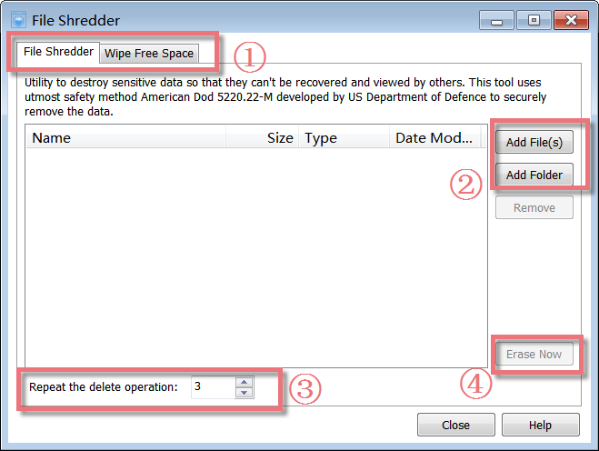
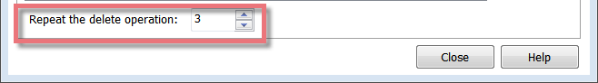
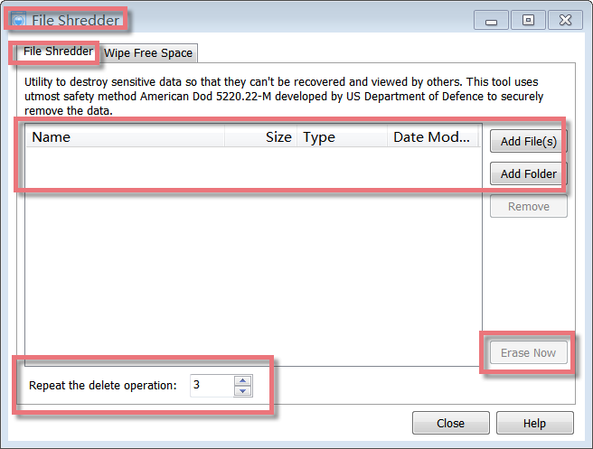
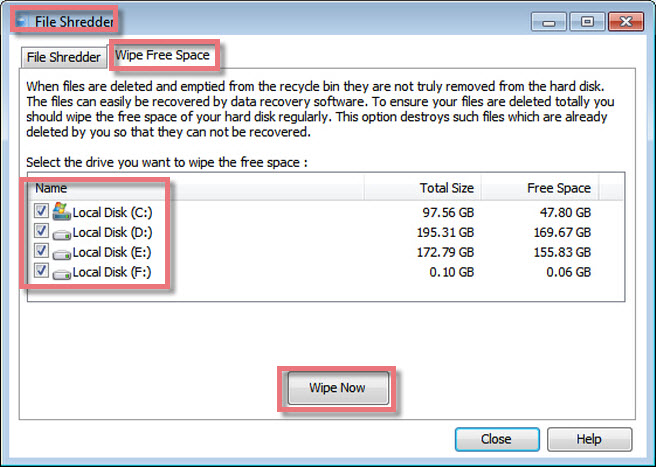

File Shredder is a powerful program that keeps the Privacy and Security of your system intact. It deletes the data in such a manner that no tool can recover it. It uses the utmost safety method American DoD 5220.22-M developed by the US Department of Defense, to securely remove the data.

**Interface Overview**

**1\. The First Line Buttons:** quick access button to "File Shredder" or "Wipe Free Space" function.

**2\. The Upper Box:** allows you to add files or folders you want to shred.  
  
3\. The Lower Field: allows you to schedule the number of times the files are marked to delete, and this is set to 3 by default.  
  
4\. "Erase Now" Button: After adding the files and folders to the delete list, click 'Erase Now' to permanently delete them.

**Set the Number of Times to Delete Files**

You can specify the number of times the files marked to delete are over-written with junk data before deletion. The range of passes is from 1 to 10. By default, this is set to 3. The security of the deletion can be increased further by increasing the number of repetitions, but the time required will also increase.

**How to Shred Files**

When you delete a file in Windows, it will probably be moved to the Recycle Bin. Anybody can get a file back out of the Recycle Bin. For this reason, many users empty the Recycle Bin regularly or delete their files without moving them to the Recycle Bin.

But you should know that Windows does not destroy a file when deletes it. Its entire contents are still located on the hard drive. Windows marks the file as "deleted" in the file system, and the disk space occupied by the file can be used to store other data. But as long as nothing is saved in the area occupied by the deleted file, this "lost" file can be found and recovered easily through inexpensive and easily available data recovery utilities. These tools make your data unsafe, as any unauthorized person can recover the deleted data and use it. Here File Shredder can help you solve this issue.

- To start the tool, click 'File Shredder' from the Glary Utilities main window.

- Click the 'Add File(s)' button to find and insert the files from your hard drive. You can also add folders by clicking the 'Add Folder' button.

- After adding the files and folders to the delete list, click 'Erase Now' to permanently delete them.

**How to Wipe Free Space**

When you delete or empty a file, Windows removes the reference to that file but doesn't remove the actual data that made up the file from your hard disk. Over time, this data will be overwritten as Windows writes new files to that disk area. However, the files can be easily recovered by data recovery software. Given the right recovery program, someone could reconstruct all or parts of the files that you've deleted. For privacy and security reasons, you can set it to wipe the free areas of your hard drive so that deleted files can never be recovered.

**Please Note:** Wipe free space can take a substantial amount of time.

- To start the tool, click 'Wipe free space' on the Advanced Tools page from Glary Utilities.

- Select the drive you want to wipe the free space.

- After marking the drives, click 'Wipe Now' to permanently delete them.
