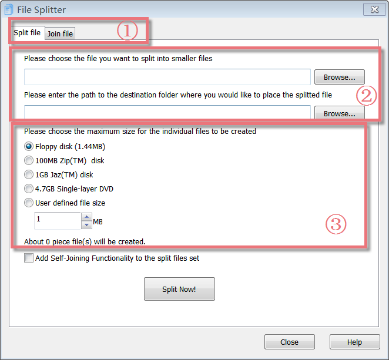
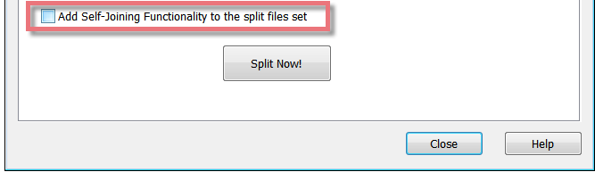
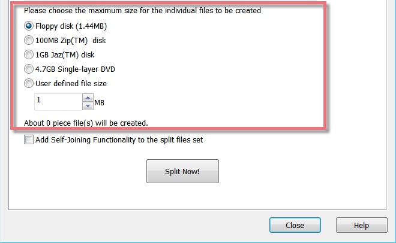
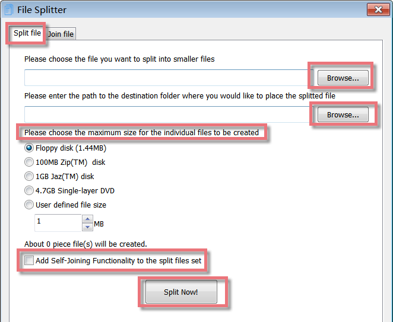
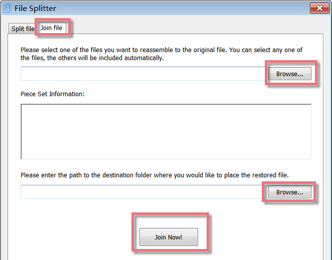

File Splitter and Joiner lets you split your large files (like Zip archives, multimedia, song, music, movie, backup, and archive document files...) into a set of smaller files called pieces and later combine the pieces to form the original file, even without this software. These pieces are easier to copy to distribute over the Internet, networks, or through E-mail; share with friends or colleagues; archive to CD, DVD, USB flash keys, Zip, and other storage supports.

**Interface Overview**

**1.The First Line Buttons:** quick access button to the "Split file" or "Join file" function.

**2.The Upper Box:** allows you to add a file that you want to split and choose the destination folder where you would like to place the split file.

**3.The Lower Box:** allows you to choose the file size for the single parts from the proposal list or enter a user-defined file size using the arrows in the User-defined file size field.

**Add Self-Joining Functionality to the split files set**

File Splitter and Joiner lets you add Self-Joining functionality to your pieces. When File Splitter and Joiner split your file into pieces, it can make a Self-Joining program (true Windows executable file). This small program can join the piece files together to restore the original file. If you want to rejoin the pieces later without this software, please mark the checkbox for "Add Self-Joining Functionality to the split files set".

**Select the Maximum sizes for the single parts**

You can choose the maximum size for the single parts from the proposal list, including Floppy disk(1.44MB), 100MB Zip(TM) disk, 1GB Jaz(TM) disk, and 4.7GB Single-layer DVD. Or you can enter a user-defined file size using the arrows in the User-defined file size field. As soon as the file size is selected, it will tell you how many pieces of files will be created.

**To split a file:**

1\. First you select the file you want to split by using the **Browse...** button.

2.Select the destination folder where you want to place the split files using the **Browse...** button.

3.Please select the file size for the individual parts either from the proposal list or enter a user defined file size using the arrows in the User-defined file size field.

4.If you want to rejoin the pieces later without this software, please mark the checkbox for "Add Self-Joining Functionality to the split files set".

5.Click on the **Split Now!** button.

6.The module will now generate the single parts. This will not delete the original file. The new files will be stored in the destination folder you selected.

The first part will get the extension ".00001.gfs"; the second one ".00002.gfs" and so on.

If you mark the checkbox for "Add Self-Joining Functionality to the split files set", The first part will get the extension ".00001.exe"; the second one ".00002.gfs" and so on.

7.Clicking on **OK** in the confirmation dialog brings you back to the start screen of File Splitter and Joiner.

**To re-join a set of split files**

Please copy the split files to the same folder. If you added Self-Joining Functionality to the split files set, launch "your file name.00001.exe", select a destination folder where you want to place the restored file, and click the "Join Now" button. If you did not create Self-joining pieces, please follow the steps below.

1.Please select any one of the piece files by using the **Browse...** button. Once you have selected one part, the module displays the information about the original file and the number of pieces.

2.Select the destination folder where you want to place the restored files using the **Browse...** button.

3.Click on the **Join Now!** button.

4.The module will now rejoin all pieces into one single file. The new file will be stored in the destination folder you selected.

5\. Clicking on **OK** in the confirmation dialog brings you back to the start screen of File Splitter and Joiner.
