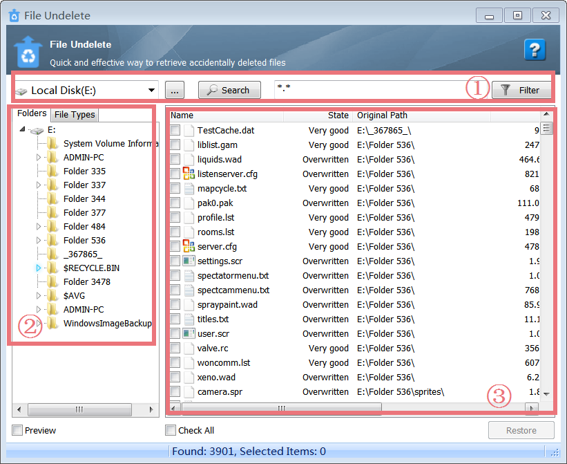
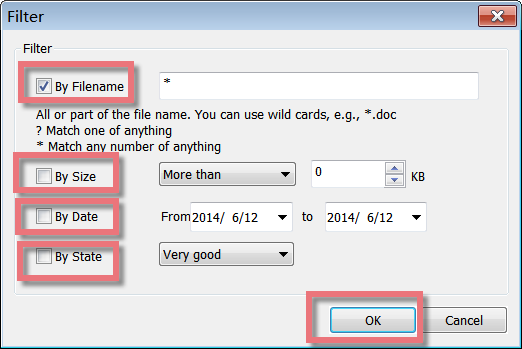

File Undelete is a free and easy-to-use yet powerful file recovery solution that can get back data emptied from the Recycle Bin and even recover files that have been deleted by bugs, crashes, and viruses for FAT and NTFS file systems!

**Interface Overview**

**1\. The First Line Buttons:** allow you to search the original disk or folders that the deleted files were on and schedule Filter to quickly retrieve the needed files.

**2\. The Left-hand Side Lower Box:** click "Folders" or "File Types" to easily find the files you need to restore.

**3\. The Right-hand Side Lower Box:** All the deleted files with some information on their state, size, original path, and type are displayed here.

**Recover Files from Local Disks or External Devices**

File Undelete can scan all parts of a drive, looking for many of your deleted files. It offers a quick and effective way to recover files from local disks or external devices and will show you a laundry list of deleted files that have been recovered on the drive. To retrieve accidentally deleted files, you can choose the original disk or folders, click "Search", and finally, all deleted files will find out.

**Get Back Files Removed from Recycle Bin**

Even if you have deleted files from Recycle Bin, you can easily get files back with File Undelete. Choose the original disk that the deleted files were on when they were deleted, click "Search", and all lost files will be listed soon. Click "File Types", and you will see kinds of types listed in a wide range of formats, such as JPG, FLV, RMV, MPGA, and so on. Choose the right image file format, and then the related image files will be displayed on the right panel.

**File Filter Makes Data Recovery More Efficiently**

The File Filter function improves the efficiency of data recovery a great deal. Using the File Filter function, you can narrow the list by file size, deleted date, and file state. After all the deleted files are listed, enter "\*asd" to filter the results you already have found, or you can set the filter items to reduce the size of unnecessary files by Filename, Size, Date, and State. Remember to click "Ok", "Filter" will help you display more accurate deleted files.  
  
**Display Clear State for File Recovery**

When searching for a "Deleted File", File Undelete reads the Microsoft Windows File Allocation Table (FAT) or Master File Table (MFT) to determine if the space used by the deleted file before its deletion is now being occupied by other active files. To give you an estimate of the probability of success of restoring the deleted files after a quick scanning, File Undelete classifies the recovery state as "Very Good", "Good", "Medium", "Overwritten" and "Poor". Please note that if the recovery state is "overwritten", the files can not be recovered.

**Save Recovered Files to User-Defined Folders**

To minimize data loss, File Undelete allows users to save recovered files according to the user-defined location. Once you have restored the files, you can save the recovered files to any folder you like. Therefore, you can easily find the restored files where you saved them.
