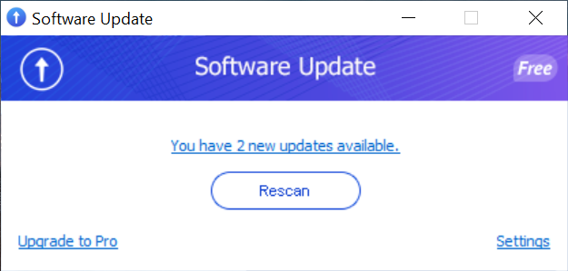
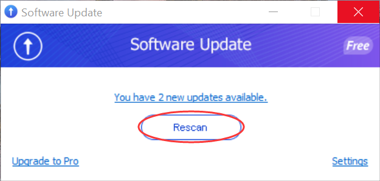
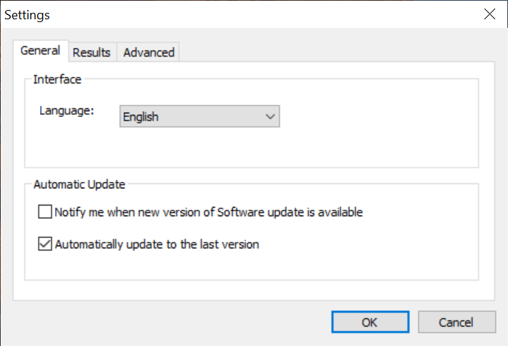
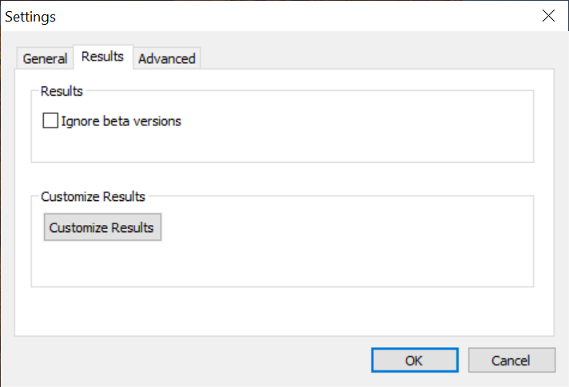
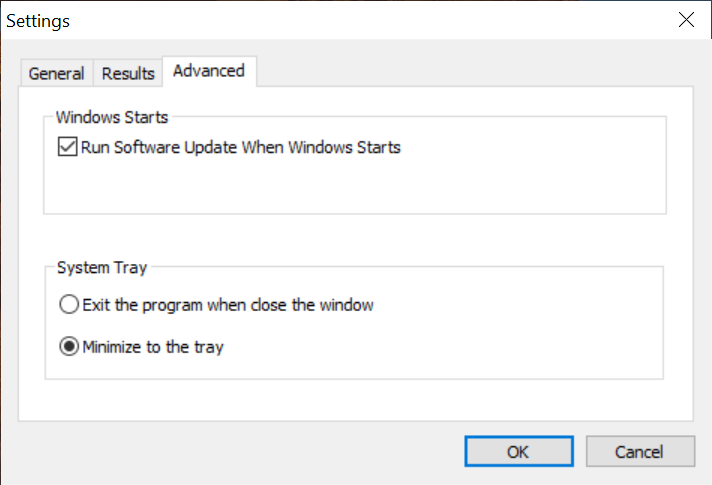

Glarysoft Software Update is a free and user-friendly tool that automates software updates on your system, guaranteeing you have the latest and most stable versions at all times. With this convenient tool, you can effortlessly enable or disable beta software scanning and receive timely notifications for available updates from our extensive software library. Our software conducts thorough security scans, ensuring the safety and reliability of the updates while safeguarding your personal information.

**How to Use Glarysoft Software Update:**

1\. **Download:**

Download Glarysoft Software Update [here](https://download.glarysoft.com/susetup.exe). Double-click the icon to run the program.

2\. **Scanning for Updates:**

Please click "Scan" to initiate the scanning process and acquire the latest version of the software. Once the scan is complete, the number of available software updates will be displayed.

Simultaneously, the software update details webpage will automatically open. Alternatively, you can click "You have N new updates available" to access the webpage.

3\. **Viewing and Customize Detected Updates:**

The webpage will provide details on the detected updates.

Here, you can review information about pending software updates, download them, and proceed with the installation. Alternatively, click "×" to ignore this version.

You can also click on the top left corner to switch to “Customize Results”. This way, you can choose to “Show all versions”“Ignore this version”, or “Ignore all versions”.

In the top right corner, the “Options” allow you to decide whether to “Show Details” or “Ignore beta versions”.

4\. **Rescanning:**

You can also click "Rescan" to perform a new scan.

5\. **Customizing Settings:**

Click "Settings" to personalize software settings, such as language preferences, whether to ignore beta versions, customize results, and enable/disable startup at boot.

**Note**: For users interested in upgrading to Glarysoft Software Update Pro, please visit [here](https://www.glarysoft.com/software-update/updatetopro/) to purchase the Pro version. After purchasing, you can download the Pro version from [this link](https://download.glarysoft.com/susetupPro.exe). Please note that the installation package for Glarysoft Software Update Pro differs from the free version.

