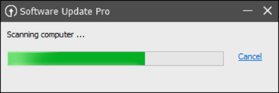
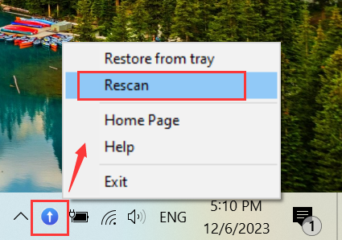
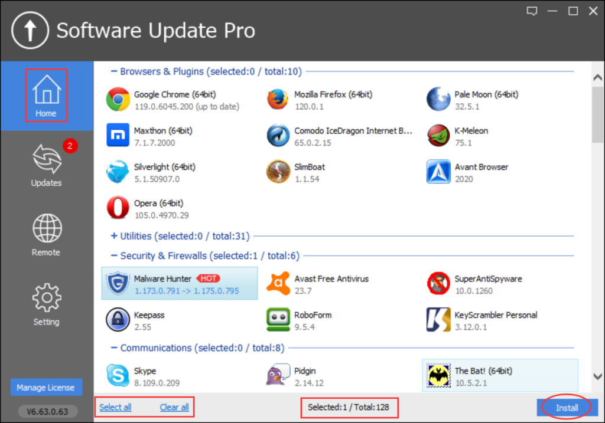
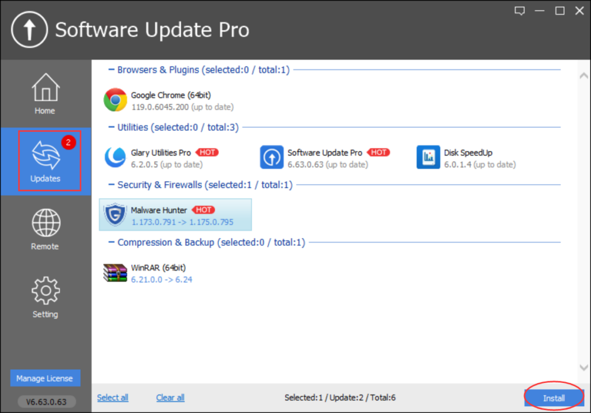
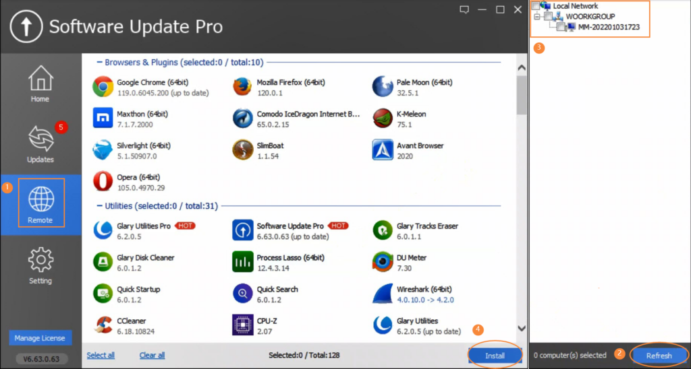
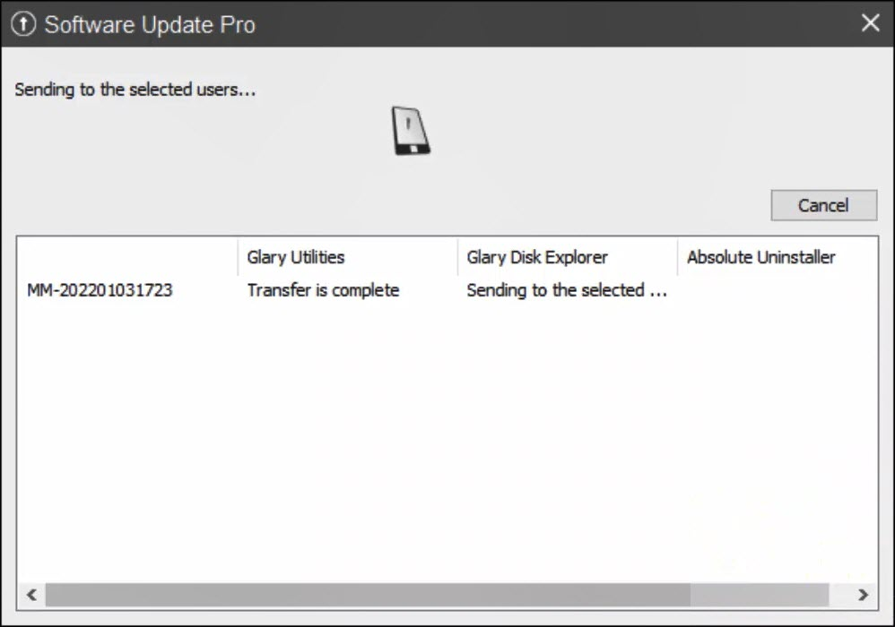
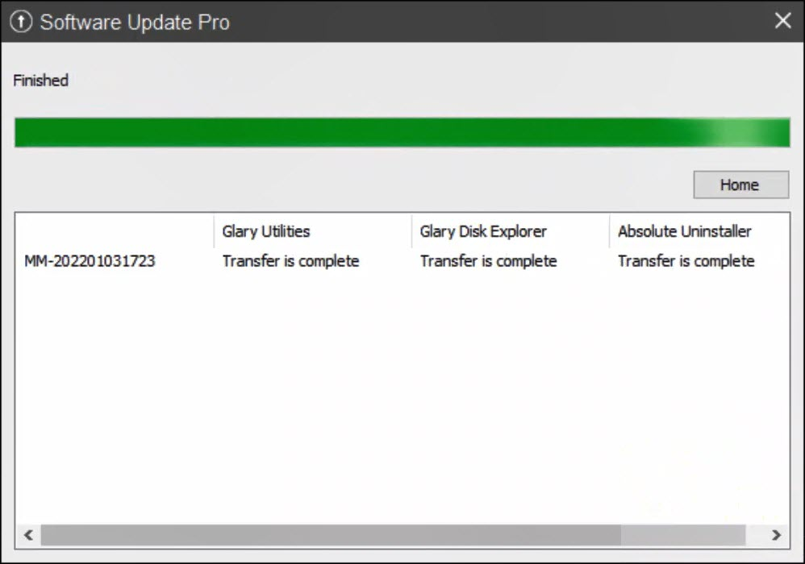
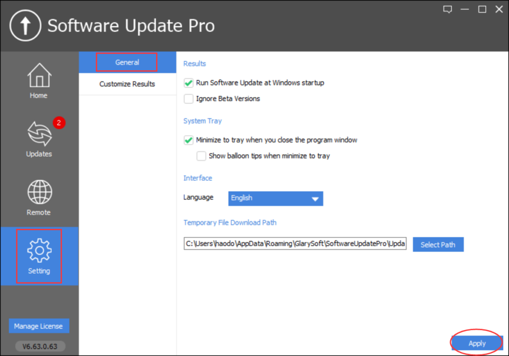
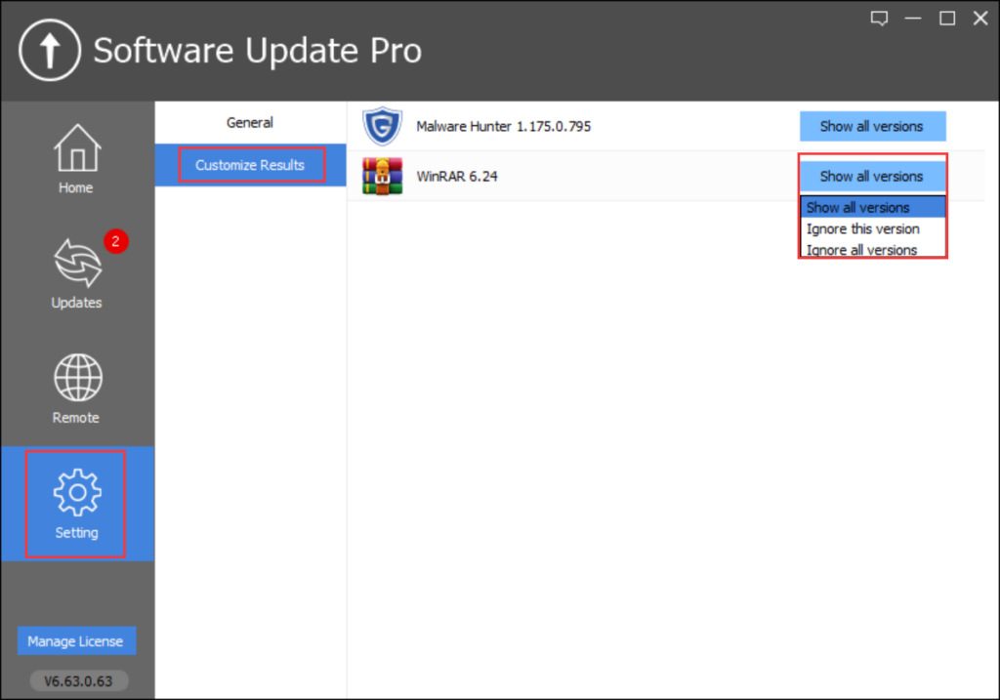
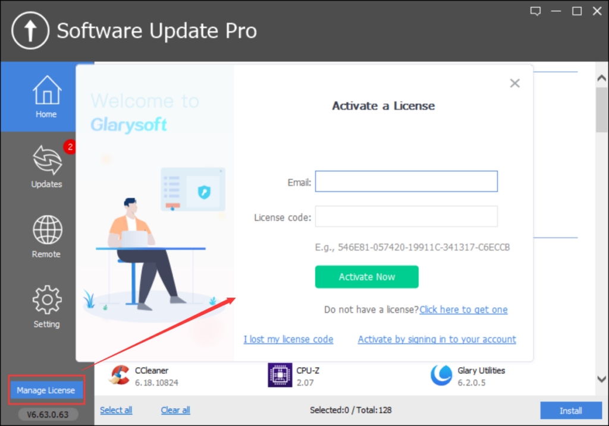

[Glarysoft Software Update Pro](https://www.glarysoft.com/software-update/updatetopro/) is an advanced tool that automates software updates, ensuring you have the latest versions. With its user-friendly client and silent installation capability, it offers a convenient and hassle-free experience. Notably, the Remote Manager feature simplifies software installation and updates on LAN-connected PCs, streamlining software management across multiple devices within your local network.

Glarysoft Software Update Pro prioritizes user convenience by offering a simple method to enable or disable beta software scanning and providing timely update notifications. The software's security scans prioritize the safety and reliability of updates, ensuring the protection of personal information.

**Scan & Rescanning:**

Glarysoft Software Update Pro automatically scans for available software updates every time it starts. If you wish to perform a manual rescan, right-click on the Pro icon in the system tray and select "Rescan."

**Home:**

The Home page displays the software in our library, categorized into various sections such as Browsers & Plugins, Utilities, Security, Communications, Video, Photos, and more. The plus and minus signs in front of each category allow you to expand or collapse the category.

If there are updates available for the software, an arrow indicates the change in version numbers. Software that is already up to date is marked as "up to date" in parentheses.

To install software, simply check or uncheck the desired software and click "Install" in the bottom right corner. The "Select all" or "Clear all" options at the bottom facilitate easy selection of multiple software items.

**Updates:**

In the Updates section, you can view the software already installed on your computer. A red notification count indicates the number of pending software updates. Similar to the Home page, you can check or uncheck software items and click "Install" to initiate the installation process.

**Remote:**

The Remote Manager allows network administrators to remotely manage software installation and updates on multiple LAN PCs. This is particularly useful in scenarios such as internet cafes, schools, and companies. Network administrators can use Software Update Pro on their own computers to manage PCs on the local network, updating and installing software included in Software Update Pro.

Usage Steps:

1\. Install Software Update Pro on each PC.

2\. In the Remote section, click "Refresh" to display the Local Network status. Select the user computers you want to install software on and choose the desired software on the left. Click the "Install" button to begin installing the software on the specified computers within the local network.

3\. Wait for the installation to complete. All software within Software Update Pro can be installed silently, without user intervention, making it convenient and straightforward.

4\. Once the installation is completed, click "Home" to return to the main interface.

**Settings:**

The Settings section allows you to modify General options, such as Language, whether to ignore beta versions, and enable/disable startup at boot. You can also Customize Results, choosing whether to display or ignore software versions.

**Register now / Manage License:**

In the bottom left corner, the "Register now / Manage License" option enables users to register or manage their licenses.

**Note:** For users interested in upgrading to Glarysoft Software Update Pro, please visit [here](https://www.glarysoft.com/software-update/updatetopro/) to purchase the Pro version. After purchasing, you can download the Pro version from [this link](https://download.glarysoft.com/susetupPro.exe). Please note that the installation package for Glarysoft Software Update Pro differs from the free version.
