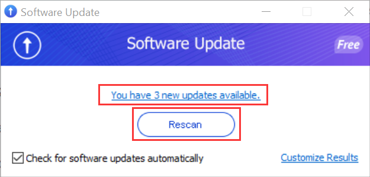
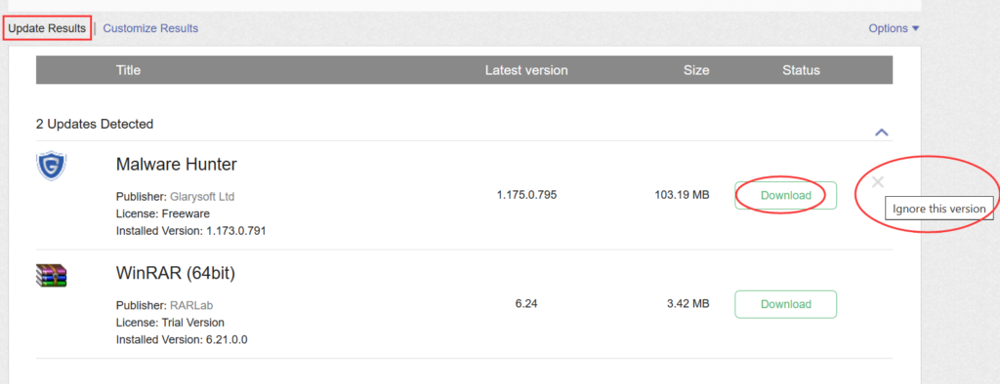
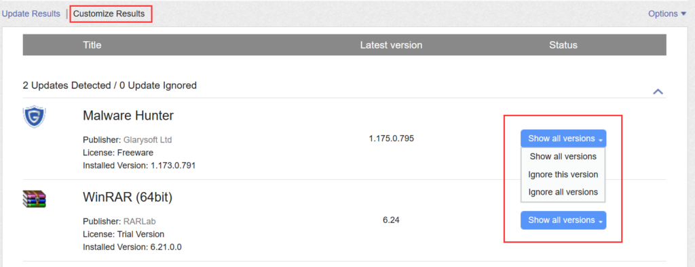
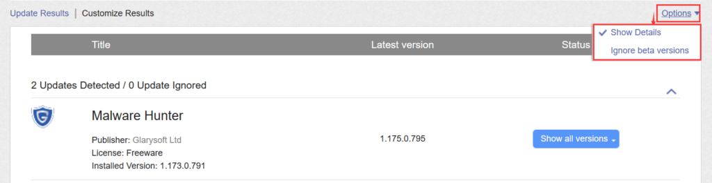
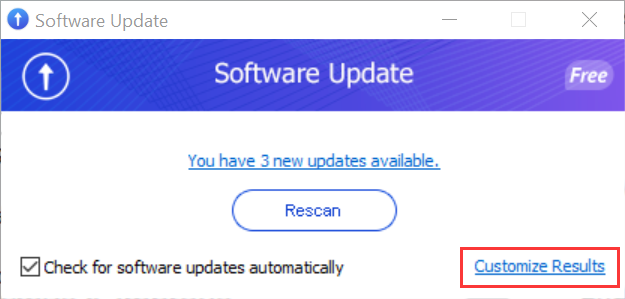
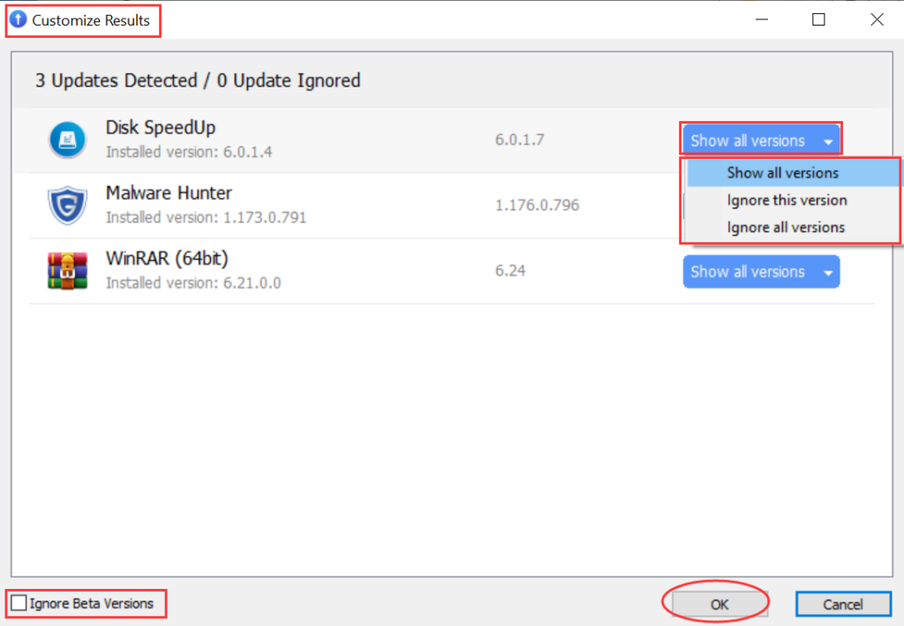
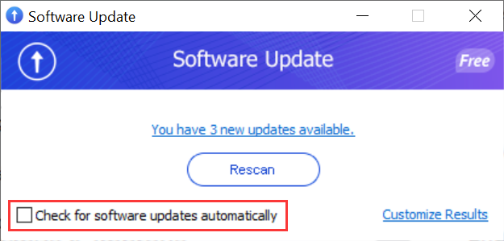

Software Update, an integrated tool within Glary Utilities, ensures that your computer software stays current by providing timely notifications about available updates. This free utility conducts thorough scans of your system, alerting you to any programs that require updating to their latest versions. It conveniently provides direct links for software updates and offers relevant information about each program.

Privacy and Security:  
Software Update exclusively scans the software name and version number, with our server refraining from recording this information or any other personal details. Rest assured that your privacy is safeguarded, and user information remains confidential, with no disclosure to third parties.

**How to Use Software Update:**

1\. Open Glary Utilities and click on the Software Update icon in the toolbar. The top right corner of the icon displays the number of detected pending software updates.

2\. Software Update will display the automatic scan result, indicating the number of new updates available. You can also click "Rescan" to refresh and obtain the latest update information for software installed on your computer.

3\. Clicking “Scan” "Rescan" or the "You have N new updates available" hyperlink will automatically redirect you to the software update details webpage. Here, you can review information about pending software updates, download them, and proceed with the installation. Alternatively, you can click "×" to ignore a particular version.

**Customize Results:**

You can customize your results by clicking on the top left corner to switch to the "Customize Results" view. This allows you to choose whether to "Show all versions," "Ignore this version," or "Ignore all versions."

In the top right corner, the "Options" menu allows you to decide whether to "Show Details" or "Ignore beta versions."

**Customizing Results within the Tool:**

In addition to customization through the webpage, you can access the "Customize Results" option in the bottom right corner of the tool. You can filter and hide beta versions by checking the "Ignore Beta Versions" option in the bottom left corner. The usage is similar to the web version.

**Disabling Automatic Software Update Checks**

To turn off the automatic software update checks, simply uncheck the checkbox located in the bottom left corner.

