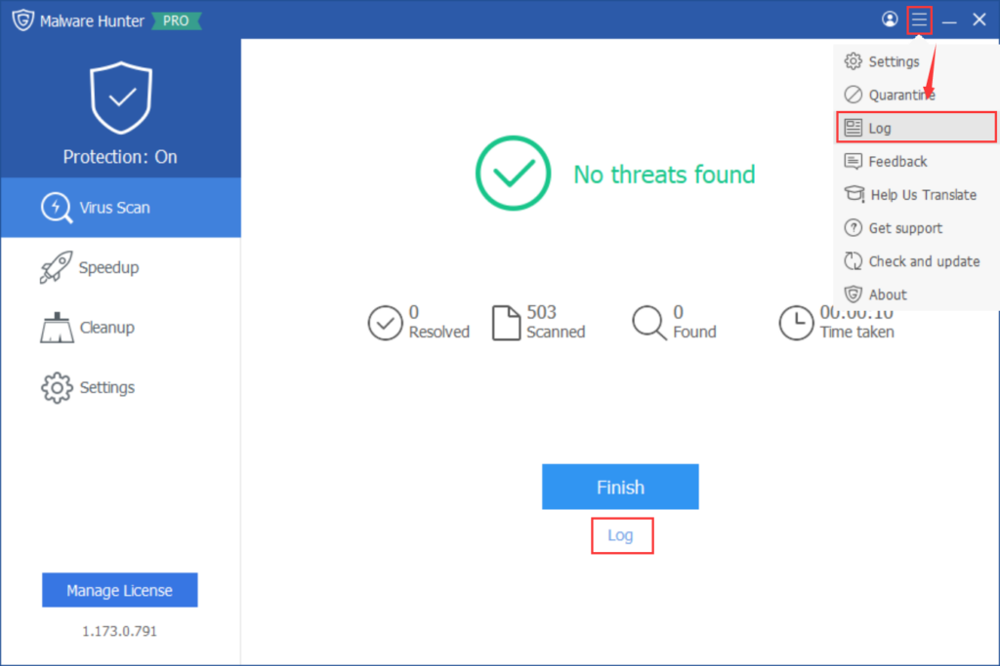
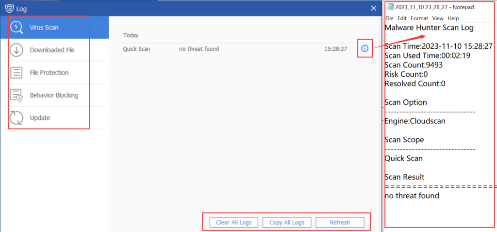

Glarysoft Malware Hunter also offers logs for users to review. After completing a Virus Scan, a Log entry will be available. Alternatively, users can access Log through the "Settings" menu.

In the Log, users can find information about **Virus Scan**, **Downloaded File**, **File Protection**, **Behavior Blocking**, and **Update** activities.

Here, users can examine the details of log files and perform actions such as clearing or copying. In case of any issues, users can copy and send the logs to **support@glarysoft.com** for more professional assistance.
