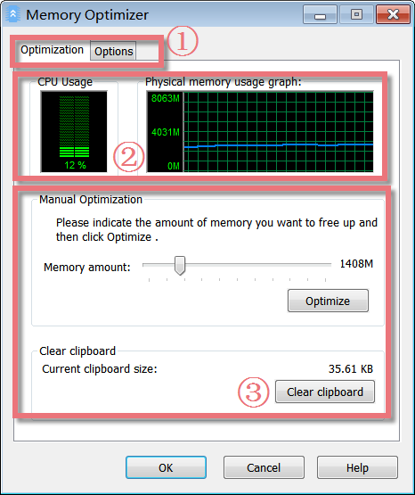
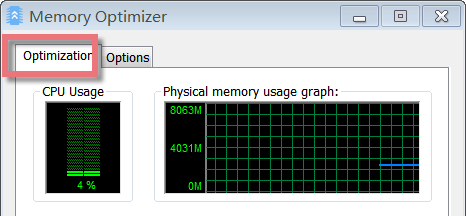
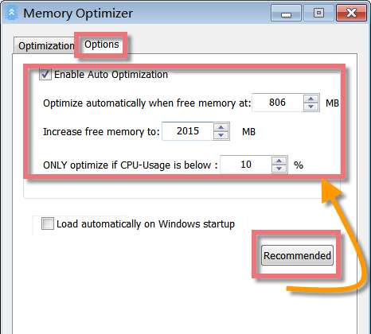
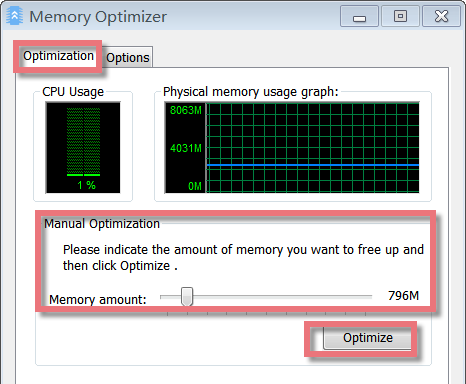
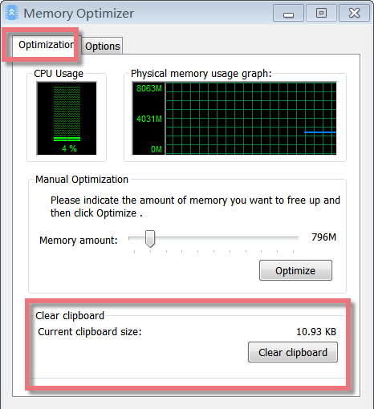
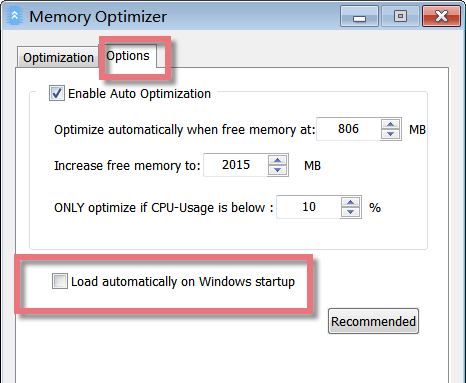

Memory Optimizer’s interface is very simple and neat. It monitors your system in the background and frees up memory whenever needed to increase the performance of your computer. If the available physical memory gets too low, Memory Optimizer causes the system to swap old data to the paging file to free up memory for your applications.

**Interface Overview**

**1\. The First Line Buttons:** quick access button to the "Optimization" or "Options" function.

**2\. The Upper Black Area:** displays the CPU Usage and physical memory usage graph, so you know how much memory you're using and how much free memory you have.

**3\. The Lower Box:** allows you to manually set the amount of memory you want to free up, optimize, and clear the clipboard.

**CPU Usage and Physical Memory Usage Graph**

The values of CPU Usage are displayed by percentages with different colors of lines. A graph recording the activity is present, and the color code functions. Memory information is similar to CPU information in that a graph shows the usage of the physical memory. The color of the lines shown in the memory usage graph also corresponds to the different values in the window. The details displayed here contain a maximum and minimum value of memory usage.

**How to Enable Auto Optimization**

- Under the "Options" tab, checkmark "Enable Auto Optimization". If you do not wish to have your memory usage optimized automatically, you can disable this function here.

- Under "Optimize automatically when free memory at", you can specify the free memory level that triggers automatic optimization. This can for example, be set at 50 MB. Under "Increase free memory to", you can specify how much memory you want to free up.

- If you wish to restore the module to the recommended settings, click **Recommended**.

**Manual Optimization**

- If you do not use Auto Optimization, or if you want to free up memory before you start a program that requires a lot of memory, you can go to Manual Optimization.

- Under "Manual Optimization", you can use the slider to specify how much memory should be improved. Click "Optimize" to free the specified amount of memory. The module will then remove unneeded DLLs and other files from physical memory, which may require a few seconds.

**Easy to Clear Clipboard**

Under **Clipboard**, the module shows the current amount of memory occupied by the data in your clipboard. Click **Clear Clipboard** to free up the memory used by this data.

**Recommended Value**

For manual optimization, you can make the appropriate optimization under the "Optimization" tab. This tab allows you to set the amount of memory to be optimized when pressing the Optimize button in the middle part of the window. There is also a recommended value by the software which analyzes the amount of memory available on your system and sets an appropriate value under the "Options" tab.

**Auto Start Memory Optimizer on Windows Logon**

Click the "Options" tab, and find "Load automatically on Windows startup". If you want to start Memory Optimizer on Windows logon, you can checkup the box before "Load automatically on Windows startup".
