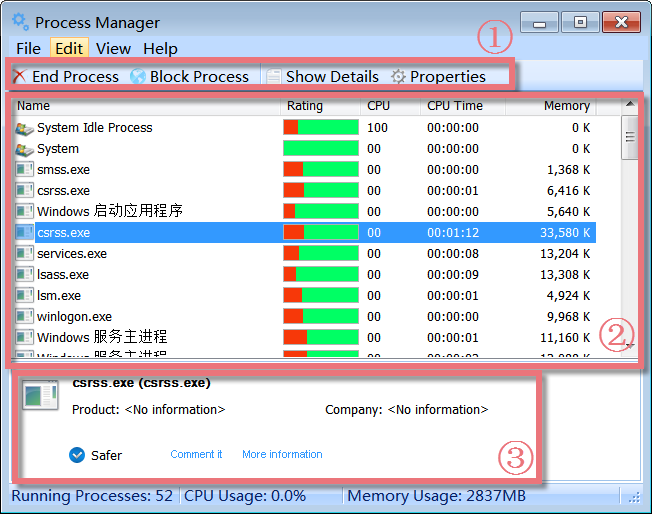
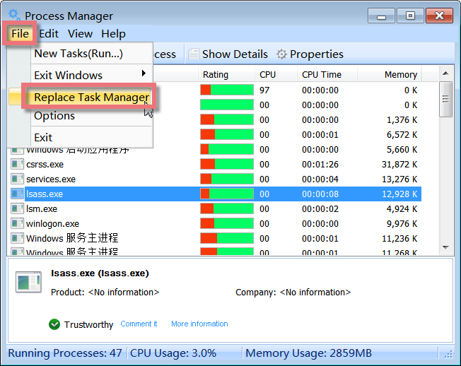
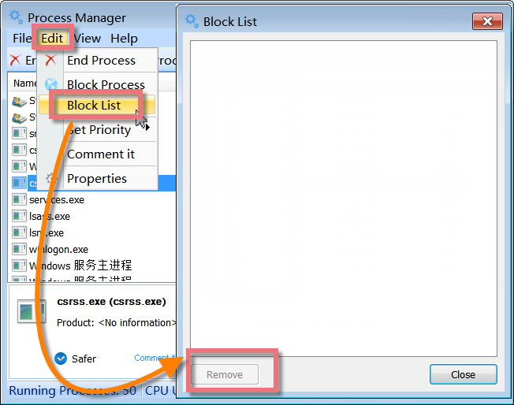
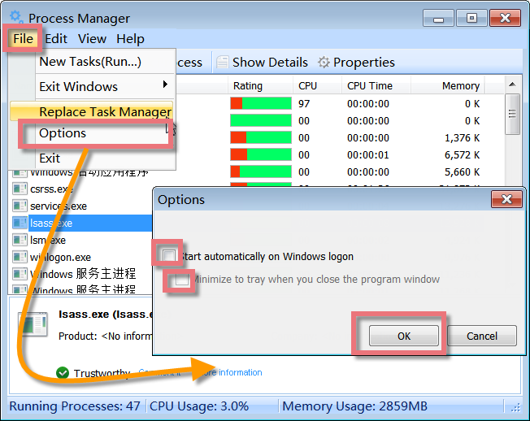
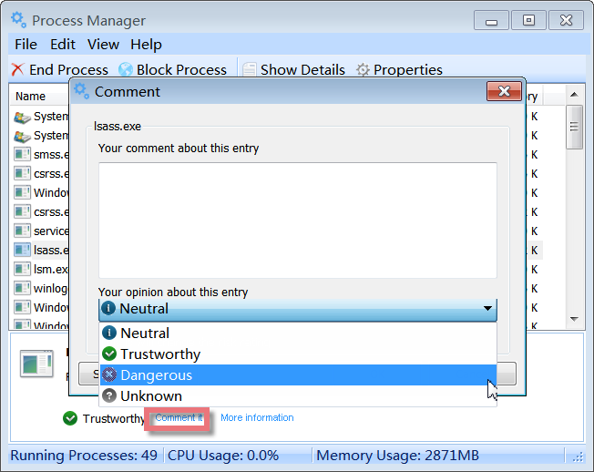

Process Manager is an enhanced yet easy-to-use task manager that provides advanced information about programs and processes running on the computer and offers a unique security risk rating for determining whether the running process should be terminated or removed.

**Interface Overview**

**1\. The Second Line Button:** quick access button to end/block or show more details on the selected running process.

**2\. Upper box:** displays all running processes with their logo, file name, security risk rating, CPU time, and memory usage.

**3\. Lower box:** shows detailed information on a selected running process, such as process name, product it belongs to, company that produced this process, and whether it is _Trustworthy_ or _Safer_ or _Neutral_ or _Dangerous_ or _Unknown_.

**Replace Task Manager**

Process Manager is an enhanced task manager that displays detailed information about programs and processes running on the computer. It shows all the standard information, including file name, description, CPU usage, and a unique security risk rating for determining whether the running process should be terminated or blocked.

Click from the "File" menu and select "Replace Task Manager", Process Manager will integrate itself into your system so that you can access the module by pressing Ctrl+Alt+Del, or by right-clicking on an empty part of the taskbar and selecting Task Manager. If you want to use the Windows Task Manager again, select the same menu item to remove the check mark in front of it.

**Security Rating Bar — Telling you which processes are dangerous**

Process Manager has a unique risk rating which is quite conclusive. It shows a list of the risk rating and allows you to determine whether the process should be terminated or removed. The green/red bars directly indicate the risks and necessity index for each process. The longer the green part is, the safer the running process is. Quite the contrary, the longer the red part is, the more dangerous the running process is. Therefore, you can remove the running process with a red bar and be careful with those with longer red bars. If all this information is not enough for your reference, you can also refer to other users' experiences with a particular process through a click on the interface.

**End/Block a Process**

Click the process you want to end/block, and then click End/Block Process.

Be careful when ending a process. If you end an application, you will lose unsaved data. If you end a system service, some parts of the system might not function properly.

**Unblock Process from Block List**

All the processes blocked will be recorded in the block list, which can be accessed from the "Edit" menu. If you want to unblock a process, please directly remove it from the block list.

**Stop/Start Process Manager on Windows Logon**

Click from the "File" menu and select "Options". If you want to stop/start Process Manager on Windows logon, you can decide whether to checkup the box before "Start automatically on Windows logon" or not.

**Sort the List of Processes**

On the Processes tab, click the column heading you want to sort by. To reverse the sort order, click the column heading a second time. You can sort your running processes by Name, Rating, Priority, CPU, CPU Time, and Memory.

**Comment on a Process or Get Ideas from Experienced Users**

Process Manager collects process comments from all users. You can comment on a process and contribute ideas to help or discuss with other users. Select a process, and click "Comment it" in the details box. You can give your opinions Trustworthy, Neutral or Dangerous, or Unknown, then describe your ideas and click "submit". Your comments will be shared with other users once reviewed. If you encounter an unknown process, you can click "more information" to learn about other users' experiences with this process you don't know.
