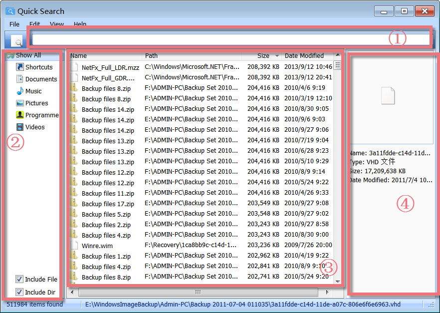
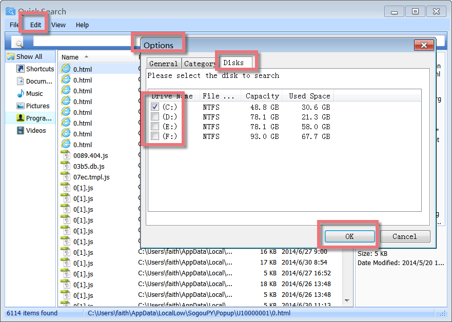
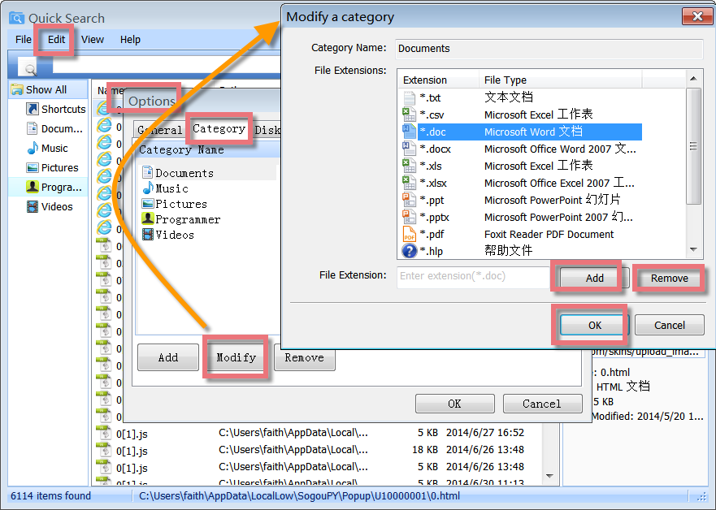
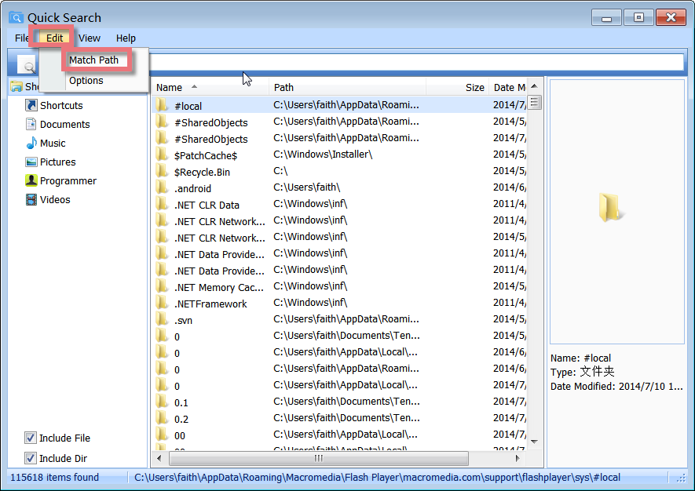
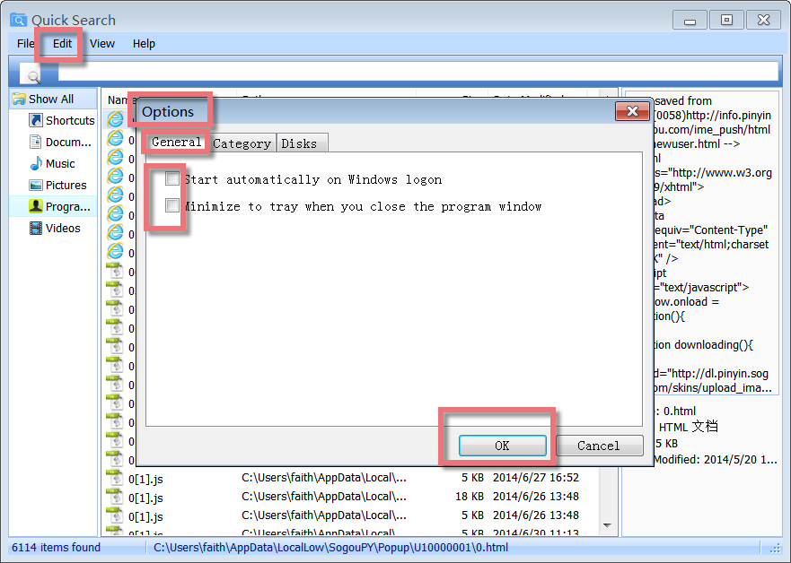

Quick Search is a free local search tool to quickly locate files or folders instantly by keywords. It is a much faster and easy-to-use alternative to Windows Search. It searches initially when you enter key letters and displays real-time search results.

**Interface Overview**

**1\. The Upper Box:** allows you to search the files or folders by entering key letters or words.

**2\. The Left-hand Side Lower Box:** click "shortcuts", "Documents", "Music", "Pictures", "Programme" or "videos" to narrow down the results of the search on the files or folders you need.

**3\. The Middle Lower box:** displays all files and folders with their name, original path, size, and date modified.

**4\. The Right-hand Side Lower Box:** shows detailed information on a selected file, such as file name, type, size, file icon, and date modified.

**Real-time Searching**

Quick Search offers a search filter to limit the search range and narrow down the search results for higher working efficiency. Type the partial file or folder name into the search field, the results will appear instantly.

Using the Search field in the upper part of the main window, you can filter the list of the files by name, path, and type. When you enter some key letters in the Search field right below, you will see the number of related files that match the search criteria in real-time.

**Search for Files from Local Disks or External Devices**

Quick Search can scan all parts of a drive, searching for many of your files. It offers a quick and effective way to find needed files from local disks or external devices and will show you a laundry list of files on the drive. To narrow down the list of files, you can only choose the needed disk to search by clicking "Edit"-> "Options"->"Disks".

**Two ways to Search for a File Type**

To search for a file type, enter the file extension into the search field, ie, to search for the mp4 file type, enter \*.mp4 into the search field. To search for more than one file type, use a | to separate file types, ie, **\*.png|\*.jpg** will search for files with the extension **png** or **jpg**.

The other way to search for a file type is: you can click **Edit**, and then choose **Options**, and find the Category tab. When you click each category, a list of the related extension will display on the right side. It allows you to add, modify or remove file extensions. After you successfully schedule the category, you can click the category on the left part of the main window, and several related files that match the search criteria will appear in real-time on the middle panel.

**Search for Files and Folders in a Specific Location**

To search for files and folders in a specific location, you could enable **Match Path** in the **Edit** menu. When **Match Path** is checked, you can filter the list of files by path and file name. If do not mark **Match Path**, when you type some text in the Search field right below, you will only see the number of files listed by file name.

**Sort the List of Files and Folders**

On the description panel, click the column heading you want to sort by. To reverse the sort order, click the column heading a second time. You can sort the list of files and folders by Name, Path, Size, and Date Modified.

**Auto Start on Windows Logon and Stop running Quick Search when Closing it**

Click from the "Edit" menu and select "Options". A box will pop up. If you want to stop/start Quick Search on Windows logon, you can decide whether to checkup the box before "Start automatically on Windows logon" or not under the "General" tab.

If you want to stop running Quick Search at once after you close the software, please do not checkup the box before "Minimize to tray when you close the program window" under the "General" tab.
