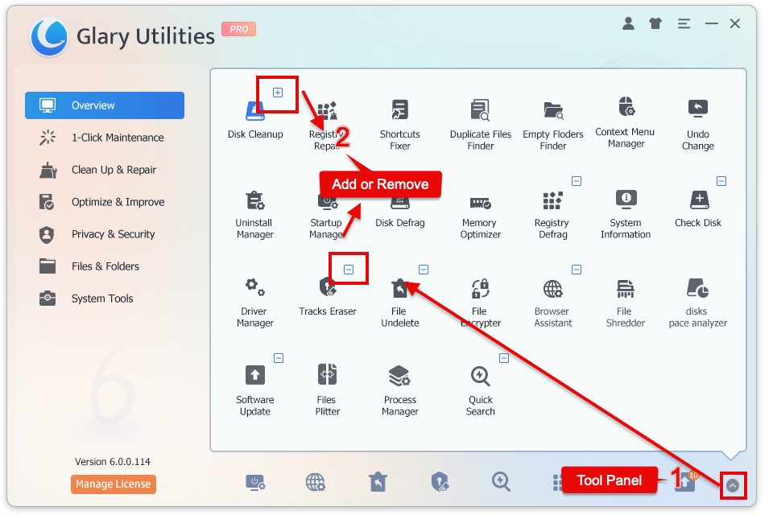

To customize the Quick Toolbar buttons, click the arrow icon in the bottom right corner to access the Tool Panel.

Then, click the “+ or -” in the top right corner of the button to add or remove tool icons.

