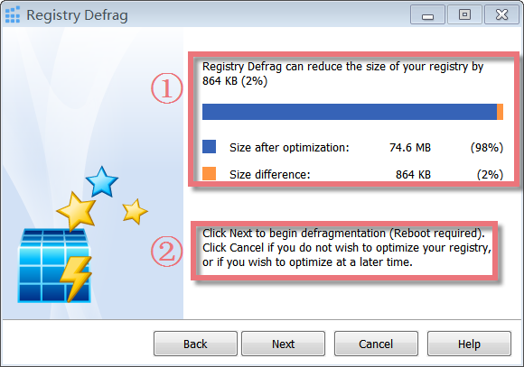
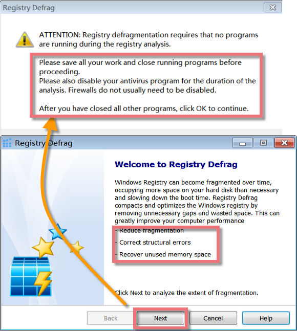
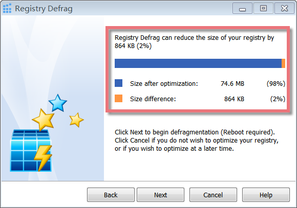
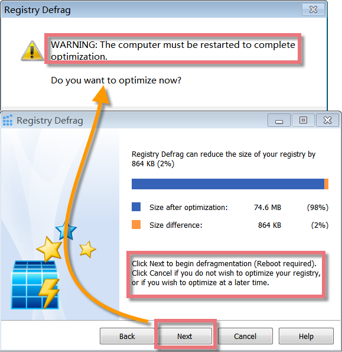

Registry Defrag analyzes the structure of your registry and rebuilds it completely from scratch, thus removing any slack space that may be left from previously modified or deleted keys. The registry is defragmented, and any structural errors are corrected. By defragging your registry, it will create a more linear structure, maximizing application response times and registry access times, saving memory, and enhancing boot-up times. This can greatly improve system performance and avoid system crashes and data loss.

**Interface Overview**

**1\. The Upper Red Square:** shows how much percentage and size of your registry can be reduced by Registry Defrag.

**2\. The Lower Red Square:** tells you what will happen when you click the **Next** and **Cancel** button.

**Why need to Defragment the Registry**  
  
Registry fragmentation is a similar phenomenon to fragmented hard drives. Your Windows registry can become fragmented over time, occupying more space on your hard disk than necessary and decreasing overall performance, especially when many programs are installed and uninstalled. When programs and other components are removed from the system, they can leave behind data inside the registry. After data is deleted from the registry, the space in the file used by that data is kept until it can be re-used by newly added data. If lots of very small bits of data are deleted, the registry can become very bloated with 'holes' where no data will fit. This causes the registry to be larger than necessary, which in turn means it is spread over more hard drive space and hence slower to access.

Registry Defrag can help to analyze the registry and create a new release of it containing the intact data in the correct order. The registry is defragmented, and every structural error is corrected. By defragging the registry, it will rebuild a more linear structure, maximizing program response times and registry access times, saving much memory, and improving boot-up times. This can greatly enhance PC performance and avoid any system freezes and the loss of data.

**Registry Defrag involves the following steps:**

1\. Registry Defrag will check how fragmented your registry is. Before the analysis starts, you will be informed that all other applications must be closed. Click the "Next" button, and you will see a new pop-up window. Please follow these instructions and close all other applications before you continue. You should do so because any changes made to the registry after Registry Defrag has been run are lost after the reboot.

2\. You will be able to view the fragmentation report. If there is potential for optimization, you will be told by how much percent and kilobytes the registry size can be reduced.

3\. Registry will be defragmented and compacted. Click the "Next" button, a new pop-up window will make sure you want to restart the computer to finish optimization. Registry Defrag must restart your computer for this.

