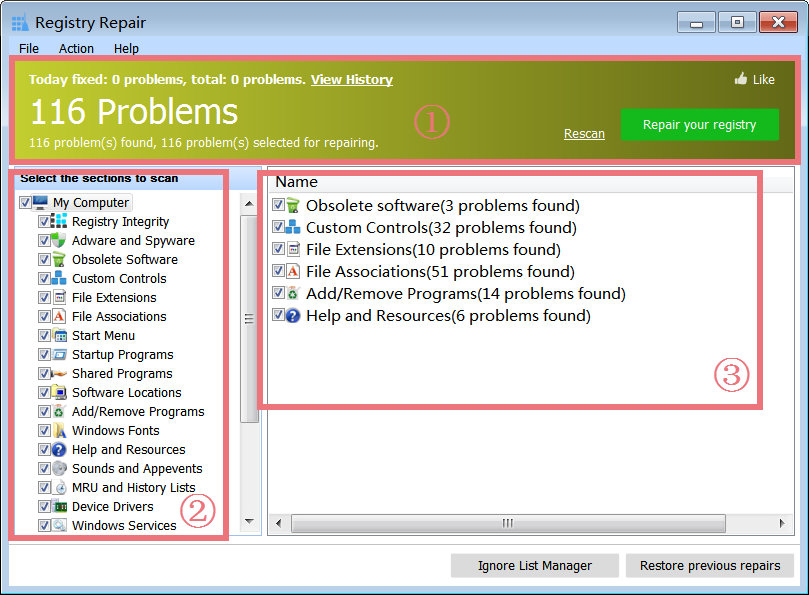
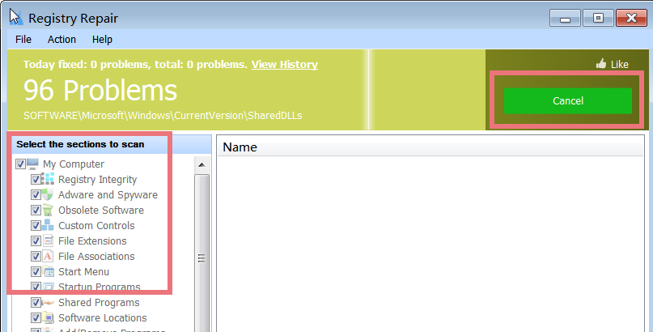
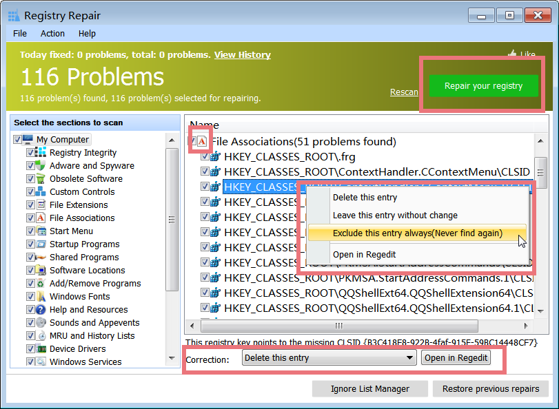
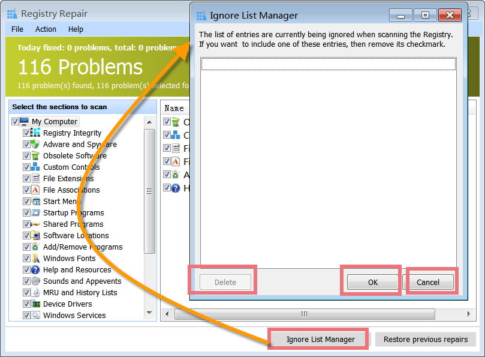
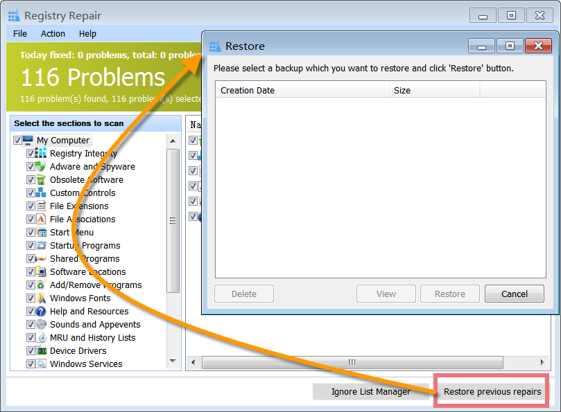
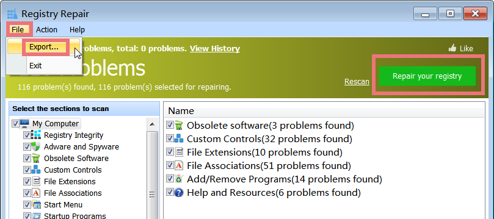

Registry Repair is a powerful registry cleaning tool that performs comprehensive and deep analysis for Windows Registry, scans computers, cleans registry junks, and fixes registry errors on invalid entries or references that can cause computer freezing, system crashes, instability, blue screen, as well as PC slowdowns.

**Interface Overview**

**1\. The Above Yellow Area:** shows the number of problems found and allows you to rescan the registry for problems, as well as repair your registry on invalid entries or references.  
  
**2\. Left-hand Side Button:** allows you to select the needed sections to scan.

**3\. Right-hand Sidebox**: displays the summary of problems found. For the one, you do not want to repair, do not check it. Choose the right one you need to repair, and click "Repair your registry" in the upper box of the main window.

**Select the Sections to Scan Registry for Problems**

Registry Repair scans the entire Windows Registry deeply and provides a comprehensive analysis. It detects all the registry problems caused by an invalid Windows registry, obsolete software entries, and dead file extensions. All you need to do is select the registry sections you want to scan. When you start Register Repair, it will scan the registry for problems. You can cancel the scanning process by pressing the "Cancel" Button. All these steps will be finished within one minute, and the Scan results will be displayed on this page.

**Remove Invalid Registry Entries**

Part of the Windows Registry will become invalid but still accumulate on your system, such as remnants of removed software and orphaned shortcuts to deleted folders. These invalid registry junks slow down computer performance and cause system freezing. Registry Repair scans the Window registry and detects all these invalid registry entries. It does registry cleanup to lighten your Windows registry and speeds up your computer performance at peak. By default, all entries found are marked for deletion since all found entries can be safely removed. If you are an expert, you can select those you want to delete by check-marking them.

**Fix Registry Errors and Exclude an Entry**

Incorrect operations may cause damaged registry entries and therein pop-up PC errors, blue screens, and application failures. Registry Repair scans your computer and lists detected registry errors. You can delete a registry error, leave it without change, or exclude it in future registry cleanup and repairs. To repair registry errors, a click on the "Repair your registry" button is enough. This registry cleaning tool will help you fix all these registry errors to keep your Windows Registry error-free.

**Ignore List Manager**

Registry cleanup and repair may cause instability or incompatibility problems with certain software updates. If you want to exclude an application from the registry cleanup and repair, you can directly add it to the Ignore List. Applications included in Ignore List won't be scanned and changed during future scans when you are running Registry Repair. If the software update becomes more stable on performance, you can just remove it from the Ignore List. Click "Ignore List Manager", find the needed entry, and then delete it.

**Restore Previous Repairs**

Whenever you clean the Registry, a corresponding Undo file is generated for any changes made. It can be used to recreate the deleted entries. Click "Restore previous repairs", select the file to be merged back to the registry and click the Restore button.

**Export as a Text File**

After scanning the registry, you can click "Repair your registry" in the upper part of the main window. During this process, this cleaning tool will do the following: backup the registry and perform an action according to your selection. At the same time, by choosing "File -> Export ...", you can save the list as a text file before repairing it. If you have problems repairing the registry, you can find out the entry from the export log and then exclude it in future registry cleanup and repairs.
