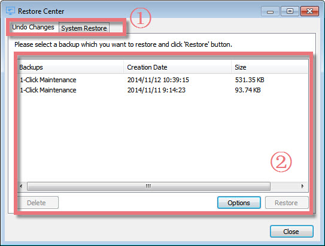
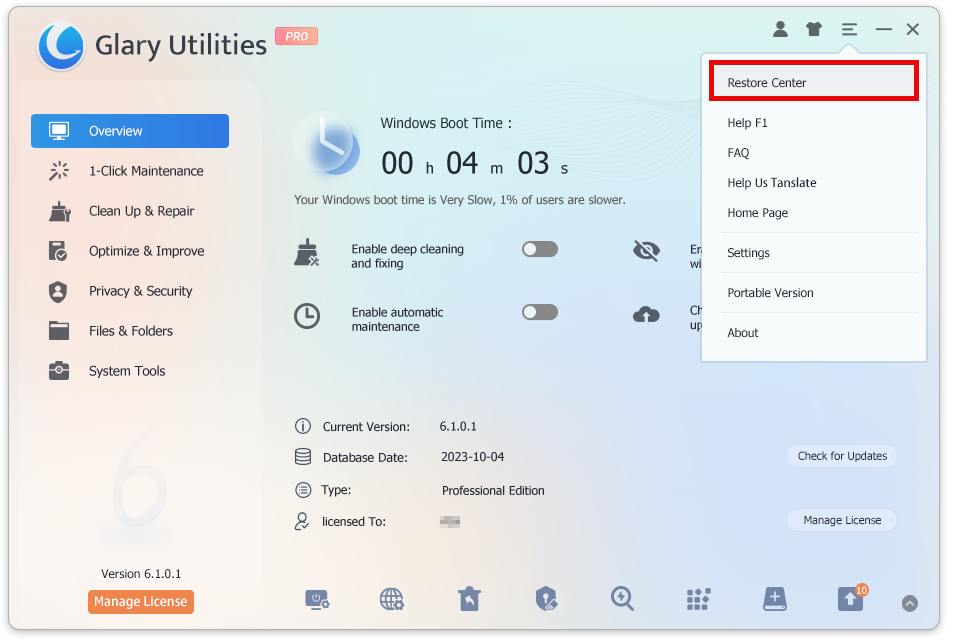
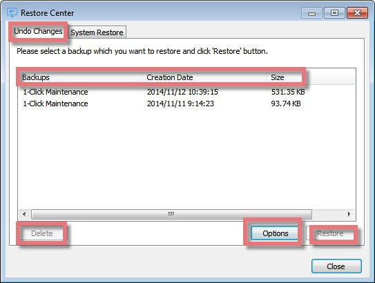
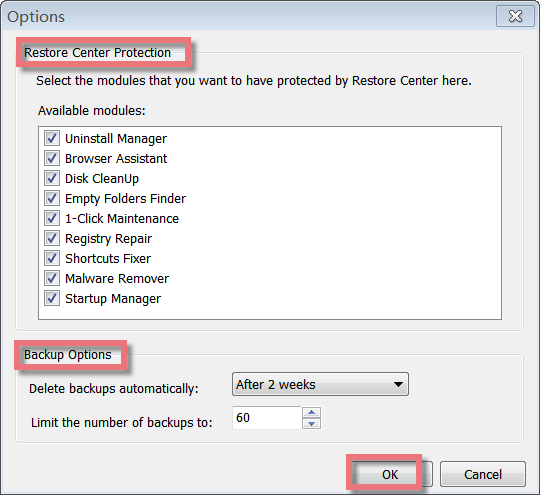
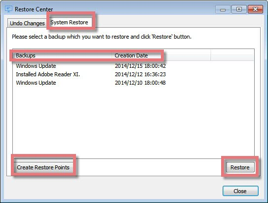

After doing Registry Cleaner and other cleaning operations with Glary Utilities, you could restore them using Restore Center. But make sure you have not deleted the operation record in the restore center before you undo it. Press F1 and search "restore" Glary Utilities will show you more information.

**Interface Overview**

**1\. The First Line Buttons:** quick access button to the "Undo Changes" or "System Restore" function.

**2\. The Larger Box:** allows you to select a backup that you want to restore or completely delete, and you can schedule it by using the **Options** button.

**Where to Start Restore Center**

To find Restore Center, you can open Glary Utilities-> Click the Menu icon on the top right -> Select Restore Center(the first button in Menu). Restore Center will start.

**How to use Undo changes**

Click **Restore** to restore your system to its status before the selected backup. If you wish, you can click **Delete** to remove a backup permanently from the list, provided that you are quite certain that you will not need this backup in the future.

Click **Options** to select the modules that you want to have protected by Restore Center. Here are nine available modules below. You can setup how often to delete backups automatically and limit the number of backups.

**How to use System Restore**

When you add and remove programs and install system updates under Windows XP/Vista, the system creates so-called restore points. These points are also created automatically at regular intervals when no software or updates are installed. If the system is not functioning properly, the system can be rolled back to any of these points, and all changes made since that time are undone except your recent work, such as saved documents, e-mail, history, and favorite lists.

Open Restore Center and go to System Restore to view all restore points. Select an entry in the list and click Restore to return the computer to the state of the selected backup. Or, if you wish to create a new restore point, click Create Restore Point.
