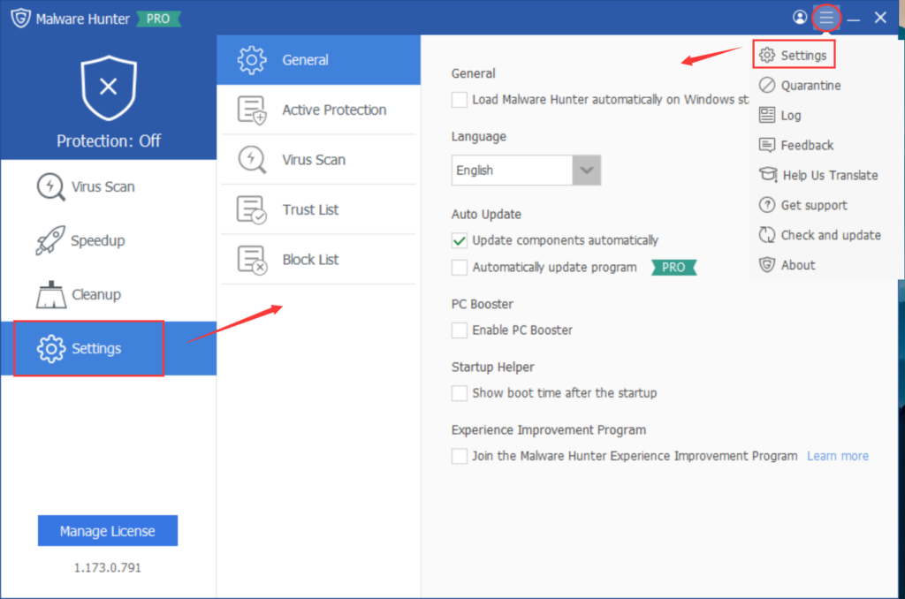

Settings in Glarysoft Malware Hunter enable you to configure essential parameters. You can adjust language preferences and enable PC Booster or automatic update features. Furthermore, you can specify configurations for Active Protection, Virus Scan, and efficiently manage Trust/Block lists. These settings empower you to optimize the performance of Glarysoft Malware Hunter.

