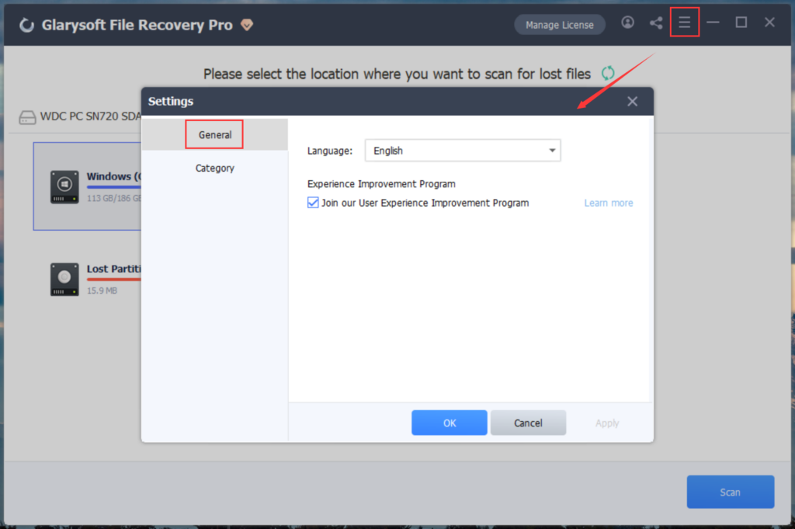
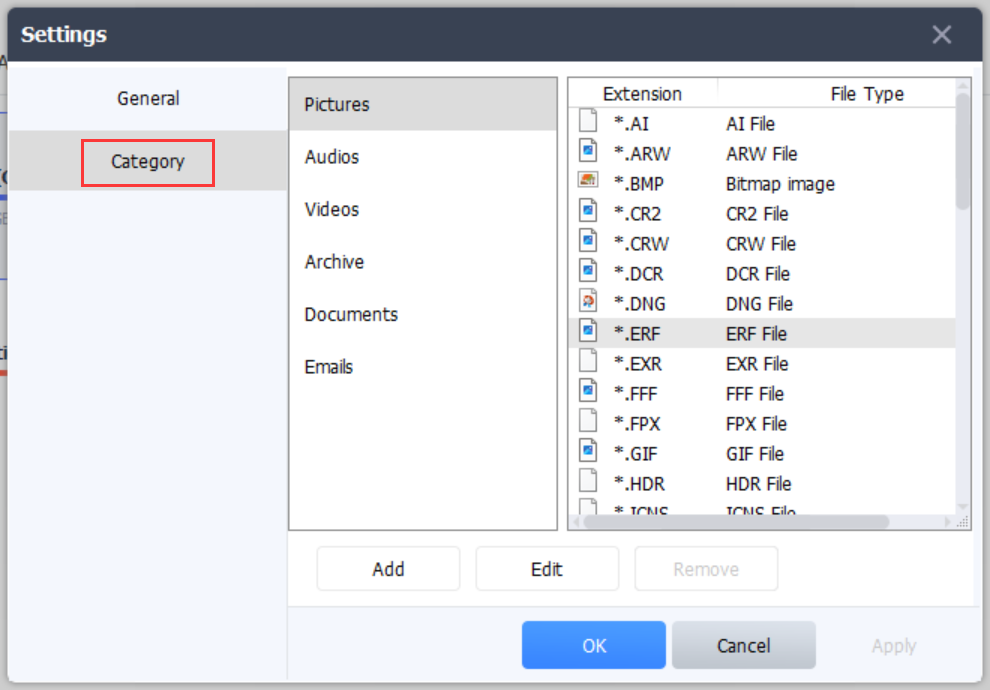

To enhance the performance of Glarysoft File Recovery to better suit your needs, you can customize the settings according to your preferences.

1\. Click on the menu button located in the upper right corner and choose "Settings."

2\. Under the "General" option, you can modify the program's language settings and opt into the User Experience Improvement Program.

3\. In the "Category" section, you have the ability to add or edit recovery file format options.

Note: Remember to click the "Apply" or "OK" button to save your settings.
