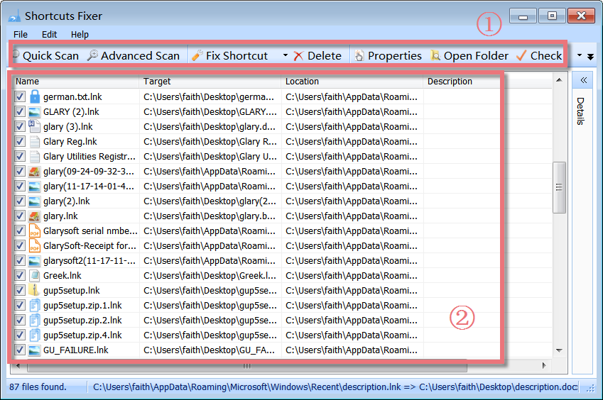
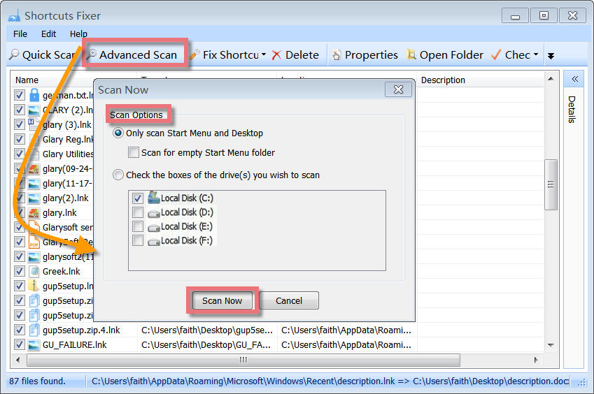
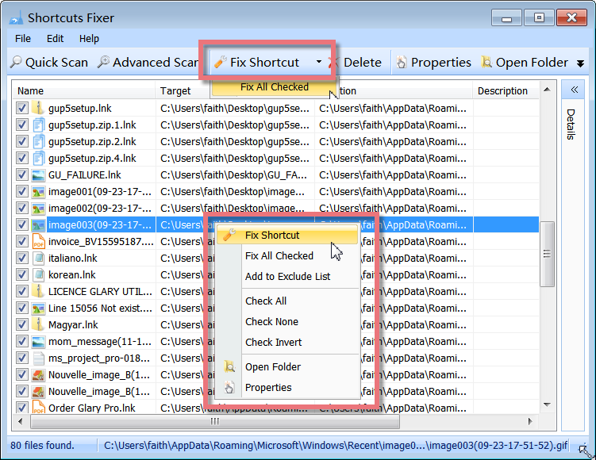
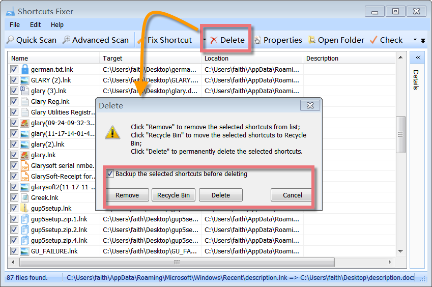
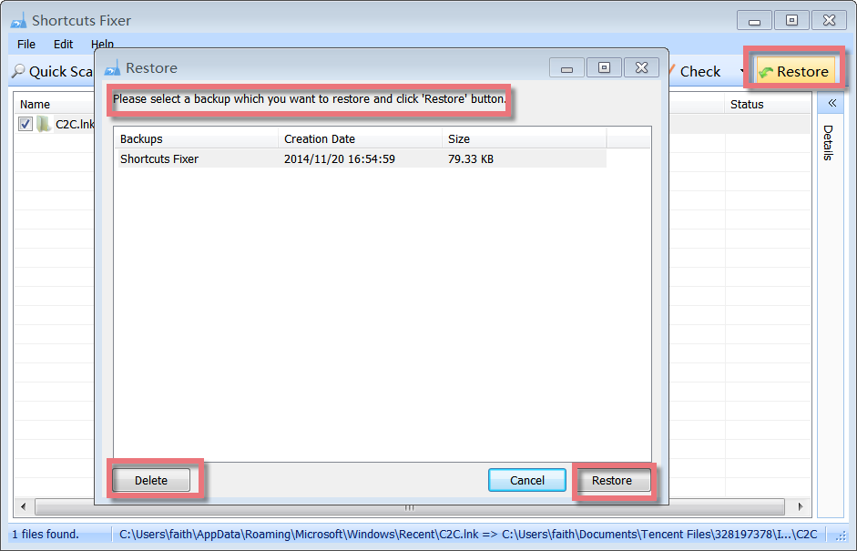

Shortcuts Fixer provides you with a convenient way to address these invalid shortcuts. By scanning your system, it finds all the invalid shortcuts and reports back to you so that you can remove them from your system or fix it by updating the shortcut with the new information.

**Interface Overview**

**1\. The First Line Buttons:** quick access button to "Quick Scan", "Advanced Scan", "Fix Shortcut" or "Delete" function.

**2\. The Lower box:** displays a list of all broken shortcuts and references with some information: their name, target, location, and more.

**Scan Invalid Shortcuts with Advanced Scan**

When you click the Advanced Scan button, you will find two options for scanning for invalid shortcuts.

1\. Only scan Start Menu and Desktop  
2\. Scan for hard-disk drives specified

After configuring the search options, click 'Scan now'. You can cancel the scanning process by pressing the 'Cancel' button or pressing the 'Esc' Key.

**Easily Fix Invalid Shortcuts**

Shortcuts are links to files stored in different folders and drives on your PC's hard disk. Your Windows Start Menu comprises shortcuts pointing to various files elsewhere on your hard drives. Double-clicking (or otherwise invoking) a shortcut automatically opens its corresponding application or document. Sometimes, the "targets" of these shortcuts are moved or deleted, leaving the shortcut pointing to a file or location that no longer exists. Such 'dead' shortcuts clutter your Start Menu and Desktop.

After the analysis, Shortcuts Fixer displays a list of all invalid shortcuts. Select the files and right-click on them to see the context menu. Click 'Fix Shortcut' to browse and select a new target file. Shortcuts Fixer will fix the broken link for you.

**Delete broken Shortcuts found**

After the scanning, you will be presented with a list of invalid links found. If some point to files that no longer exist or which have been moved, you can remove them. You can select those files that you want to delete by check-marking them. By default, all links found are marked for deletion, and you can choose to backup the selected shortcuts before deleting.

Click '**Remove**' to remove the selected shortcuts from the list;

Click '**Recycle Bin**' to move the selected shortcuts to Recycle Bin;

Click '**Delete**' to permanently delete the selected shortcuts.

**How to restore deleted Shortcuts**

In case you have deleted some invalid shortcuts mistakenly, you can restore them with a few clicks.

When you decide to remove the invalid shortcuts, by default, Shortcuts Fixer will back up the selected shortcuts before deleting them. You can restore the deleted shortcuts by clicking the Restore button, and a small window will pop up. Here you can delete the backup or restore it according to its creation date and size.
