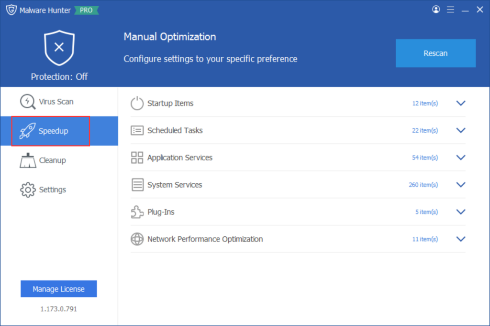
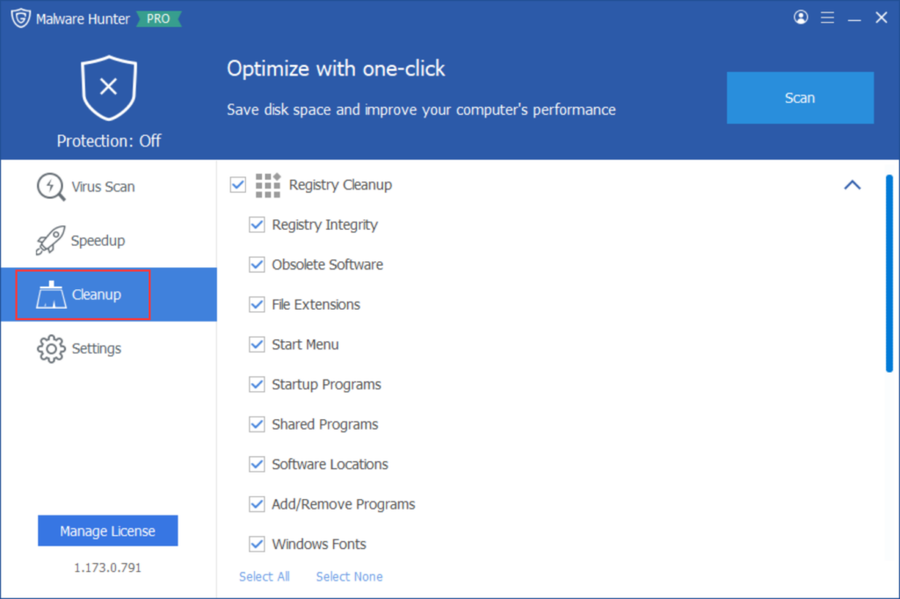

In addition to its malware detection and removal capabilities, Glarysoft Malware Hunter offers Speedup and Cleanup functions to optimize your PC's performance.

The Speedup function optimizes processes by managing items and tasks, helping to enhance the overall speed and responsiveness of your computer.

The Cleanup function removes unnecessary registries and plug-ins to free up disk space, improving your system's efficiency and storage capacity.

By utilizing the Speedup and Cleanup functions in Glarysoft Malware Hunter, you can ensure that your PC operates at its best, delivering a smoother and more efficient computing experience.
