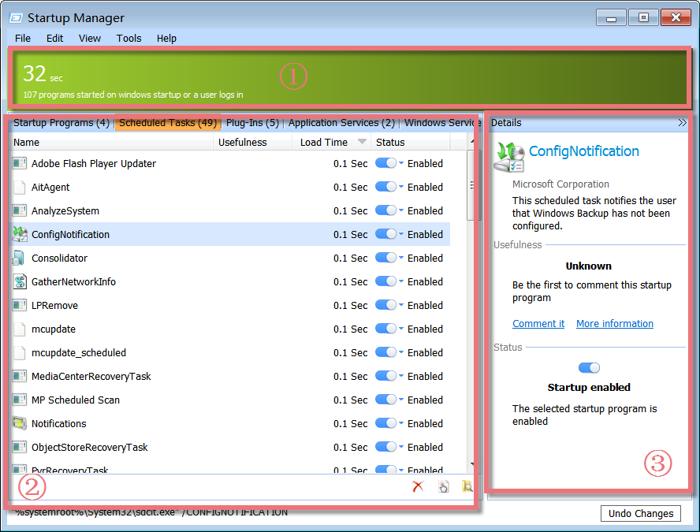
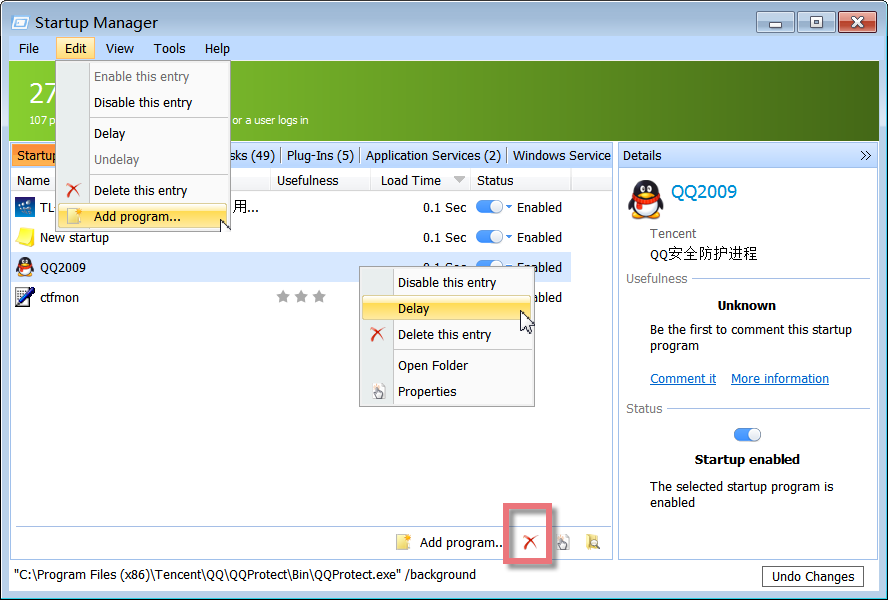
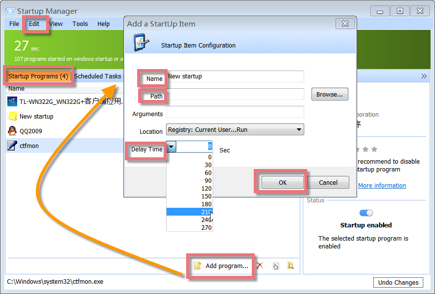
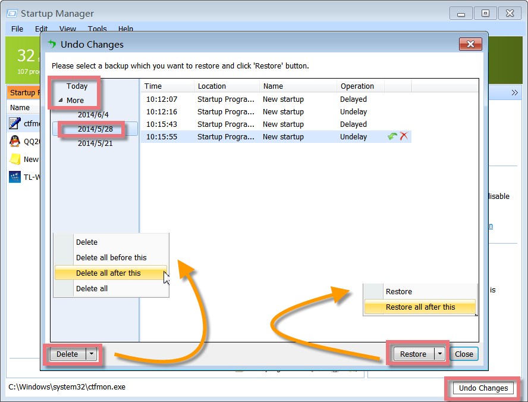

Startup Manager is a powerful yet easy-to-use program that allows you to centrally manage all of these items by delaying some program's auto-startup after booting the system, or removing unnecessary programs, as well as making enough resources for system boots, speeding up PC loading to the fastest performance with one single interface.

**Interface Overview**

**1\. The Above Green Area:** shows the windows boot time and how many programs started when windows startup or a user logs in.

**2\. Left-hand Lower Box:** displays a laundry list of programs, including windows startup programs, scheduled tasks, plug-Ins, and some application services with a little information on the process name, usefulness, load time, status, and path.

**3\. Right-hand Lower Box:** shows detailed information on a selected process, such as process name, manufacturer, usefulness, and status on windows boot. You can click the links here to comment on the selected process and give recommendations, click more information to learn the process on our web database, or even edit this selected entry.

**Delaying Auto-start Programs at Windows Boot**

All the programs that start automatically at the beginning of Windows Startup will be listed out for your reference, including the program icon, product name, description, and company. If an entry is unnecessary to start with Windows boot, right-click and choose "Delay" it, or click "Edit" you can also find "Delay" in the list. Therefore, programs will start in sequence according to the default delay time. The delay interval is set in seconds. The default is 30 seconds, and the maximum interval is 270 seconds.

**Deactivating and Deleting Entries**

Right-click an entry and choose to disable it, and the program will no longer be started the next time you start Windows. Or click "Edit". You can also find "Disable this entry" in the list. In this way, you can determine whether the entry is needed.

If something doesn't work properly the next time you start Windows, all you have to do is "Enable this entry". If you are certain that you no longer need an entry, you can entirely remove it by right-clicking and choosing "Delete this entry" from the list.

**Add Program to Launch Automatically and Schedule the Delay Time**

If you wish to add a program to one of the startup folders yourself, click "Add program..." on the page of Startup Programs, or click "Edit" you can also find "Add program..." in the list. Enter the name of the desired application in the dialog and enter the directory path of the program file in the Path/Command Line box. You can use the Browse... button to help you find the file. You may also edit any existing listed items to move them from one location to another, change their program description, or update the command line that is being used to start the item.

Here you can also schedule the delay time as you need. You can set it to auto-start 30 seconds later after windows boots. Therefore, programs will start in sequence according to the delay interval preset by you. The delay interval is set in seconds, the default is 30 seconds, and the maximum interval is 270 seconds. Or you can enter the time constant by yourself.

**Delete or Restore a Backup with Undo Changes**

If you want to undo all changes you made with Startup Manager in recent days, you need to click "Undo Changes" in the bottom right-hand corner. A dialog will pop up showing you the programs that you've changed. According to the days, you can choose to restore or delete these backups that are shown with some information, including operating time, location, program name, and operating status.
