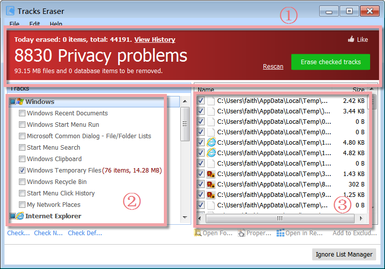
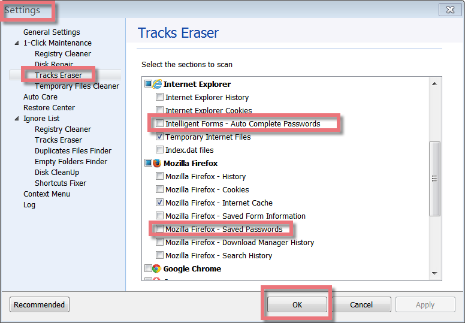
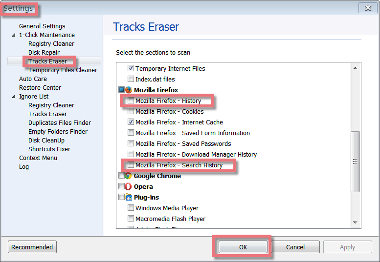
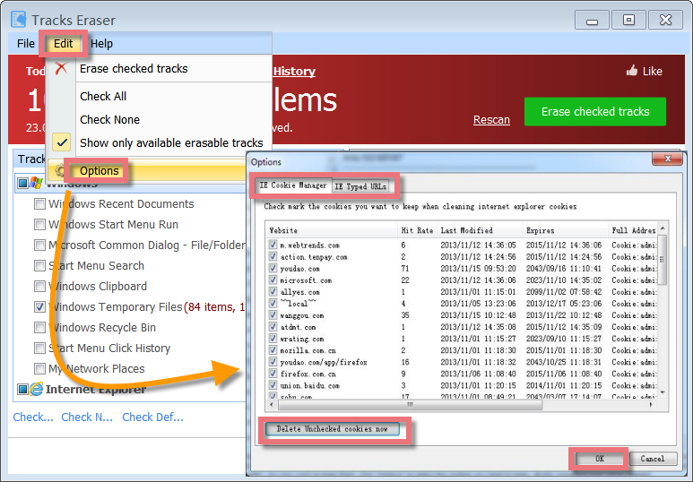
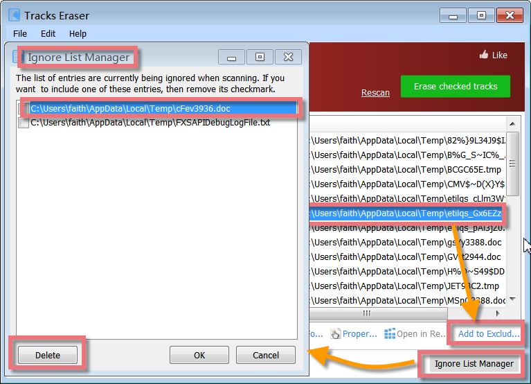
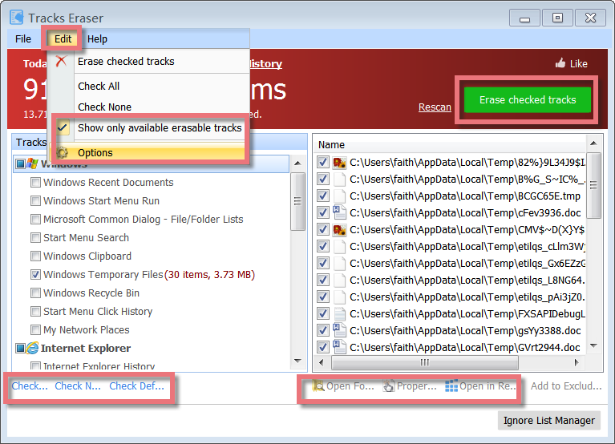

Glary Tracks Eraser is a powerful tool to help secure your privacy. It allows you to erase common Internet and computing tracks, including browser cache, cookies, visited websites, typed URLs, recent documents, index.dat files, and more. Glary Tracks Eraser makes life much easier by taking care of everything at the click of a button, freeing up wasted hard drive space, and removing your past activity records from the PC.

**Interface Overview**

**1\. The Above Red Area:** shows the number of privacy problems found and allows you to rescan problems, as well as **erase checked tracks** from your PC.

**2\. Left-hand Side Button:** allows you to select the needed sections to scan tracks.

**3\. Right-hand Side box:** displays the summary of problems found. For the one, you do not want to erase, do not check it. Just choose the right one you need to clear and click "**Erase checked tracks**" in the upper box of the main window.

**How to Keep Passwords on your PC**

If you want to keep passwords on your PC, please do not check the box on passwords in IE, Firefox, and google in Tracks Eraser.

You can find **Menu**\--**Settings**\--**Tracks Eraser**, do not check the entries on passwords. Or on the Overview page, if you are a Pro user, when you check up on "erase privacy tracks on windows shutdown",--choose "select tracks", in the new pop-up window. Please do not check the box on passwords. However, if you clear some cookies, it may still clean your passwords.

**How to clear Firefox History**

To clear Firefox history, please check those items: **Menu**\--**Settings**\--**Tracks Eraser. You** can check the entries on Firefox history. Or on the **Overview** page, if you are using the Pro version, when you check up on "erase privacy tracks on windows shutdown"--choose "select tracks", please check the box on Firefox history in the new pop-up window.

**How to Select the Cookies you want to Keep**

Cookies are created when you browse some websites, and other websites that run ads, widgets, or other elements on the page being loaded, so you'd better remove these cookies. However, you regularly contact some cookies that link with your bank and other regular network address so that you can keep those cookies.

Here you can set Glary Utilities to stop cleaning some cookies, so it does not remove the 'links' that you wish to have remaining on your PC. Please click "Edit", choose Options, and then check the cookies you want to keep, finally click the **OK** button.

**Add to Exclude List and Remove from Ignore List**

If you want to exclude an item from being erased by Tracks Eraser, you can directly add it to the Exclude List. Items included in Ignore List won't be scanned and erased when you are running Tracks Eraser. When the software update becomes more stable on performance, you can delete it from the Ignore List. Click "Ignore List Manager", find the needed entry, and then **delete** it.

**When to use Tracks Eraser**

Tracks Eraser should be used daily before you shut down your computer. Regular use of Tracks Eraser will protect your personal information from strangers.

**Recommended use:**

- Daily.

- When you leave your computer unattended.

- When you feel like using it.

**How to use Tracks Eraser**

Tracks Eraser is very simple to use. When you start Tracks Eraser, it will automatically scan privacy problems. You’d better close the browser you are using before you clear your personal information. Just check mark items that you wish to erase and press 'Erase checked tracks' and you are ready to go. As soon as you press the 'Erase checked tracks' you will see the window showing what it is currently cleaning up. Generally, clean-up could finish in a few minutes.

"**Check All**": Check all tracks in track lists.

"**Show only available erasable tracks**": Hide the item not installed on your system.

"**Options**": Manage IE typed URLs and cookies. You can select those cookies or URLs you want to keep and delete the rest. To select a cookie, checkmark the box beside it. To deselect, uncheck it. By default, all cookies are deselected.
