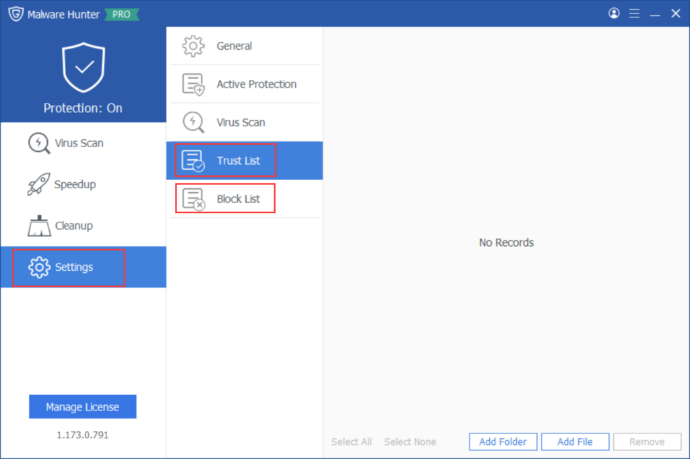

Trust/Block List & Quarantine are pivotal features within Glarysoft Malware Hunter, designed to provide comprehensive security assurance. Through these functionalities, users gain better control over applications, files, and potential threats, ensuring the safety and stability of their computer systems.

**Trust List**: Users can add applications and files they trust to the Trust List, ensuring that these items are not misjudged or subject to unnecessary restrictions.

**Block List**: Users can add potential threats, malicious software, or unwanted applications to the Block List, effectively safeguarding the system from potential harm.

**Quarantine**: Threats identified during virus scans or behavior monitoring are automatically or manually moved to the Quarantine. This allows the user's system to block potential dangers while providing an opportunity for further user intervention. Users can review detailed information about threats in the Quarantine, enabling them to perform **Restore** or **Delete** operations.

Users can swiftly access the Quarantine and Trust List through the main interface. Alternatively, they can enter the Quarantine, Trust List, and Block List via the Settings menu.

