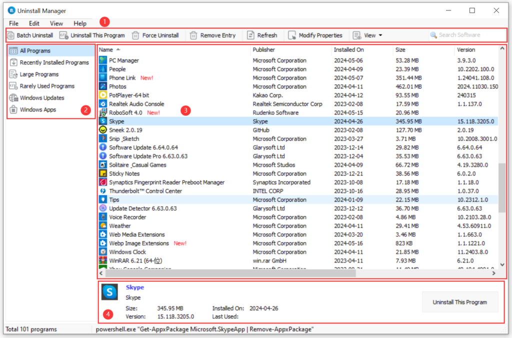
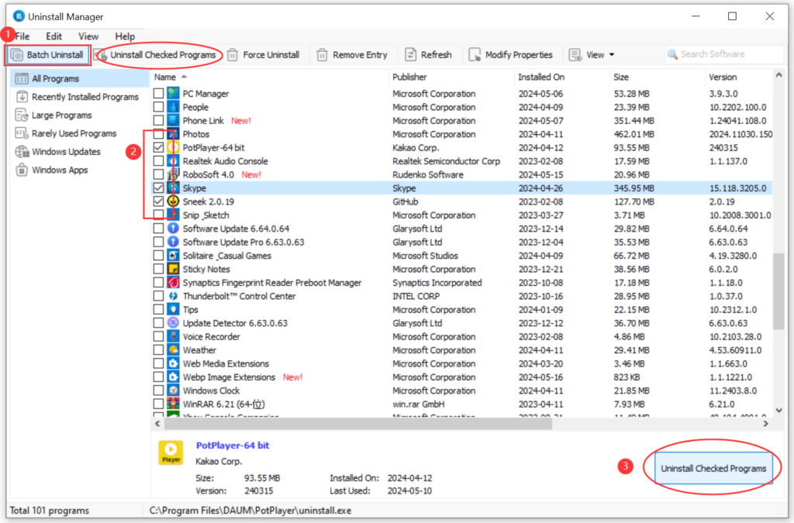
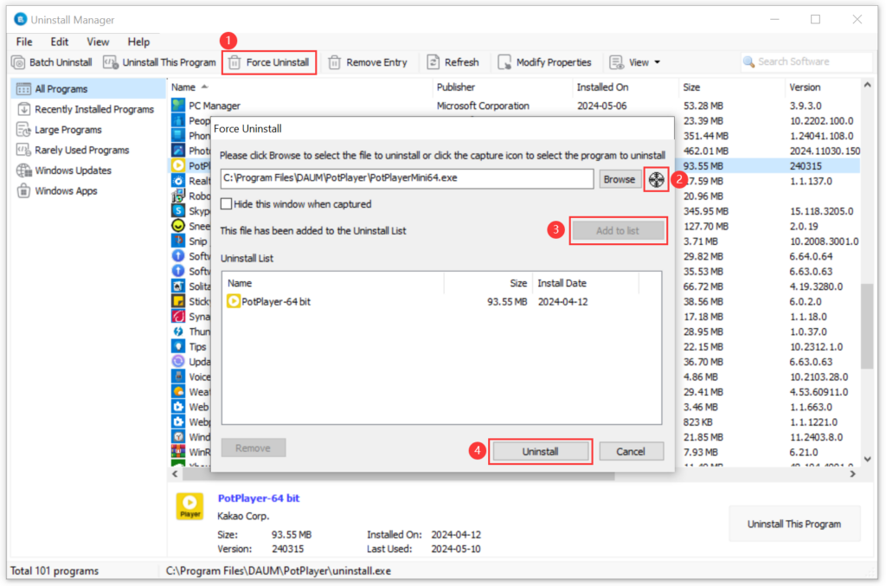
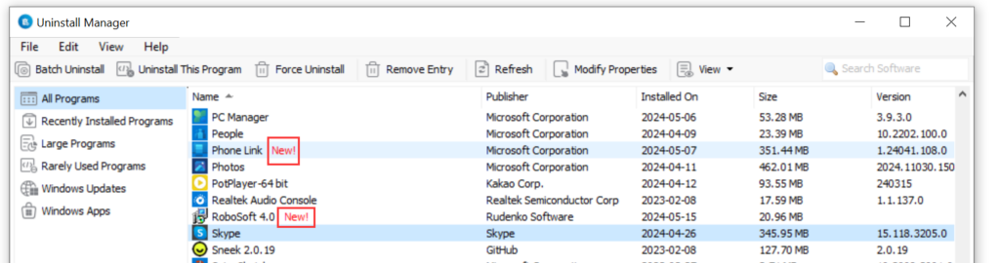
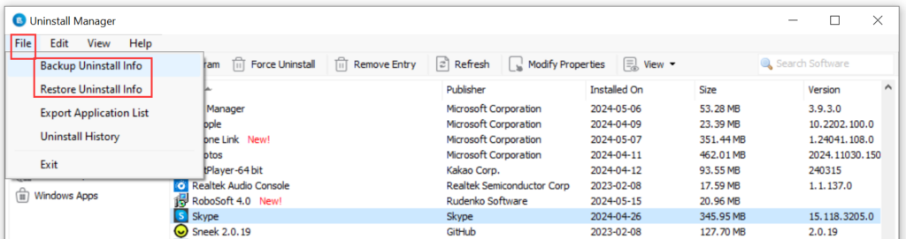
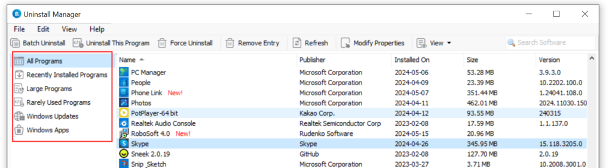
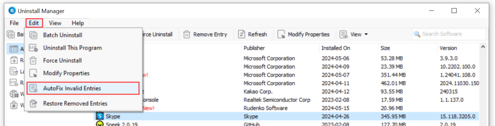

Uninstall Manager is a powerful yet user-friendly Windows Add/Remove program that offers a range of tools to efficiently and quickly uninstall unwanted programs in batches. The accumulation of junk files on your computer can significantly slow down its performance. With Uninstall Manager, you can easily remove all these junk files within seconds, providing a more streamlined way to uninstall unnecessary applications and enhance your computer's efficiency.

**Interface Overview:**

1. **Quick Function Buttons**: Provides quick access to Batch Uninstall, Uninstall This Programs, Force Uninstall, Remove Entry, Refresh, or Modify Properties on the selected program.
    - **Batch Uninstall**: Refers to the capability of uninstalling multiple programs or applications at once. Users can select multiple target programs and uninstall them together rather than one by one.
    
    - **Uninstall This Program**: Indicates the action of uninstalling a specific individual program or application. Users can choose the particular program they want to remove and initiate the uninstallation process.
    
    - **Force Uninstall**: A special uninstallation method used to remove programs from the system that cannot be uninstalled through regular means. It is typically employed to deal with stubborn or difficult-to-delete software.
    
    - **Remove Entry**: Users can remove an entry of a particular software from the uninstall list.
    
    - **Refresh**: Used to update displayed content, typically in a user interface, to ensure that the information shown is the most current.
    
    - **Modify Properties**: Allows users to change the properties of a program or application, such as name and Command Line.
    
    - **View**: Users can change the view mode using the "View" function, including Icons, List, and Details.
    
    - **Search Software**: Users can enter keywords to search for particular software titles.

3. **Programs Categories**: Allows you to narrow down the search results by clicking on options like "Recently Installed Programs," "Large Programs," "Rarely Used Programs," or "Windows Updates/Apps."

5. **Programs Details**: Displays all programs with their name, publisher, size, and date of installation.

7. **Selected Program Details**: Provides detailed information about the selected program, including its name, publisher, size, version, and so on.

**Batch Uninstall:**

Uninstall Manager supports batch uninstallation, allowing you to remove multiple applications from your computer system with a single click. This feature is particularly useful for those who frequently try out various applications. Uninstall Manager also allows you to create backups for certain programs in case of mistakes. Moreover, unlike other similar software, it does not require a system reboot after uninstalling each application.

Steps:

1. To easily uninstall multiple programs, click on "Batch Uninstall."

3. Select the programs you want to uninstall.

5. Once selected, click on "Uninstall checked programs" and confirm your choice.

**Force Uninstall:**

A special uninstallation method used to remove programs from the system that cannot be uninstalled through regular means. It is typically employed to deal with stubborn or difficult-to-delete software.

Steps:

1. Click on the "Force Uninstall" feature.

3. Browse to select the file to uninstall or drag the icon labeled as "2" onto the running program window or the small icon on the desktop to locate the uninstall program by using mouse tracking.

5. Click "Add to list" to add the software you want to uninstall.

7. Click the "Uninstall" button to proceed.

**Newly Installed Applications Marked Out:**

Uninstall Manager conveniently marks recently installed applications with a red "New!" label on the right side. This feature makes it easy to identify and uninstall your recently installed unnecessary programs.

**Backup/Restore Uninstall Information:**

Uninstall Manager allows users to back up uninstall information, export a list of installed applications, restore removed entries, and even modify application properties. One unique feature of Uninstall Manager is its ability to automatically fix invalid entries and ensure an error-free and smooth-running Windows system.

For future use or unforeseen problems, you can backup/restore uninstall information before removing an entry. With Uninstall Manager, you can quickly perform these actions by selecting the program you want to backup/restore and going to File -> Backup/Restore Uninstall Info -> choose a file for backup/restore.

**Quickly Find Needed Programs:**

To find "Recently Installed Programs," "Large Programs," "Rarely Used Programs," or "Windows Updates," simply click on the corresponding entries in the left panel. This feature helps narrow down the search results and quickly locate the programs you need.

**Auto-fix Invalid Entries:**

Uninstall Manager offers an auto-fix feature for invalid entries. To auto-fix invalid entries, go to Edit -> AutoFix Invalid Entries. If all the entries are working correctly, Uninstall Manager will confirm that "All programs installed on your system are OK, and no invalid entries are found."

**Sort the List of Programs:**

On the description panel, you can click on the column heading to sort the list of programs. Clicking the column heading again will reverse the sort order. You can sort the list by Name, Publisher, Size, and Date Installed, making it easier to manage your files and folders.

**Enhanced Windows Add/Remove Program:**

Uninstall Manager is an enhanced version of the Windows Add/Remove program, offering more powerful functions to uninstall stubborn programs. The standard Add/Remove program often fails to completely uninstall software, leaving behind broken registry keys and unnecessary files on the hard disk. Uninstall Manager can effectively clean up all these junk files within seconds after uninstalling software. It provides a more user-friendly approach to remove useless applications and improve computer efficiency. Additionally, the uninstallation process typically includes residual file and registry checks to ensure thorough cleanup.

Ready to bid farewell to stubborn programs and reclaim valuable disk space? Try [**Glary Utilities**](https://www.glarysoft.com/) today!

[**Download Glary Utilities**](https://www.glarysoft.com/)
