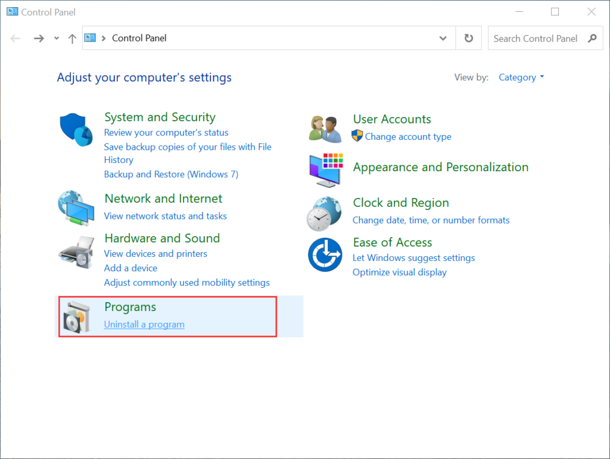
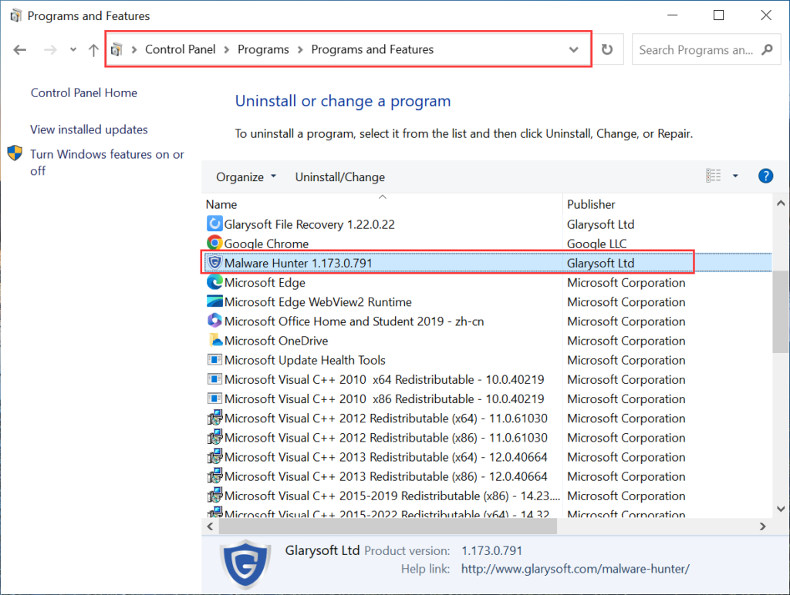
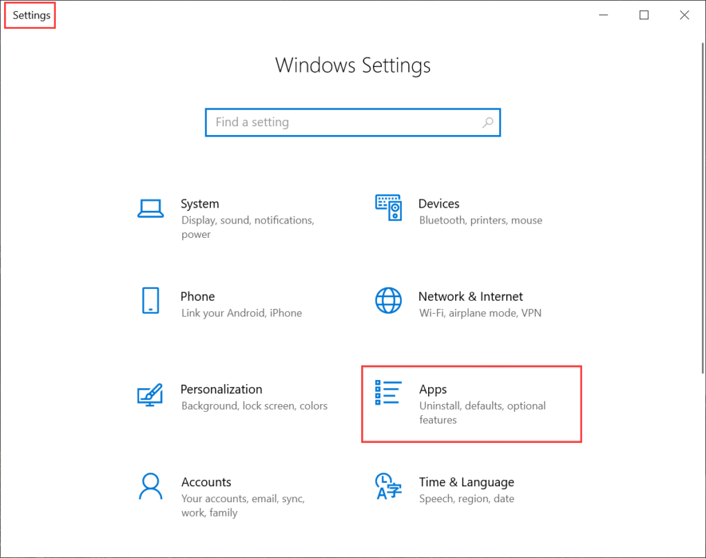
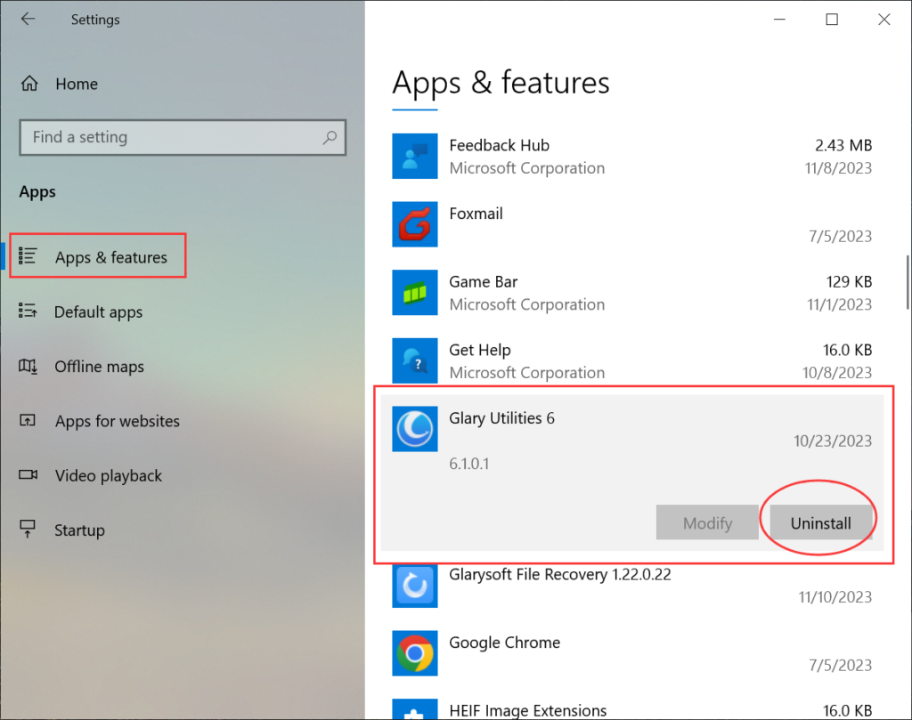

  
To remove a Glarysoft program from your computer, you can uninstall it using one of two methods: through the Control Panel or Settings.

**Method 1: Uninstall via the Control Panel**

1\. Open the **Start menu** and click on **Control Panel** (you can type “Control Panel” in the search box).

2\. Within the Control Panel, locate and click on the "**Uninstall a program**" option. This will take you to the "Programs and Features" section.

3\. Find the Glarysoft Program that you want to uninstall in the list of installed programs. Right-click on it and select the "**Uninstall/Change**" or "**Uninstall**" button.

4\. Follow the on-screen instructions that appear to complete the uninstallation process.

**Method 2: Uninstall via the Settings**

1\. Open the **Start menu** and click on **Settings**, select **Apps**.

2\. In the list of **Apps & features**, find the Glarysoft Program that you want to uninstall. Click on the "**Uninstall** " button.

3\. Follow the on-screen instructions that appear to complete the uninstallation process.

By following these steps, you will be able to uninstall a Glarysoft Program from your computer successfully.
