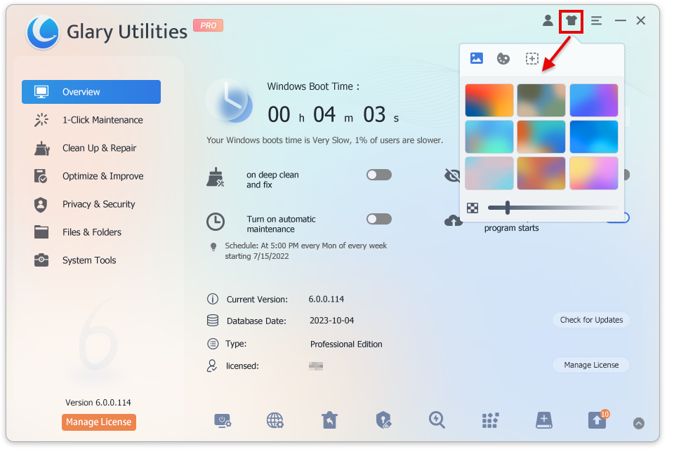
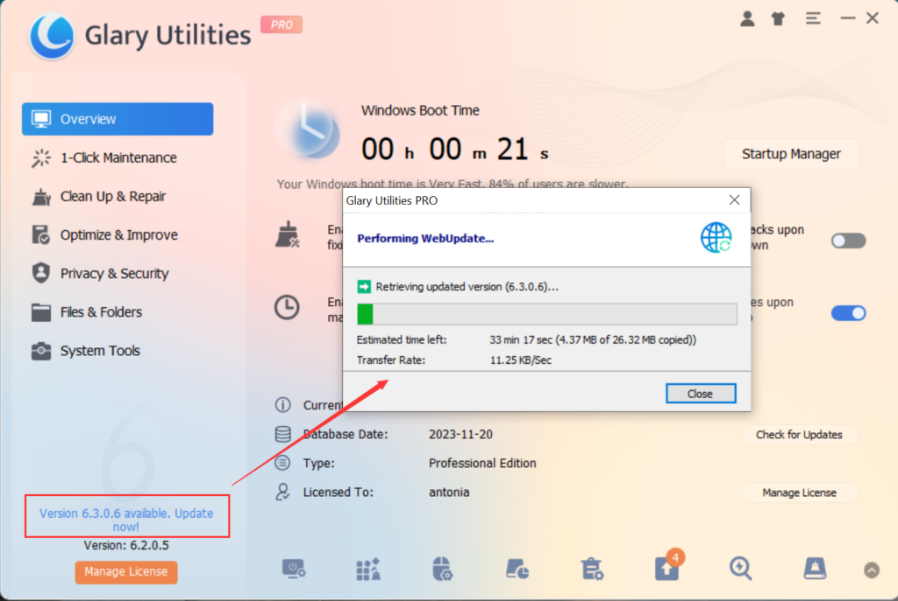

Pro users can enable automatically download updates, and Glary Utilities will notify you to install after the download.

For free users, Glary Utilities offers two manual update options:

1\. Click on Overview -> Check for Updates to update.

2\. Click "Version 6.x.x.x available. Update Now!" and download the latest version from the website.

