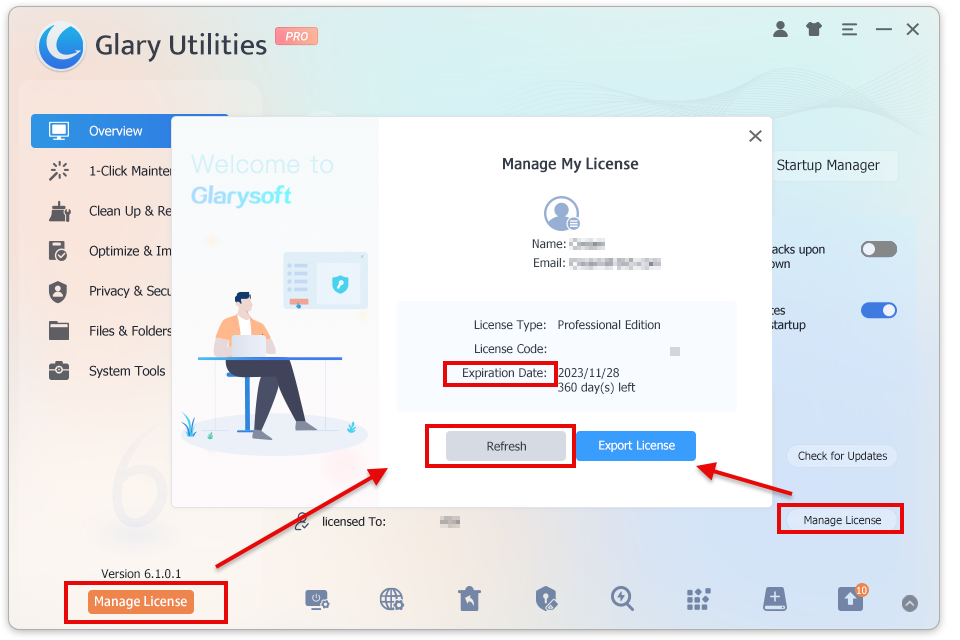
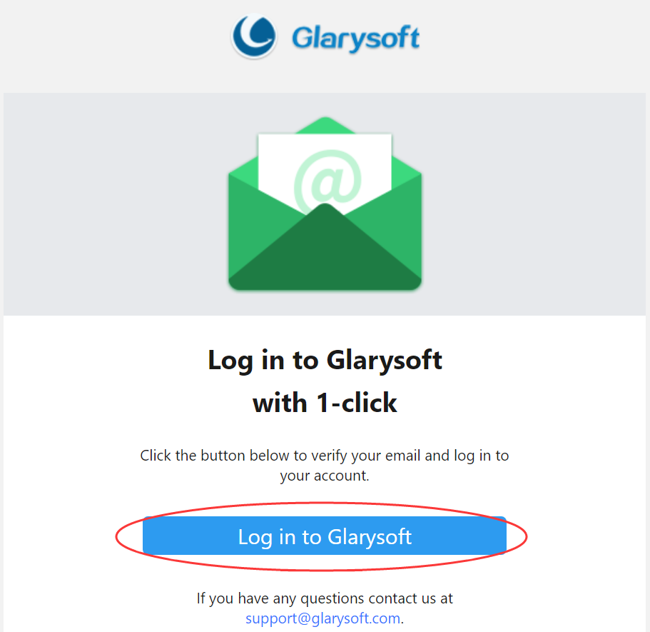
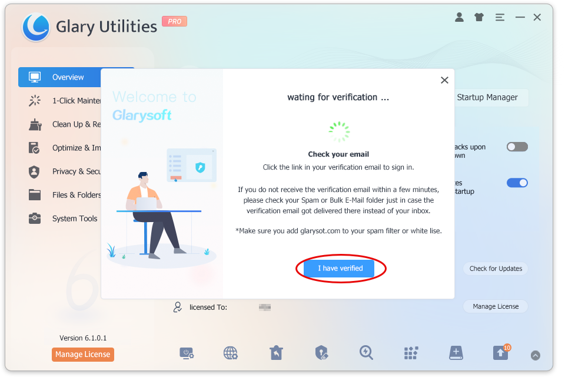
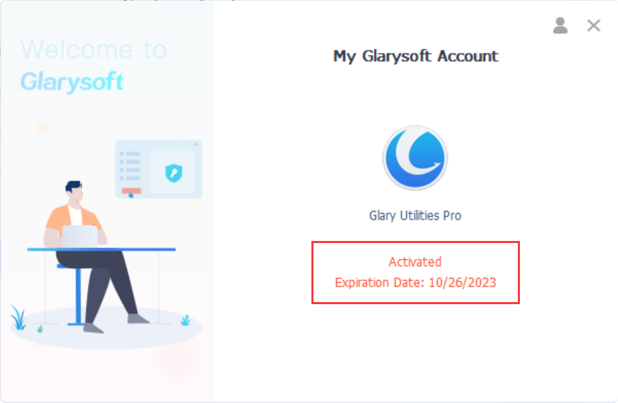

Glary Utilities Pro offers a range of advanced features not found in the free version. With the Automatic Download Update feature, you can save valuable time by effortlessly downloading and maintaining the latest version of Glary Utilities. The Deep Scan and Fix functionality thoroughly examines your computer for potential threats, vulnerabilities, and unnecessary files, optimizing its speed and performance through effective fixes and cleanups. Additionally, the Auto-Care feature runs discreetly in the background, regularly and automatically scanning your computer to ensure it stays in optimal condition.

With Glary Utilities Pro, empower your system and elevate your computing experience to new heights. [Upgrade from here](https://www.glarysoft.com/store/) today and witness the difference in performance and efficiency.

**How to register to get the PRO version**？

You need to register the program with the license code you purchased manually. The license code can be found in the email you received after you purchased the program.

After you use the license code to activate the trial version successfully, you can enjoy Glary Utilities Pro.

There are two registration methods to choose from:

**Method 1:**

1\. When you run Glary Utilities after installing it, click the “**Manage License**” button under the “**Overview**” tab.

2\. It will pop up a box for you. Please click “**Refresh**”.

3\. Enter your **Email** and the **License code**, and finally, click “**Activate Now**.”

**Method 2:**

1\. Click on the icon located in the top right corner of the program interface.

2\. Enter your email and click the "**Email me a Quick Sign-in Link**" button.

3\. Wait for verification... You will receive a verification email within seconds. (Please make sure to add glarysoft.com to your spam filter.)

4\. Open the email sent by Glarysoft, and click the "**Log in to Glarysoft**" button to verify your email and access your account.

5\. Return to the software interface. You can either wait for the system to automatically activate or click the "**I have verified**" button. The software will be successfully activated, and the expiration date information will be displayed.

To log out of your account, click the icon in the top right corner. Alternatively, you can click "**Manage My Account**" to access the User Management Center, review your purchases, change your password, and more.

If you successfully register with your license code, the trial version will turn into the pro version.
