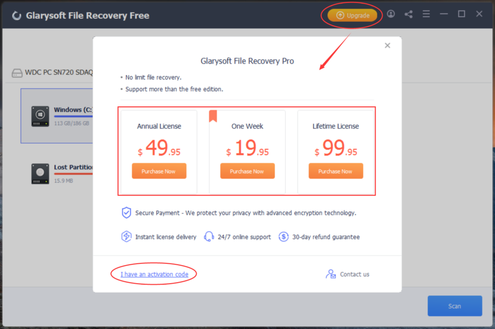
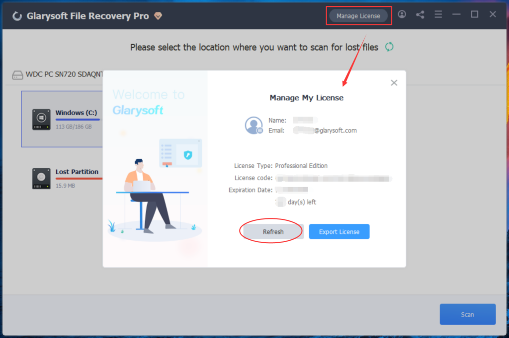
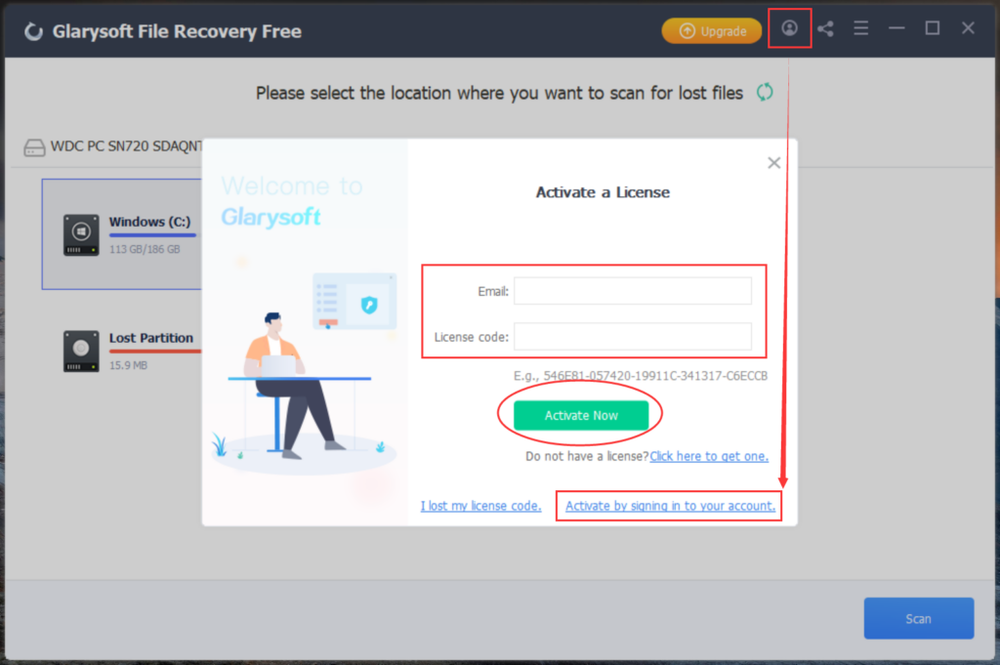
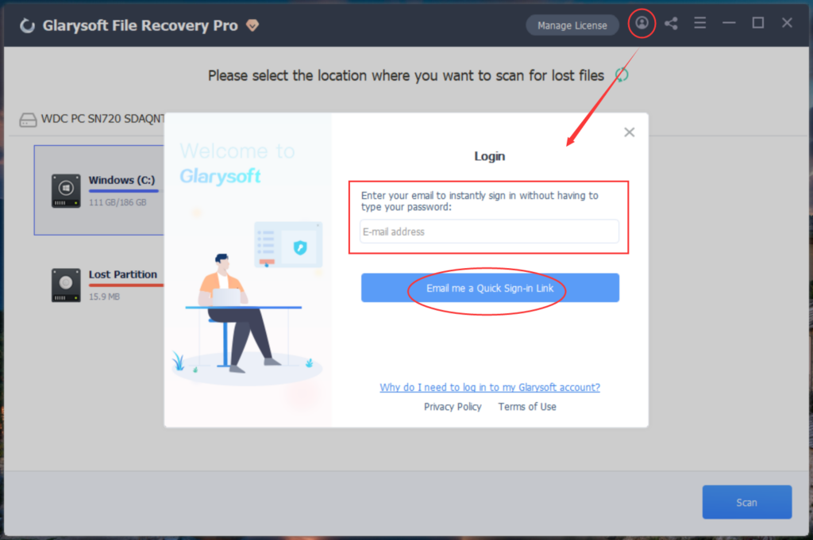
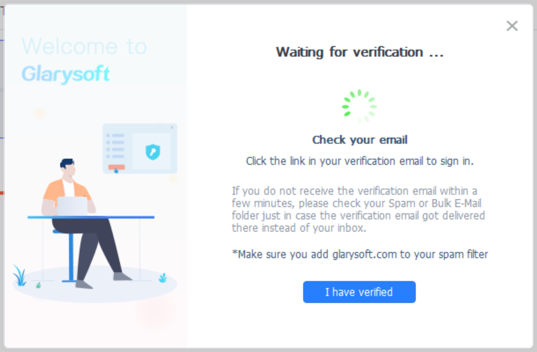
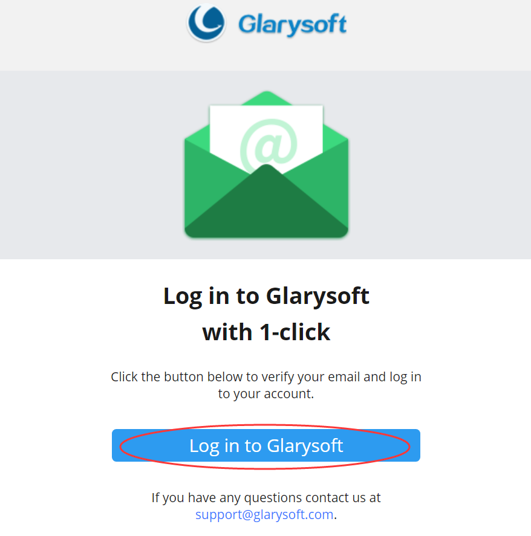
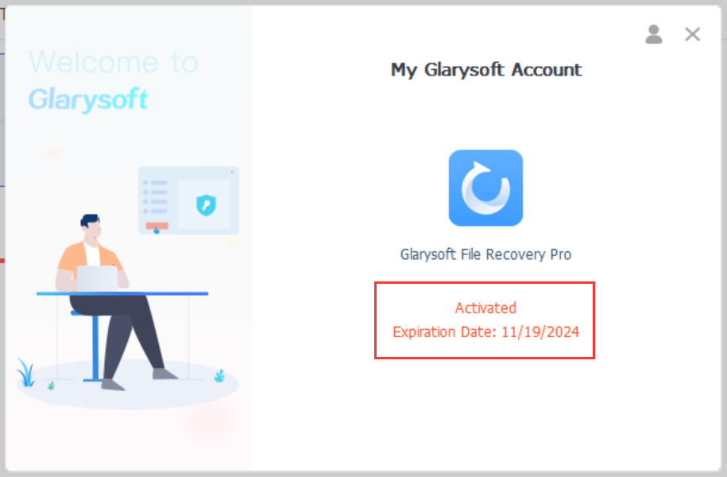
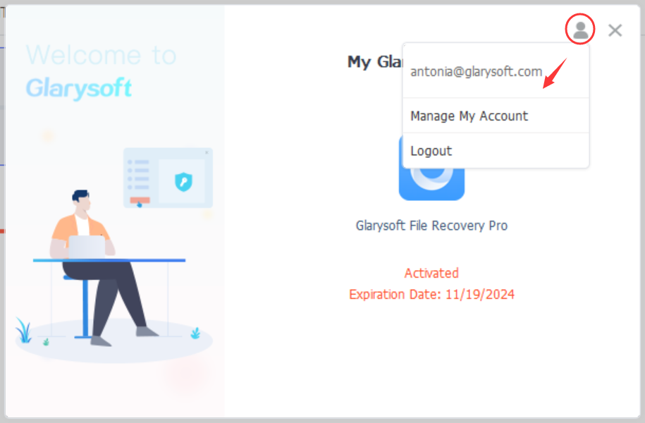

Glarysoft File Recovery Pro unlocks additional features compared to the free version. Both versions allow scanning and viewing of lost files and data, but when it comes to restoring permanently deleted files, the Free version is limited to recovering only three files, with a maximum size of 2GB. In contrast, the Pro version has no limits on the number of files that can be recovered. Moreover, the Pro version supports the restoration of formatted, corrupted, or virus-damaged files and data, along with the added benefit of prompt online support. These functionalities are not available in the Free version.

**How to obtain and register the PRO version?**

To activate Glarysoft File Recovery Pro, manually register the program using your purchased license code. Once you have successfully activated the trial version, you can enjoy all the Glarysoft File Recovery Pro features.

You can purchase the professional version on the official Glarysoft website or by clicking the "**Upgrade**" option within the program. Choose the desired license duration and find the license code in the email received after purchasing the program.

There are two registration methods to choose from:

**Method 1:**

1\. After installing Glarysoft File Recovery, run the program and click the "**Upgrade**" button. A dialog box will appear. Please select "**I have an activation code**."

Alternatively, you can click on the "Manage License" button and then click on "**Refresh**."

2\. Enter your **Email** and the **License code** in the provided fields, and finally, click on "**Activate Now**."

**Method 2:**

1\. Click on the icon in the program interface's top right corner.

2\. Enter your email and click the "**Email me a Quick Sign-in Link**" button.

3\. Wait for verification... You will receive a verification email within seconds. (Please make sure to add glarysoft.com to your spam filter.)

4\. Open the email sent by Glarysoft, and click the "**Log in to Glarysoft**" button to verify your email and access your account.

5\. Return to the software interface. You can either wait for the system to automatically activate or click the "**I have verified**" button. The software will be successfully activated, and the expiration date information will be displayed.

- To log out of your account, click the icon in the top right corner. Alternatively, you can click "**Manage My Account**" to access the User Management Center, review your purchases, change your password, and more.

If you successfully register using your license code, the trial version will be transformed into the Pro version, unlocking all its features.
