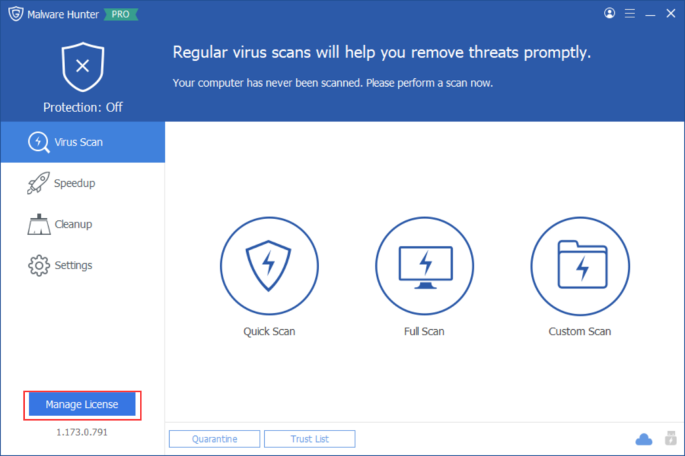
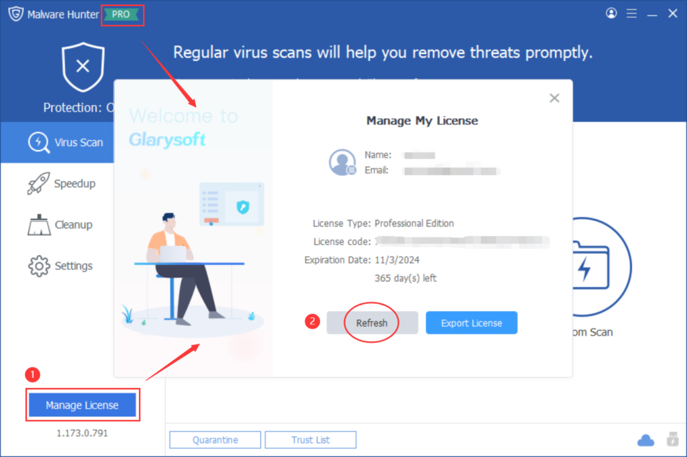
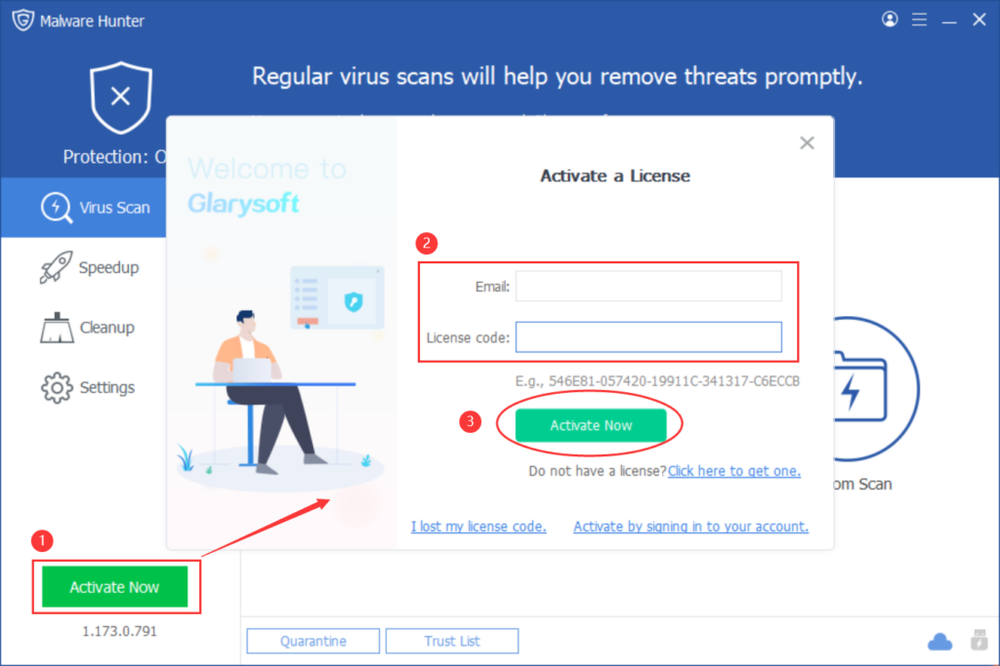
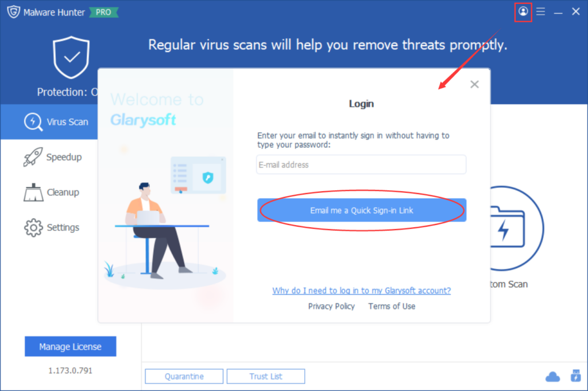
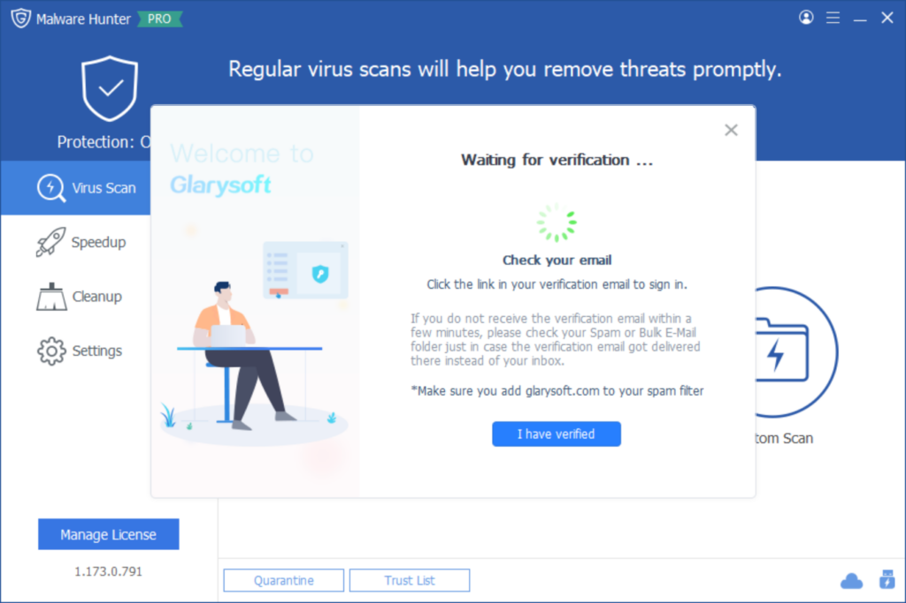
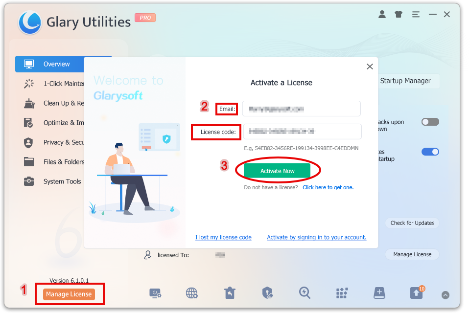
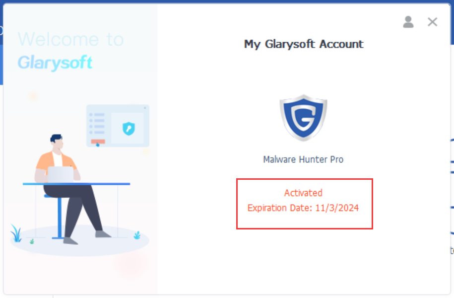
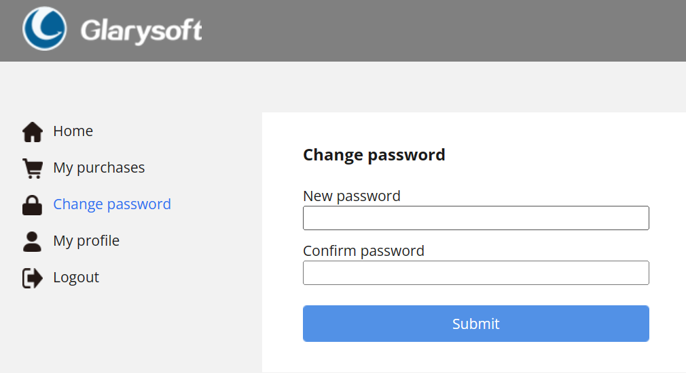

Glarysoft Malware Hunter Pro offers more features compared to the free version. It allows you to initiate automatic scanning and program auto-updates, saving time and keeping your Malware Hunter current. It excels at detecting and removing stubborn malware that can be dangerous. With its regularly updated malware database, it stays effective. Additionally, it cleans your disk and speeds up your PC for enhanced performance.

**How to register to get the PRO version**？

You need to register the program with the license code you purchased manually. The license code can be found in the email you received after you purchased the program.

After you use the license code to activate the trial version successfully, you can enjoy Glarysoft Malware Hunter Pro.  

There are two registration methods to choose from:

**Method 1:**

1\. When you run Glarysoft Malware Hunter after installing it, click the “Manage License” or  “Free/Pro” button.

2\. It will pop up a box for you. Please click “Refresh”.

3\. Enter your **Email** and the **License code**, and finally, click “**Activate Now**.”

**Method 2:**

1\. Click on the icon in the program interface's top right corner.

2\. Enter your email and click the "**Email me a Quick Sign-in Link**" button.

3\. Wait for verification... You will receive a verification email within seconds. (Please make sure to add glarysoft.com to your spam filter.)

4\. Open the email sent by Glarysoft, and click the "**Log in to Glarysoft**" button to verify your email and access your account.

5\. Return to the software interface. You can either wait for the system to automatically activate or click the "**I have verified**" button. The software will be successfully activated, and the expiration date information will be displayed.

To log out of your account, click the icon in the top right corner. Alternatively, you can click "**Manage My Account**" to access the User Management Center and review your purchases, change your password, and more.

If you successfully register with your license code, the trial version will turn into the pro version.
