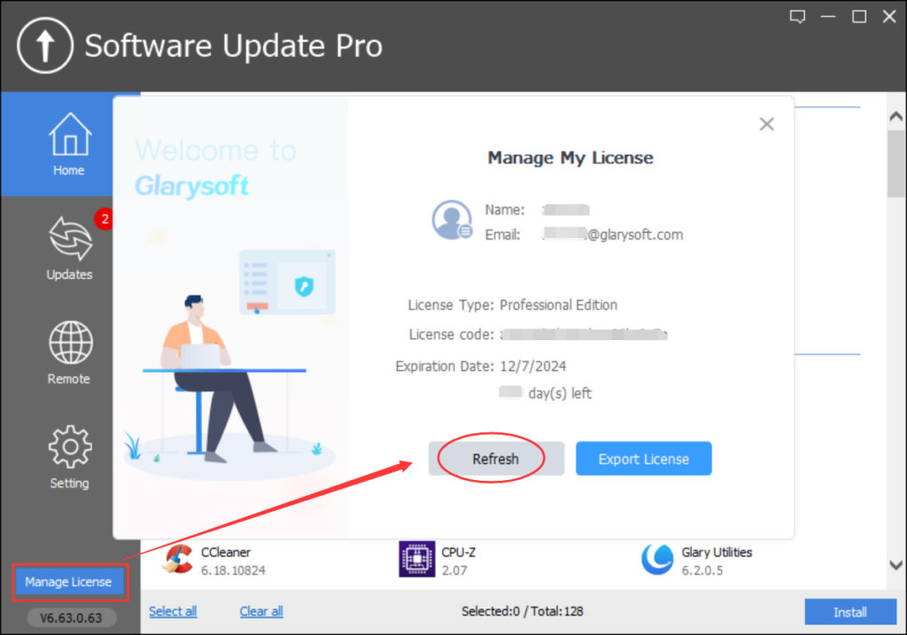
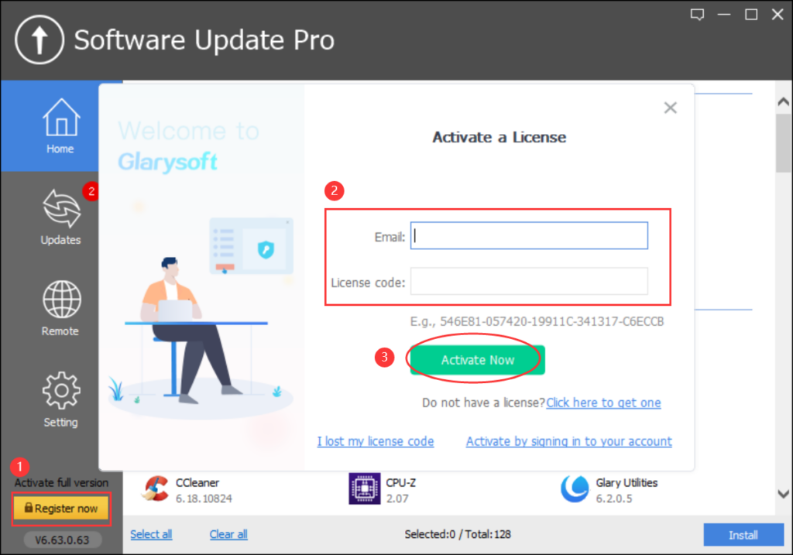
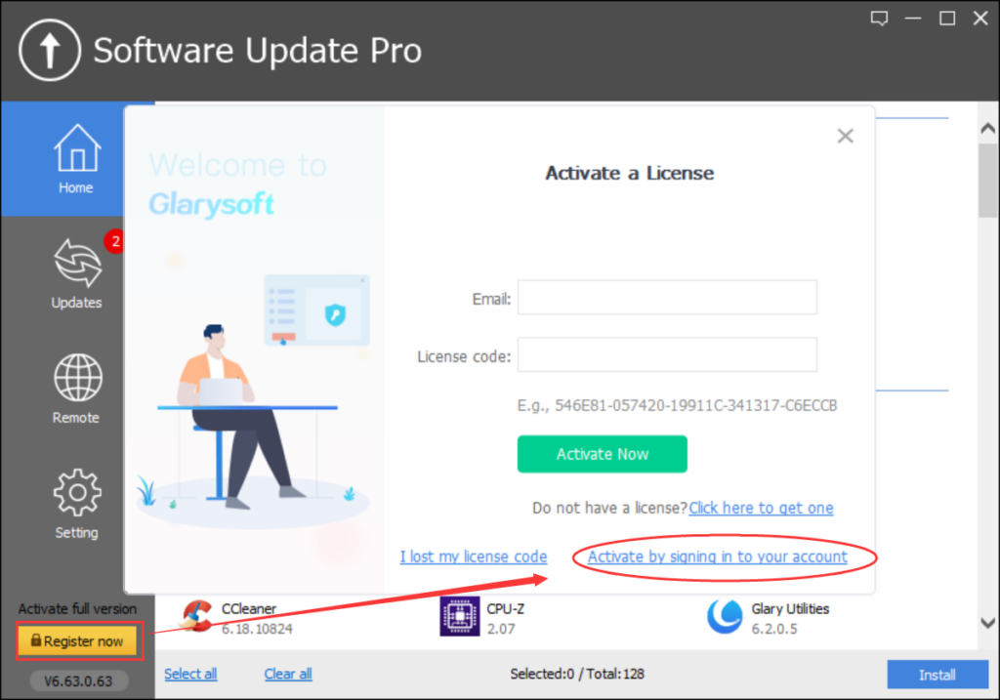
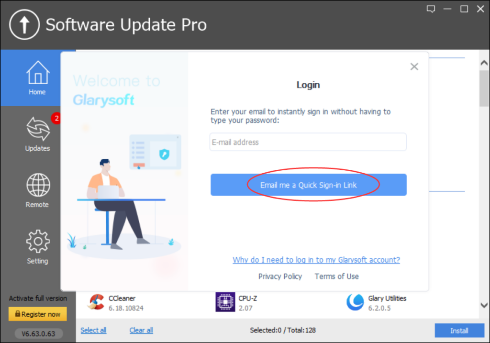
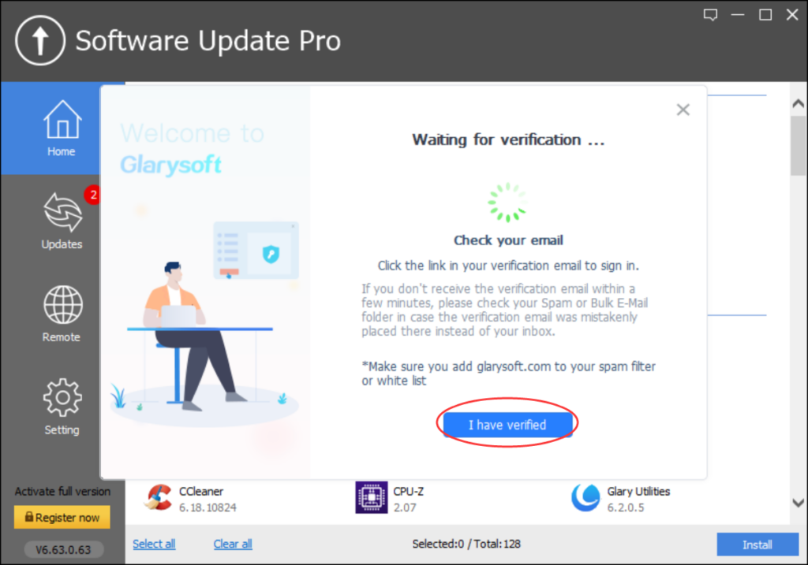
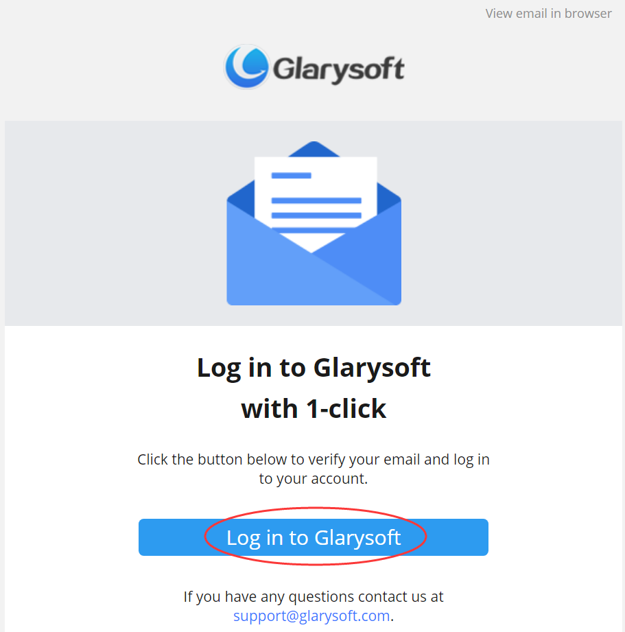
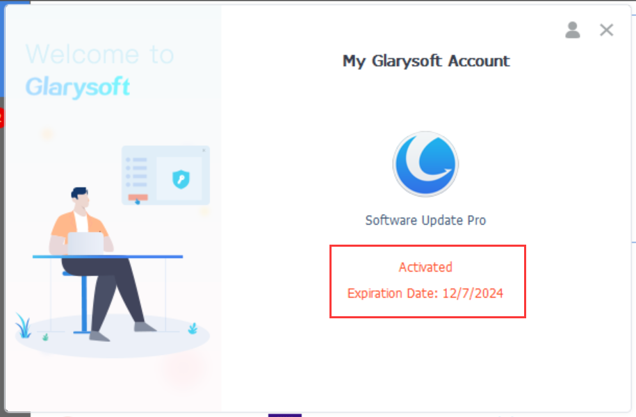
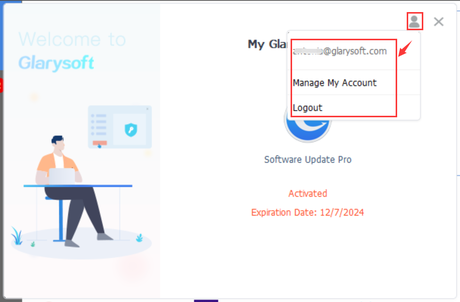

Glarysoft Software Update Pro is an advanced tool that automates software updates for the latest versions. Setting itself apart from the Free version, Pro encompasses all Free version functions and introduces an independent client, a user-friendly interface, and the ability to install included software silently. Additionally, the Remote Manager feature enhances the user experience by simplifying software installation and updates on LAN-connected PCs. This streamlining makes software management across multiple devices within your local network efficient. Upgrade to [Glarysoft Software Update Pro](https://www.glarysoft.com/software-update/updatetopro/) for an advanced and convenient software updating solution.

**How to register to get the PRO version****？**

You need to register the program with the license code you purchased manually. The license code can be found in the email you received after you purchased the program.

After purchasing, you can download the Pro version from [this link](https://download.glarysoft.com/susetupPro.exe). Please note that the Glarysoft Software Update Pro installation package differs from the free version.

After you use the license code to activate the trial version successfully, you can enjoy Glarysoft Software Update Pro.  
  

There are two registration methods to choose from:

**Method 1:**

  
1\. When you run Glarysoft Software Update Pro after installing it, click the “**Register now / Manage License**” button in the bottom left corner.

2\. It will pop up a box for you. If you are on the “**Manage License**” interface, please click "**Refresh**." You can proceed with direct registration if you are on the “Register Now” interface.

3\. Enter your **Email** and the **License code**, and finally, click “**Activate Now**.”

**Method 2:**

1\. Click the "**Register Now / Manage License**" button. On the Manage License page, please click "**Refresh**." You can proceed with direct registration if you are on the "Register Now" interface. Click the "**Activate by signing in to your account**" hyperlink.

2\. Enter your email and click the "**Email me a Quick Sign-in Link**" button.

3\. Wait for verification... You will receive a verification email within seconds. (Please make sure to add glarysoft.com to your spam filter.)

4\. Open the email sent by Glarysoft, and click the "**Log in to Glarysoft**" button to verify your email and access your account.

5\. Return to the software interface. You can wait for the system to activate or click the "**I have verified**" button. The software will be successfully activated, and the expiration date information will be displayed.

To log out of your account, click the icon in the top right corner. Alternatively, you can click "**Manage My Account**" to access the User Management Center, review your purchases, change your password, and more.

If you successfully register with your license code, the trial version will turn into the pro version.
