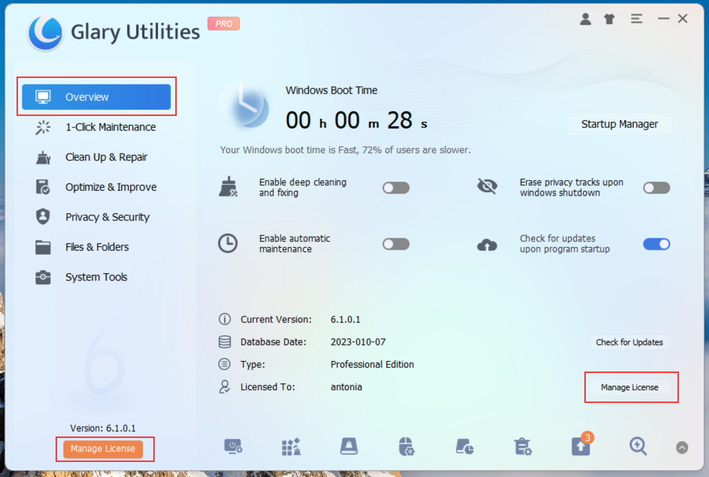
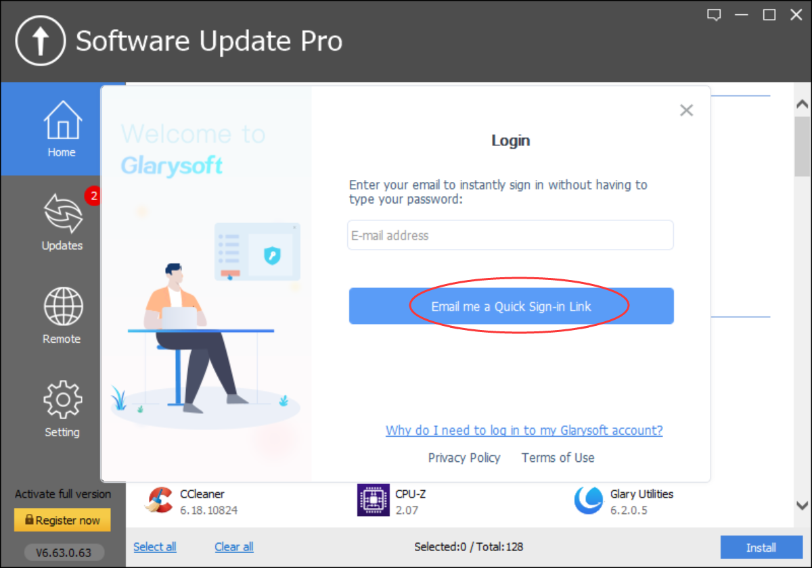
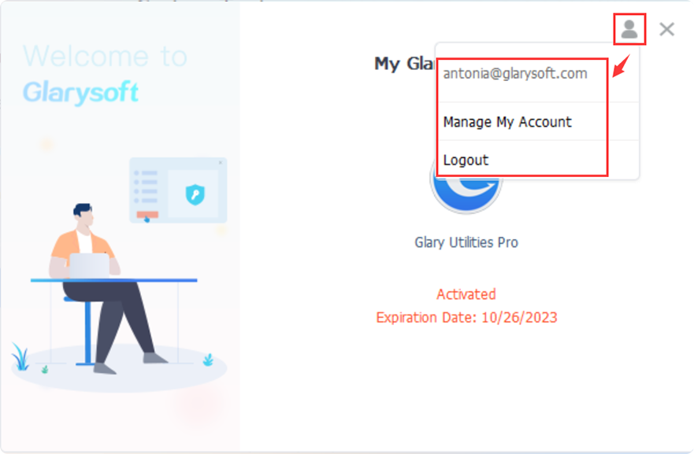
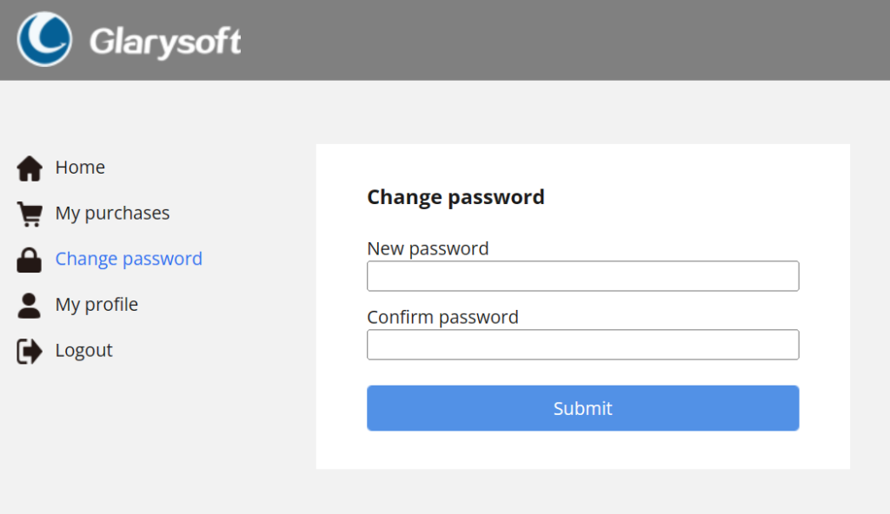
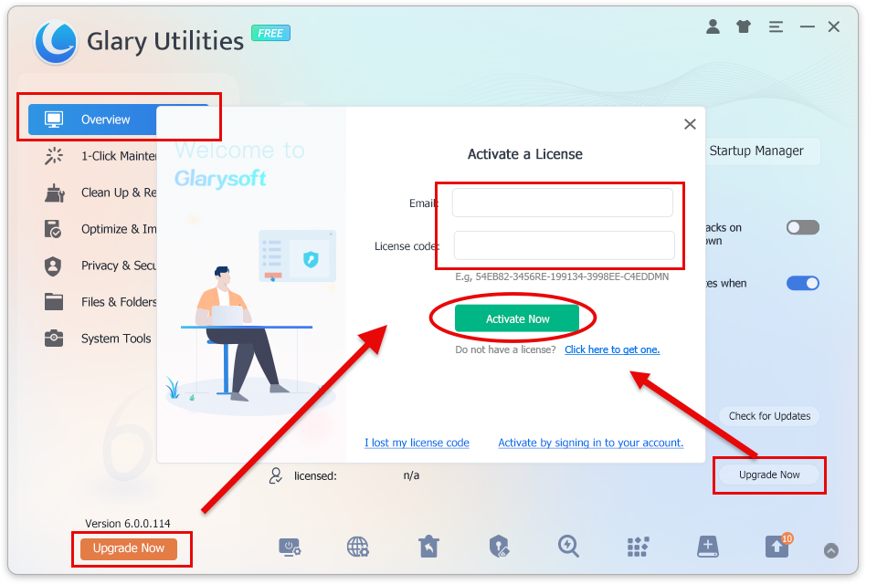

Glarysoft Account offers a convenient activation and license management feature. Now, users can simply log in to the User Center using their email, and the system will automatically send an activation link to the designated email address. By clicking the link, users can easily complete the login process and obtain the available license, significantly simplifying the operation and eliminating the need for complex and hard-to-remember passwords or licenses.

**How to use it:**

1\. Click on the icon located in the top right corner of the Glary Utilities interface.

2\. Enter your email and click the "Email me a Quick Sign-in Link" button.

3\. Wait for verification... You will receive a verification email within seconds. (Please make sure to add glarysoft.com to your spam filter.)

4\. Open the email sent by Glarysoft, and click the "Log in to Glarysoft" button to verify your email and access your account.

5\. Return to the software interface. You can either wait for the system to automatically activate or click the "I have verified" button. The software will be successfully activated, and the expiration date information will be displayed.

To log out of your account, click the icon in the top right corner. Alternatively, you can click "Manage My Account" to access the User Management Center and review your purchases, change your password, and more.

**In addition, we have retained the previous activation method, allowing users to choose to activate via email and license, providing them with more options.**

