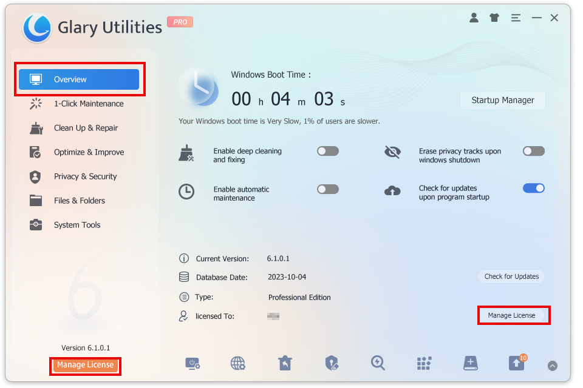
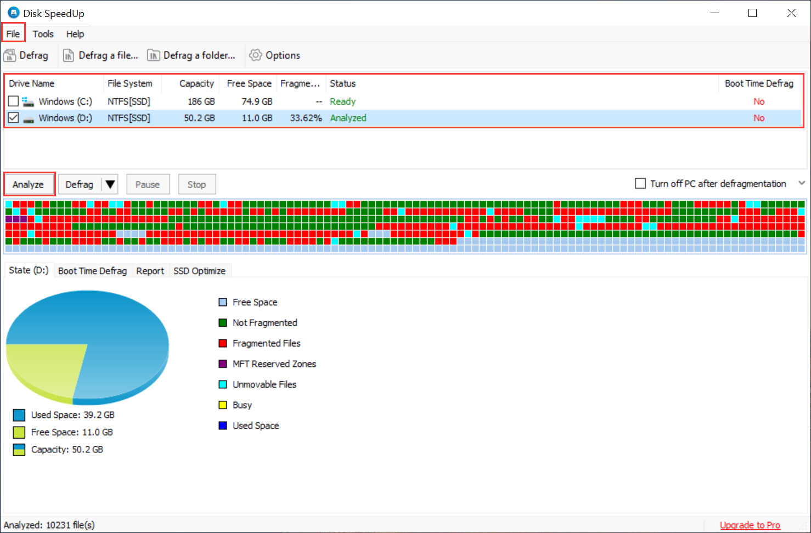
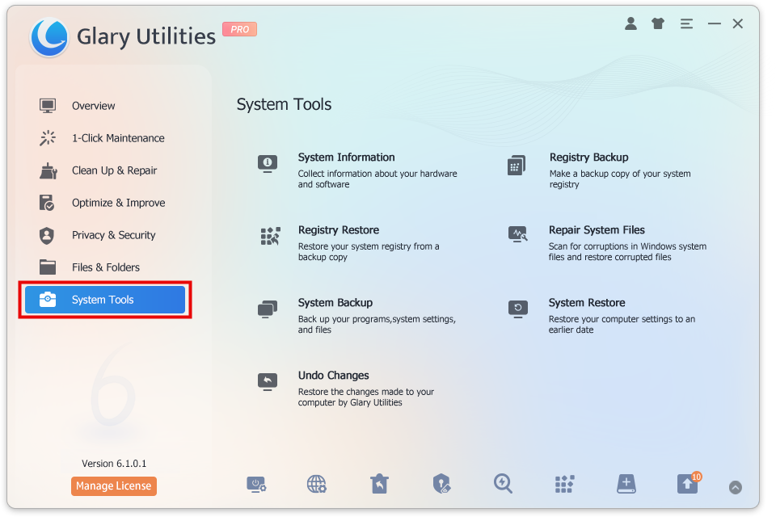

Glary Utilities offers numerous powerful and easy-to-use system tools and utilities to fix, speed up, maintain and protect your PC. It allows you to clean common system junk files, invalid registry entries and Internet traces.

With Glary Utilities, you can manage and delete browser add-ons, analyze disk space usage and find duplicate files. You can also view and manage installed shell extensions, encrypt your files from unauthorized access and use, split large files into smaller manageable files and then rejoin them. Furthermore, Glary Utilities includes the options to optimize memory, find, fix, or remove broken Windows shortcuts, manage the programs that start at Windows startup and uninstall software. Other features include secure file deletion, an Empty Folder finder and more.

All Glary Utilities tools can be accessed through an eye-pleasing and intuitive interface.

**Clean Up & Repair**  
  
**Disk CleanUp:** Removes junk data from your disks and recovers disk space

**Registry Repair:** Scans and cleans up your registry to improve your system's performance.

**Shortcuts Fixer:** Corrects the errors in your start menu & desktop shortcuts.

**Duplicates Files Finder:** Searches for space-wasting and error-producing duplicate files

**Empty Folders Finder:** Finds and removes empty folders in your windows

**Context Menu Manager:** Manages the context-menu entries for files, folders, etc...

**Uninstall Manager:** Uninstalls programs completely that you don't need anymore

**Optimize & Improve**  
  
**Startup Manager:** Manages programs that run automatically on startup

**Disk Defrag:** Defrag hard Disks to speed up the PC performance  
  
**Memory Optimizer:** Monitors and optimizes free memory in the background

**Registry Defrag:** Defrag the Windows registry to speed up your computer

**Check Disk:** Scans your disk drives to find and repair disk problems

**Driver Manager:** Backups, restores, and updates drivers for your PC

**Software Update:** Quickly scans and checks for new versions of software installed on your system

**Privacy & Security**  
  
**Tracks Eraser:** Erases all the traces, evidence, cookies, internet history, and more

**File Shredder:** Erases files permanently so that no one can recover them

**File Undelete:** Quick and effective way to retrieve accidentally deleted files

**File Encrypter and Decrypter:** Protects your files from unauthorized access and use

**Browser Assistant:** Manages Internet Explorer Add-ons and restores hijacked settings

**Process Manager:** Monitors running processes and optionally stops them

**Files & Folders**  
  
**Disk Space Analyzer:** Shows you the disk space usage of your files and folders

**File Splitter and Joiner:** Splits large files into smaller manageable files and then rejoin them

**Quick Search:** Locates files and folders by name instantly

**System Tools**

**System Information:** Collects information about your hardware and software

**Registry Backup:** Makes a backup copy of your system registry

**Registry Restore:** Restores your system registry from a backup copy

**Repair System Files:** Scans for corruptions in Windows system files and restores corrupted files

**System Backup:** Backups your programs, system settings, and files

**System Restore:** Restores your computer settings to an earlier date

**Undo Changes:** Restores the changes made to your computer by Glary Utilities
