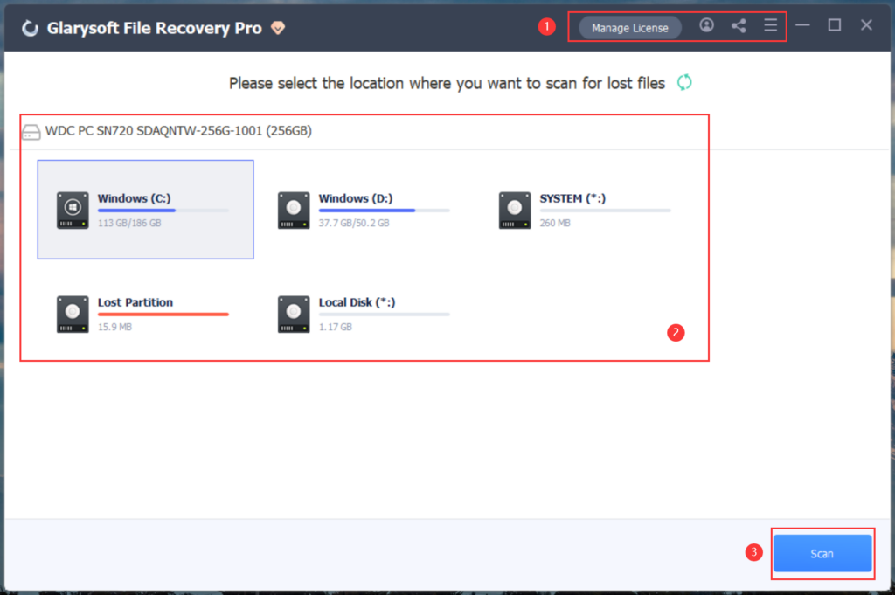
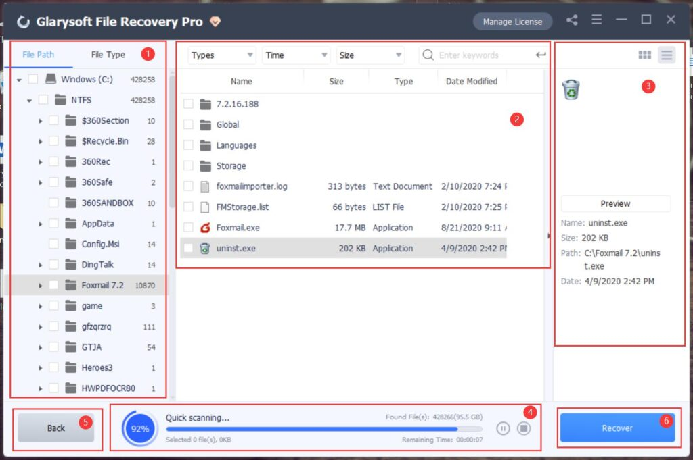
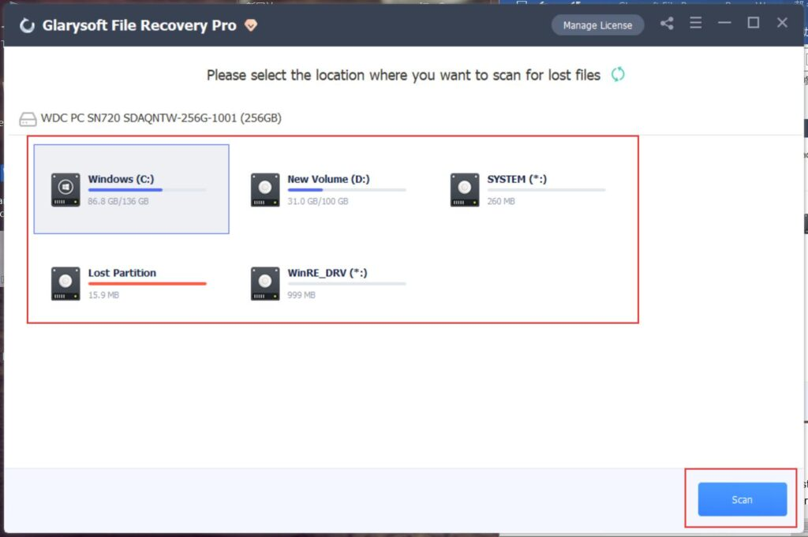
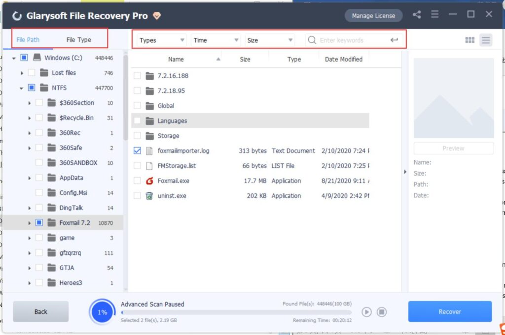
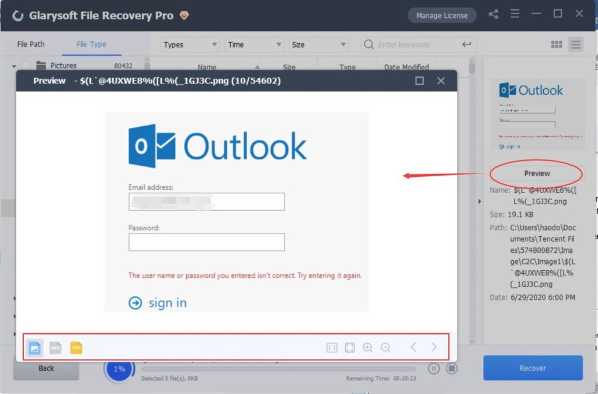
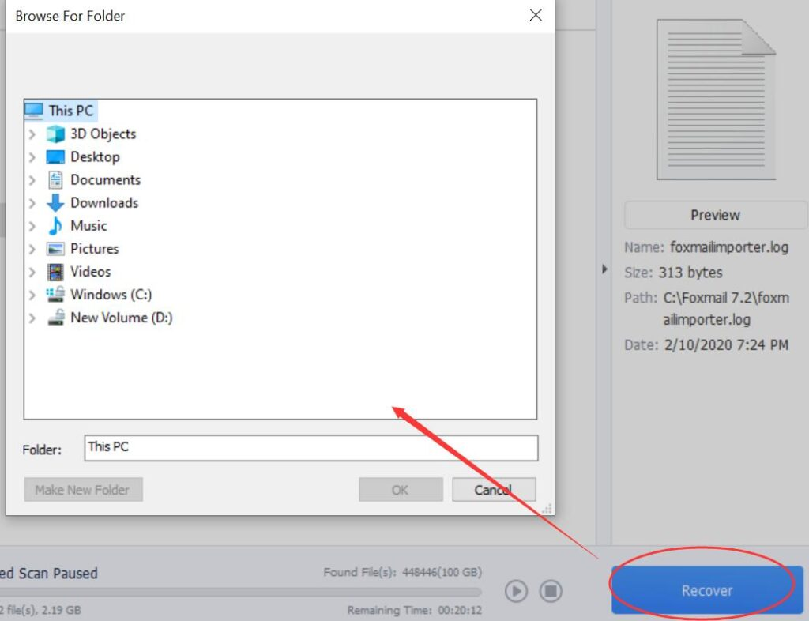
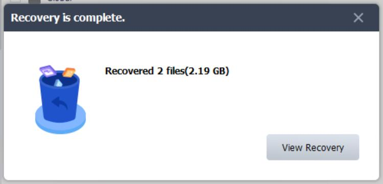
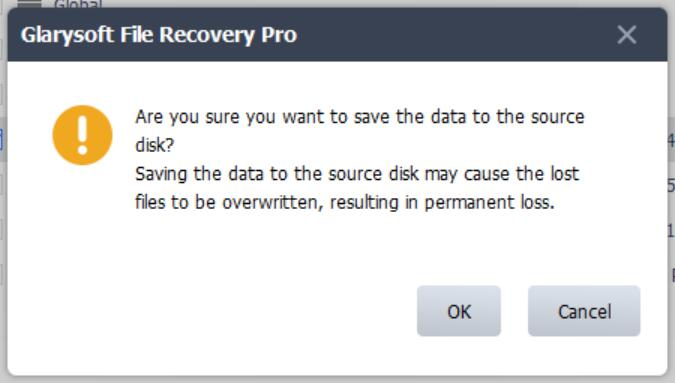

Glarysoft File Recovery is a powerful tool designed to efficiently recover lost files. With just two simple steps - scan and recover, it can retrieve files that have been lost due to various reasons such as accidental deletion, system crashes, virus attacks, formatting of drives, and even from external storage devices like camera memory cards. This reliable software supports a wide range of file types including videos, audios, documents, and images, ensuring that you can recover almost any lost data.

**Interface Overview:**

**Interface 1:**

1. **Top Area**: Manage licenses, Settings, Updates, and access Help.

3. **Middle Area**: Select the location from where you want to recover the files.

5. **Lower Right Corner Button**: Initiates the scanning process.

**Interface 2**:

1. **Left Area**: Further refine file search based on File Path or File Type.

3. **Middle Area**: Display of scanned files. Filter files by Name, Type, Size, Date Modified, etc. Use the search box to enter keywords for precise positioning and narrow down the search results.

5. **Right Area**: Preview recoverable files. Select a file and preview its details to confirm if it's the one you need. The two buttons above the preview area allow you to switch between different file view modes.

7. **Bottom Progress Bar**: Displays scan progress, remaining time, and other information. Pause or stop the scan if needed.

9. **Back Button**: Go back to the previous section and re-select the partition.

11. **Recover Button**: Start the file recovery process.

**How to Use Glarysoft File Recovery to Recover Lost Files?**

**Step 1: Download and Install**

Download Glarysoft File Recovery from the following link:  
[https://www.glarysoft.com/file-recovery-free/](https://www.glarysoft.com/file-recovery-free/)  
Double-click the icon to run the program.

**Step 2: Scan**

1. Select the hard disk where the lost data was stored. The software supports scanning FAT, NTFS, and NTFS+EFS file systems.

3. Click "Scan" to initiate a full scan of the selected location. The scanning process usually takes a few minutes to complete. However, if there are many large files, it may require more time.

5. Once the scan results appear, you can use the left panel to filter the files based on Name, Type, Size, Date Modified, File Path, or File Type to narrow down the results.

**Step 3: Preview and Restore**

a. Glarysoft File Recovery allows you to select and preview the target file. You can switch between different preview formats or zoom in on the preview.

b. After previewing the files and confirming their validity, select the files you want to restore. Click the "Recover" button to retrieve the lost data. Choose a location to save the recovered files and complete the process.

c. View Recovery

Click to jump to the location where the recovered files are saved.

**Tips:** To avoid overwriting the data, please do not save the recovered files to the same location. Take note of the warning message:

