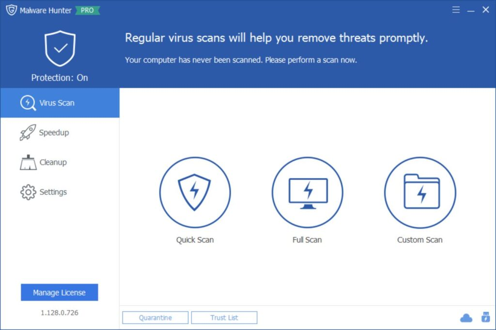
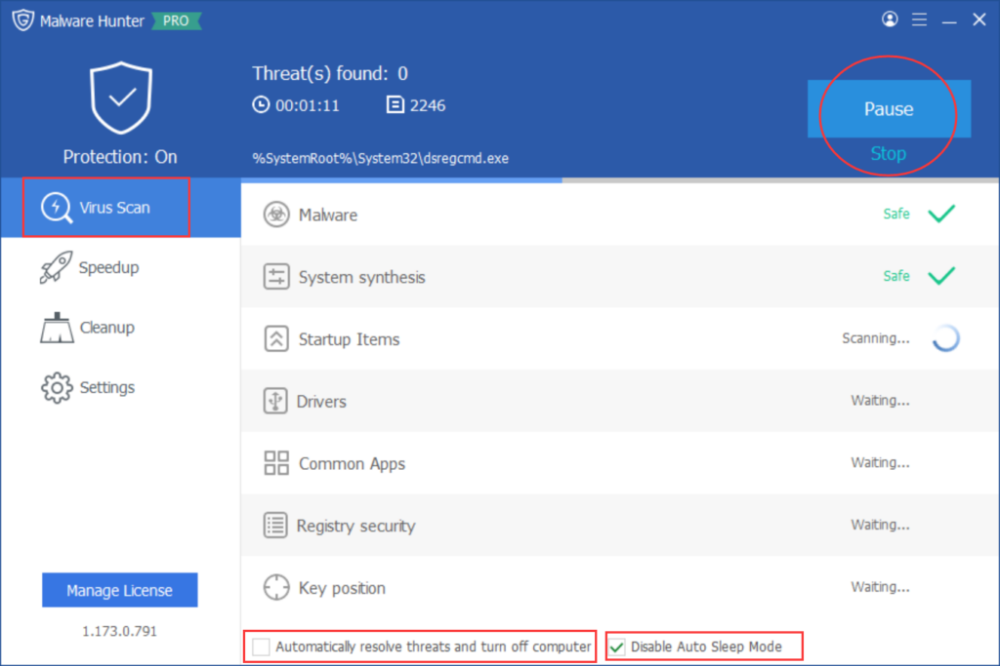
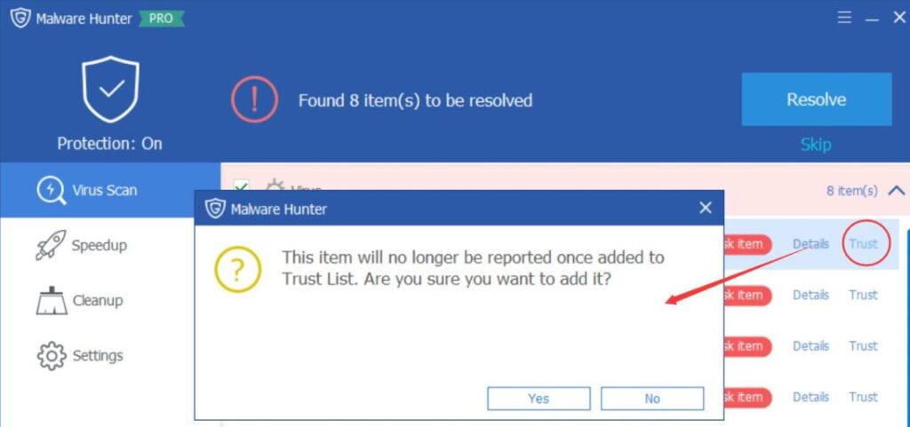
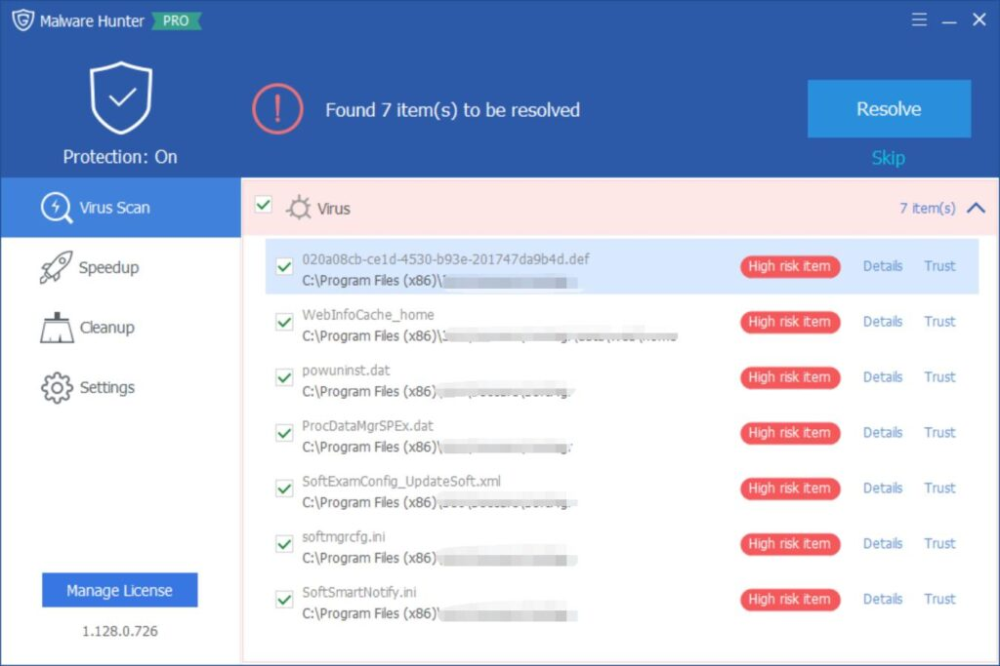
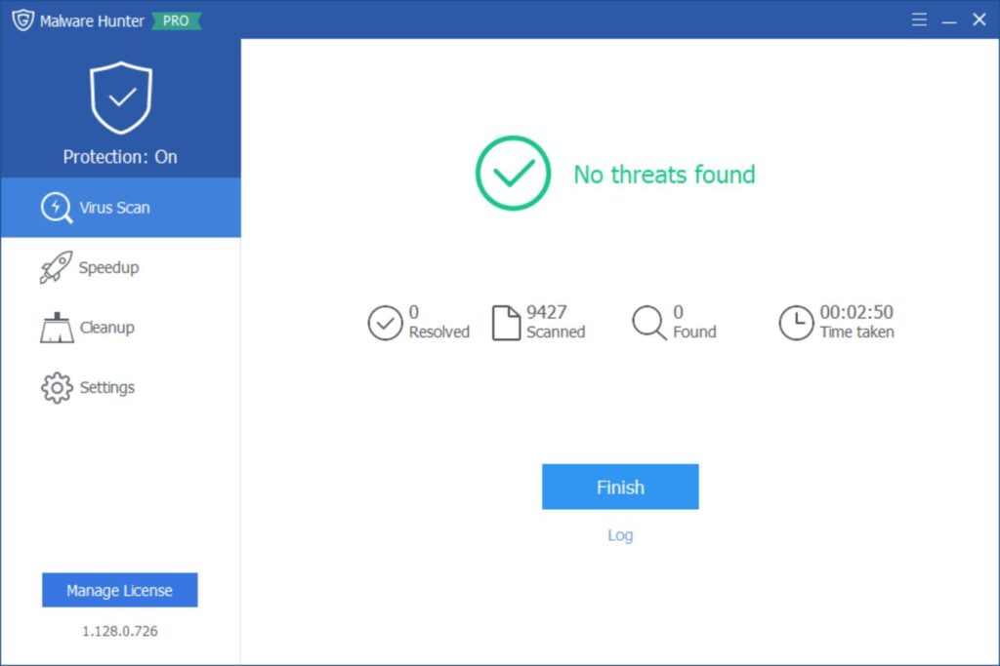

Glarysoft Malware Hunter is a high-quality and efficient Windows software client designed to detect and remove stubborn malware, ensuring your computer's safety from potential threats. With its hyper scan feature, you can enjoy faster scanning speeds, while automatic updates provide real-time protection, keeping your PC up-to-date and secure. This comprehensive solution not only protects your data and privacy but also rids your system of viruses, ensuring a virus-free environment.

**How to Remove Malware with Glarysoft Malware Hunter:**

**Step 1:** Download and install Glarysoft Malware Hunter from [here](https://www.glarysoft.com/malware-hunter/). Double-click the desktop icon to launch the program on Windows.

**Step 2: Scanning**

Glarysoft Malware Hunter offers three scanning options: **Quick Scan**, **Full Scan**, and **Custom Scan**.

**Quick Scan** is the fastest option, targeting key system locations vulnerable to malware. It completes within minutes.

**Full Scan** thoroughly checks every file in the system, ensuring comprehensive detection. The scanning time depends on the disk size and the number of files.

**Custom Scan** allows you to specify the locations you want to scan.

Select the appropriate scan mode based on your needs and await the results. During the scanning process, you can Pause or Stop the scan at any time. Below, there are checkboxes for additional settings: "Automatically resolve threats and turn off computer" and "Disable Auto Sleep Mode."

**Step 3: Resolve**

Once the scan results appear, you can view the details and utilize the **Trust List**. Adding an item to the Trust List prevents it from being reported in the future.

Check the viruses you want to remove and click "Resolve."

Click "Finish" or access the Log to review the process.

Following these three simple steps, you can effortlessly and efficiently eliminate malware with Glarysoft Malware Hunter.

In conclusion, Glarysoft Malware Hunter is a powerful tool that not only removes malware from your system but also enhances your PC's performance. With its user-friendly interface and advanced features, it is indispensable software for maintaining a secure and efficient computing environment.
