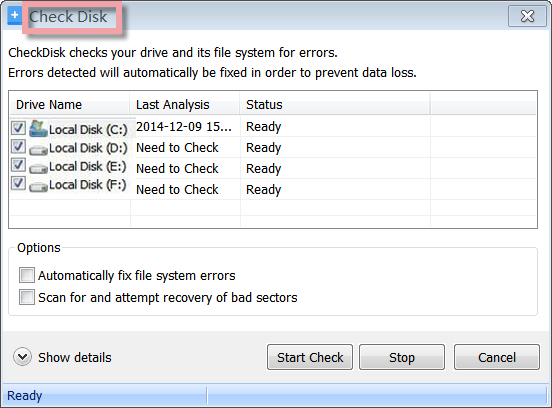
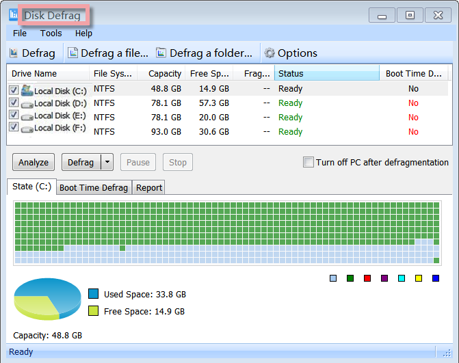
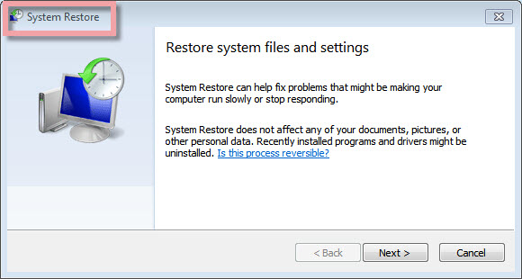
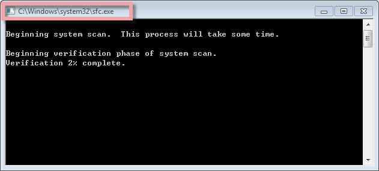
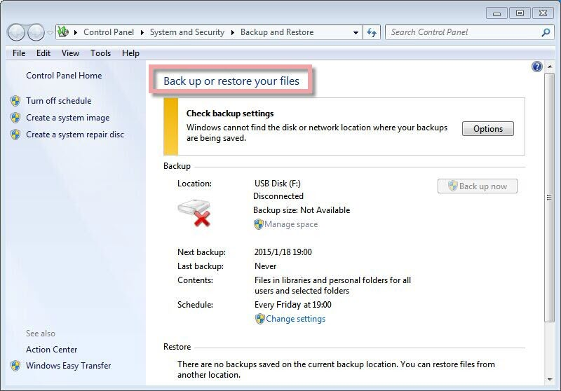

The Windows Standard Tools provide direct access to the five most useful tools, making it much easier to use them regularly and helping you to keep your system stable and running smoothly.

**Check Disk**

A command-line tool that checks volumes for problems. The tool then tries to repair any that it finds. For example, Check Disk can repair problems related to bad sectors, lost clusters, cross-linked files, and directory errors.

**Disk Defrag**

When a program is installed on your computer, the program's files may be broken up over multiple locations on your hard disk. This is called fragmentation. If fragmentation occurs on your hard disk, the performance of programs on your computer is slower. The Disk Defrag tool optimizes the performance of your computer by reorganizing the files on your hard disk into contiguous blocks. When Disk Defrag completes the defragmentation of files on your hard disk, the performance of your programs is faster because the files are arranged closer together.

**System Restore**

Every time you download or install a new game, application, or software update, you make changes to your computer. Sometimes that change may make your system unstable. Have you ever wanted to go back to the way it was? With System Restore, you can.

**Repair System Files**

Repair System Files gives an administrator the ability to scan all protected files to verify their versions. If Repair System Files discovers that a protected file has been overwritten, it retrieves the correct version of the file from the cache folder (%Systemroot%\\System32\\Dllcache) or the Windows installation source files and then replaces the incorrect file.

**Backup**

The Backup utility helps you protect data from accidental loss if your system experiences hardware or storage media failure.
